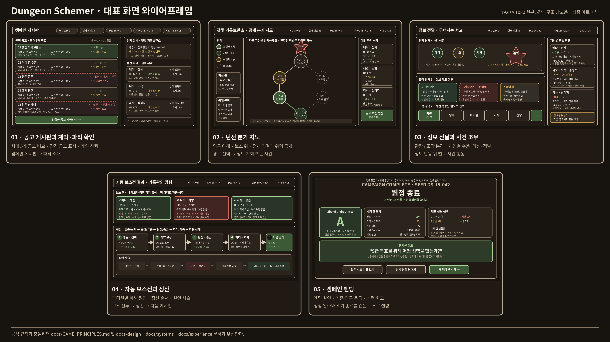

# Dungeon Schemer 시각 자료

이 디렉터리는 공식 게임 문서를 이해하기 쉽게 요약한 파생 자료다. 규칙이
충돌하면 [게임 원칙](../GAME_PRINCIPLES.md)과 `docs/design`, `docs/systems`,
`docs/experience`의 공식 문서가 우선한다.

## 추천 읽기 순서

1. [캠페인 시퀀스](campaign-sequence.md): 캠페인 생성부터 다음 공고 또는 엔딩까지
2. [탐험 시퀀스](expedition-sequence.md): 경로, 정보 전달, 사건과 순차 턴제 보스전 기록
3. [캠페인 상태 전이](campaign-state.md): 월드턴과 엔딩 5종의 판정 우선순위
4. [탐험 상태 전이](expedition-state.md): 공식 단계와 조건부·조기 전이
5. [대표 화면 와이어프레임](screen-wireframes.md): 인트로부터 엔딩까지 화면 6개의 정보 배치

> 상태·시퀀스 4장의 SVG·PNG는 D7 산출물로 최신 규칙에 맞게 재생성했다.
> 대표 화면 6장과 전체 모음은 남은 작업인 D8에서 재작업한다.

## 한눈에 보기

전체 모음은 탐색용이다. 글자와 세부 상태를 확인할 때는
[개별 화면](screen-wireframes.md)을 사용한다.

## 이미지 형식

- Markdown: 설명과 Mermaid 원본
- SVG: 확대·편집용
- PNG: IDE·Pull Request 미리보기용

| 자료 | SVG | PNG |
| --- | --- | --- |
| 캠페인 시퀀스 | [열기](svg/campaign-sequence.svg) | [열기](png/campaign-sequence.png) |
| 탐험 시퀀스 | [열기](svg/expedition-sequence.svg) | [열기](png/expedition-sequence.png) |
| 캠페인 상태 전이 | [열기](svg/campaign-state.svg) | [열기](png/campaign-state.png) |
| 탐험 상태 전이 | [열기](svg/expedition-state.svg) | [열기](png/expedition-state.png) |
| 대표 화면 전체 모음 | [열기](svg/screen-overview.svg) | [열기](png/screen-overview.png) |

## 해석 원칙

- 화면에 보이는 수치는 공식 프로토타입 규칙을 설명하기 위한 한 장면의 예시다.
- 와이어프레임은 최종 아트나 실제 React 구현을 확정하지 않는다.
- 보스방에서는 새 정보 카드, 보스 거래와 길잡이의 직접 전투를 제공하지 않는다.
- 카드 유형은 선택 전에 표시하지 않는다. 판단 재료는 활성 생태 규칙과 단서다.
- 같은 시드와 같은 선택 순서는 같은 캠페인 결과를 만든다.

## 근거 문서

- [게임 원칙](../GAME_PRINCIPLES.md)
- [게임 개요](../design/GAME_OVERVIEW.md)
- [핵심 게임 루프](../design/CORE_GAME_LOOP.md)
- [캐릭터와 신뢰](../systems/CHARACTERS_AND_TRUST.md)
- [캐릭터 풀과 월드턴](../systems/CHARACTER_POOL_AND_WORLDTURN.md)
- [정보와 기만](../systems/INFORMATION_AND_DECEPTION.md)
- [던전 이벤트와 보스](../systems/DUNGEON_EVENTS_AND_BOSSES.md)
- [성장과 엔딩](../systems/PROGRESSION_AND_ENDINGS.md)
- [온보딩과 인터페이스](../experience/ONBOARDING_AND_INTERFACE.md)
