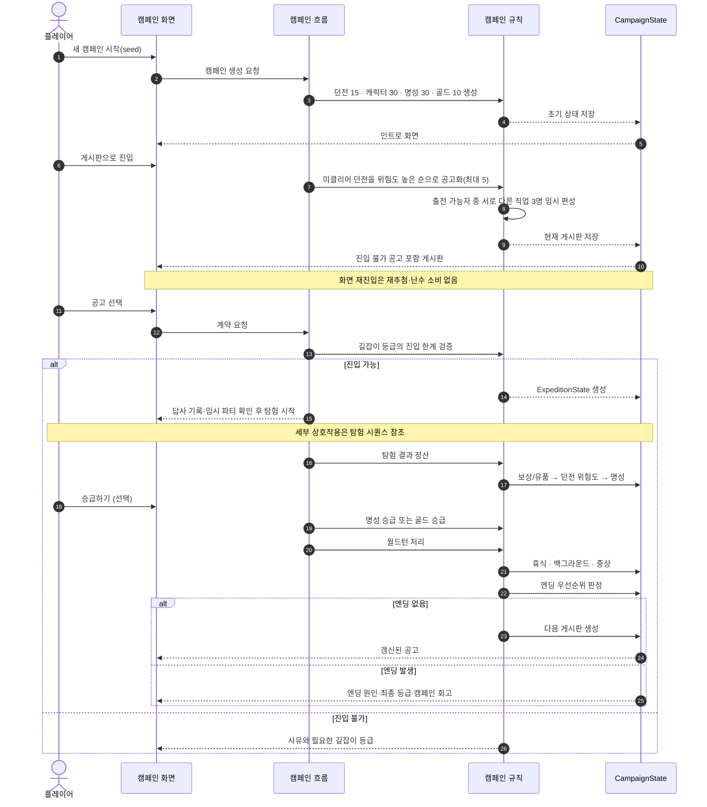

# 캠페인 시퀀스

한 캠페인은 던전 15개와 캐릭터 30명으로 시작한다. 인트로에서 길잡이의 역할을
전달한 뒤 게시판으로 들어간다. 계약한 원정의 결과는 매번 캠페인 상태에
병합되고, 엔딩이 발생하지 않으면 갱신된 상태로 다음 게시판을 만든다.

[SVG로 크게 보기](svg/campaign-sequence.svg) ·
[PNG로 보기](png/campaign-sequence.png)

## 읽을 때 볼 것

- 인트로는 캠페인 시작 시 한 번 나오고, 길잡이의 역할·개입 수단·목표를 전달한다.
- 진입 한계를 정하는 것은 명성이 아니라 길잡이 등급이다. 명성은 승급 요구치다.
- 승급은 자동으로 일어나지 않는다. `승급하기`를 눌러야 오르고 강등은 없다.
- 진입 불가 공고도 숨기지 않고 사유와 함께 보여준다.
- 월드턴은 엔딩 판정보다 앞에 온다. 누가 다음 원정에 나갈 수 있는지가 정해져야 인력 소진을 판정할 수 있다.
- 화면을 다시 열기만 해서는 게시판을 재추첨하거나 난수를 소비하지 않는다.
- 같은 시드와 같은 선택 순서는 같은 상태와 결정 기록을 만든다.

## 관련 문서

- [핵심 게임 루프](../design/CORE_GAME_LOOP.md)
- [성장과 엔딩](../systems/PROGRESSION_AND_ENDINGS.md)
- [캐릭터 풀과 월드턴](../systems/CHARACTER_POOL_AND_WORLDTURN.md)
- [대표 화면 와이어프레임](screen-wireframes.md)
