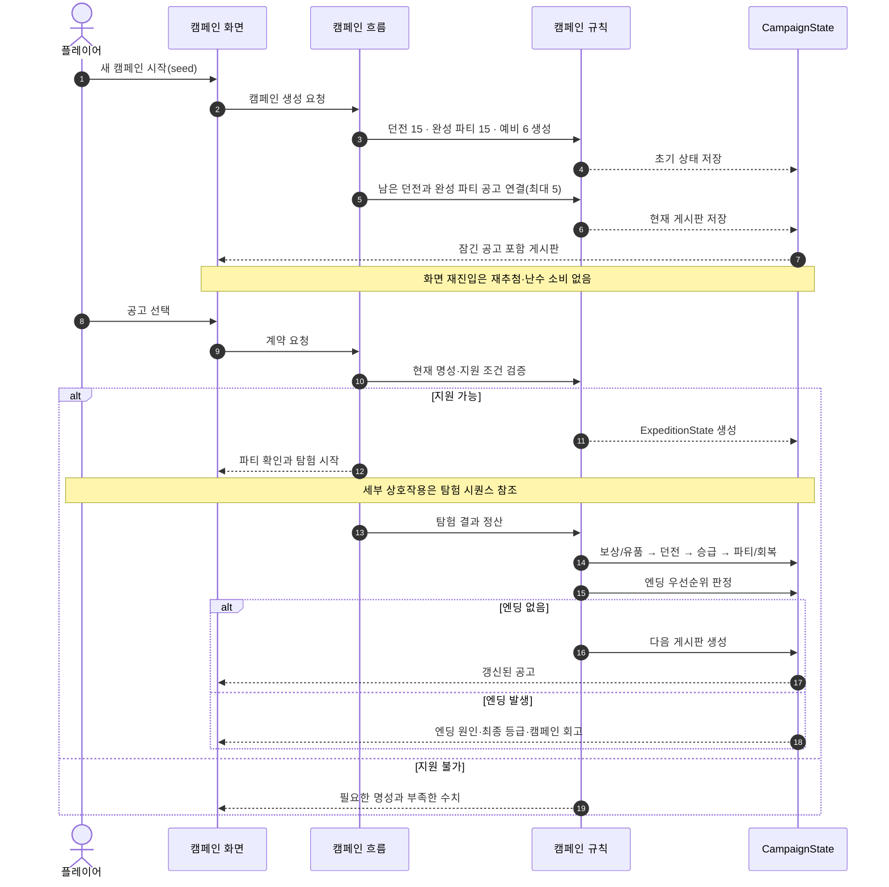

# 캠페인 시퀀스

한 캠페인은 던전 15개, 완성 파티 15팀과 예비 인원 6명으로 시작한다. 게시판에서
계약한 탐험의 결과는 매번 캠페인 상태에 병합되며, 엔딩이 발생하지 않으면 갱신된
상태로 다음 게시판을 만든다.

[SVG로 크게 보기](svg/campaign-sequence.svg) ·
[PNG로 보기](png/campaign-sequence.png)

## 읽을 때 볼 것

- 현재 명성은 공고 지원을 제한하지만, 이미 얻은 영구 길잡이 등급은 내려가지 않는다.
- 잠긴 공고도 숨기지 않고 필요한 명성과 부족한 수치를 알려준다.
- 화면을 다시 열기만 해서는 게시판을 재추첨하거나 난수를 소비하지 않는다.
- 같은 시드와 같은 사용자 선택 순서는 같은 상태와 결정 기록을 만든다.
- 탐험 결과는 보상·던전·승급·파티·엔딩의 순서로 다음 캠페인 상태에 남는다.

## 관련 문서

- [핵심 게임 루프](../design/CORE_GAME_LOOP.md)
- [성장과 엔딩](../systems/PROGRESSION_AND_ENDINGS.md)
- [대표 화면 와이어프레임](screen-wireframes.md)
