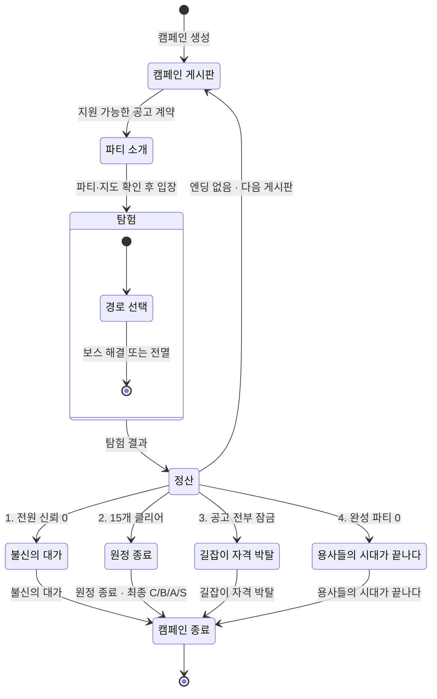

# 캠페인 상태 전이

탐험 정산 뒤에는 한 번에 하나의 엔딩만 적용한다. 여러 조건이 동시에 성립하면
번호가 낮은 조건부터 판정한다. 어느 엔딩도 성립하지 않으면 다음 게시판으로
돌아간다.

[SVG로 크게 보기](svg/campaign-state.svg) ·
[PNG로 보기](png/campaign-state.png)

## 엔딩 판정 우선순위

1. **불신의 대가**: 이번 탐험의 생존 출전자가 한 명 이상이고 전원의 신뢰가 0
2. **원정 종료**: 던전 15개를 모두 클리어. 최종 C·B·A·S 모두 정상 완주
3. **길잡이 자격 박탈**: 공고가 생성됐지만 전부 현재 명성 제한에 막힘
4. **용사들의 시대가 끝나다**: 완성 가능한 3인 파티가 없어 공고를 만들 수 없음

전멸처럼 생존자가 0명이면 첫 번째 조건은 성립하지 않는다. 파티가 없어 공고
자체를 만들 수 없다면 세 번째가 아니라 네 번째 조건을 적용한다.

## 관련 문서

- [게임 개요](../design/GAME_OVERVIEW.md)
- [성장과 엔딩](../systems/PROGRESSION_AND_ENDINGS.md)
- [캠페인 시퀀스](campaign-sequence.md)
