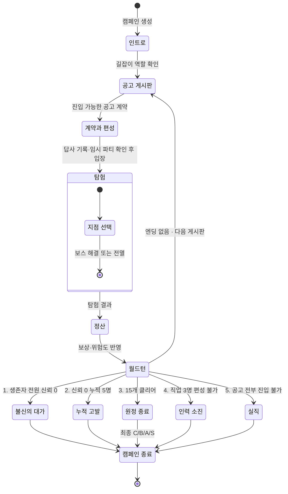

# 캠페인 상태 전이

정산과 월드턴 처리가 끝난 뒤에는 엔딩 5종 중 하나만 적용한다. 여러 조건이
동시에 성립하면 번호가 낮은 조건부터 판정한다. 어느 엔딩도 성립하지 않으면
다음 게시판으로 돌아간다.

[SVG로 크게 보기](svg/campaign-state.svg) ·
[PNG로 보기](png/campaign-state.png)

## 엔딩 판정 우선순위

1. **불신의 대가**: 원정 중 생존 파티원이 1명 이상이고 그들 전원의 신뢰가 0
2. **누적 고발**: 신뢰 0 캐릭터가 5명. 조사 이벤트 없이 즉시
3. **원정 종료**: 던전 15개를 모두 클리어. 최종 C·B·A·S 모두 정상 완주
4. **인력 소진**: 출전 가능한 캐릭터로 서로 다른 직업 3명을 편성할 수 없음
5. **실직**: 게시판의 모든 공고가 진입 불가

전멸처럼 생존자가 0명이면 첫 번째 조건은 성립하지 않는다.

인력 소진과 실직은 막히는 이유가 다르다. 인력 소진은 보낼 사람이 없는 것이고,
실직은 사람은 있는데 길잡이 등급으로 들어갈 수 있는 던전이 없는 것이다.

## 월드턴이 판정 앞에 오는 이유

엔딩 판정은 정산이 아니라 월드턴 처리 뒤에 한다. 월드턴에서 회복과 중상이
정해져야 다음 원정에 누구를 보낼 수 있는지가 확정되고, 그래야 인력 소진을
판정할 수 있다.

## 관련 문서

- [게임 개요](../design/GAME_OVERVIEW.md)
- [성장과 엔딩](../systems/PROGRESSION_AND_ENDINGS.md)
- [캐릭터 풀과 월드턴](../systems/CHARACTER_POOL_AND_WORLDTURN.md)
- [캠페인 시퀀스](campaign-sequence.md)
