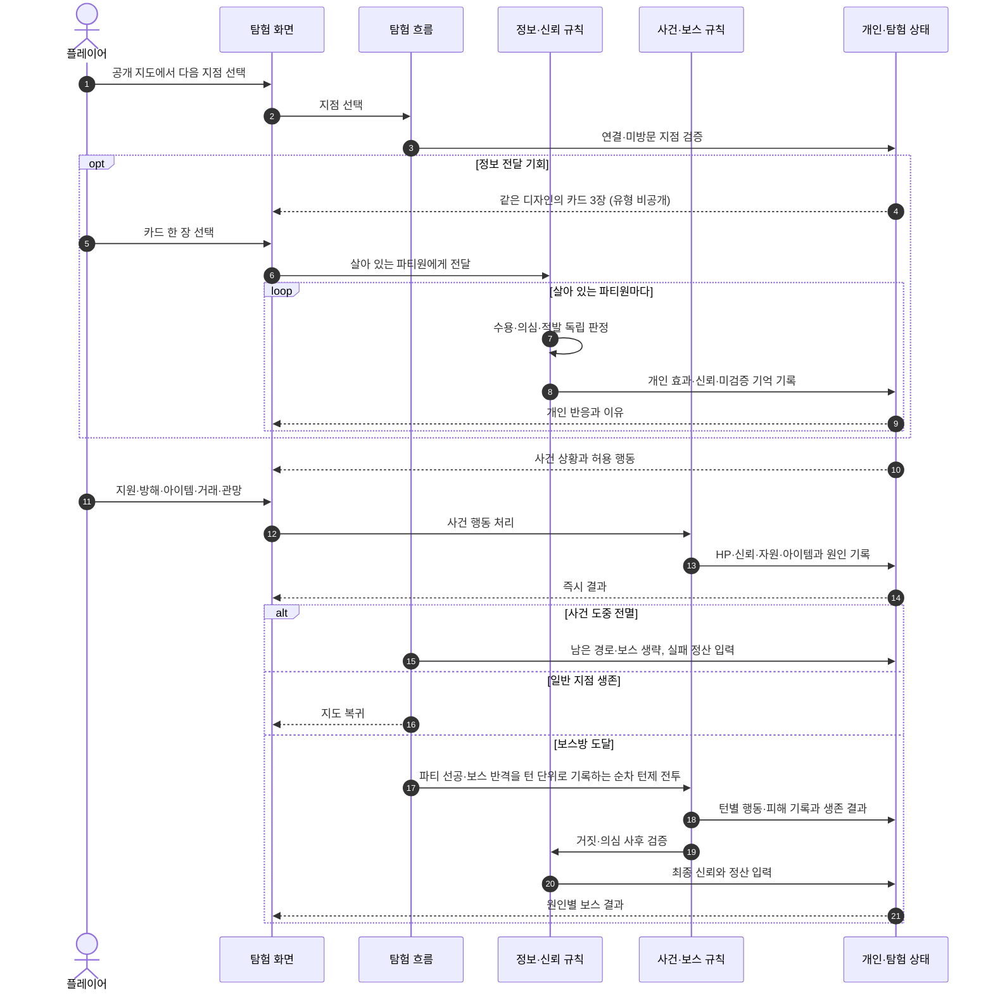

# 탐험 시퀀스

한 번의 탐험에서 플레이어는 공개 지도를 보고 지점을 선택한다. 일부 지점에서는
사건 전에 카드를 전달하고, 그 뒤에도 사건 행동을 별도로 고른다. 전투는 직접
조작이 아니라 이 선택들이 HP와 생존으로 드러나는 결과다.

카드의 진위는 카드 자체가 아니라 그 던전의 활성 생태 규칙에 대해 정해진다.
플레이어는 답사 기록이 공개한 규칙과 사건 묘사의 단서로 어느 카드가 규칙과
맞는지를 판단한다.

[SVG로 크게 보기](svg/expedition-sequence.svg) ·
[PNG로 보기](png/expedition-sequence.png)

## 읽을 때 볼 것

- 카드 3장은 같은 디자인으로 제시하고 유형·발각 위험·예상 신뢰 변화를 모두 감춘다.
- 감추는 것은 결론이지 근거가 아니다. 활성 규칙과 단서는 경로 위에 남아 있다.
- 정보 전달은 사건 행동을 대체하지 않는다.
- 같은 카드를 받은 파티원도 성격과 현재 신뢰에 따라 독립적으로 반응한다.
- 전멸하면 남은 사건과 보스전을 건너뛰고 실패 정산으로 간다.
- 보스방에서는 새 카드, 보스 거래와 길잡이의 직접 전투 개입을 제공하지 않는다.
- 보스전은 턴을 주고받으며 진행하고 턴별 행동과 피해를 기록으로 남긴다.
- 보스전 뒤에는 수용한 거짓과 의심을 검증해 최종 신뢰 변화의 이유를 남긴다.

## 관련 문서

- [정보와 기만](../systems/INFORMATION_AND_DECEPTION.md)
- [던전 테마와 생태](../systems/DUNGEON_THEMES_AND_ECOLOGY.md)
- [던전 이벤트와 보스](../systems/DUNGEON_EVENTS_AND_BOSSES.md)
- [캐릭터와 신뢰](../systems/CHARACTERS_AND_TRUST.md)
- [캐릭터 풀과 월드턴](../systems/CHARACTER_POOL_AND_WORLDTURN.md)
