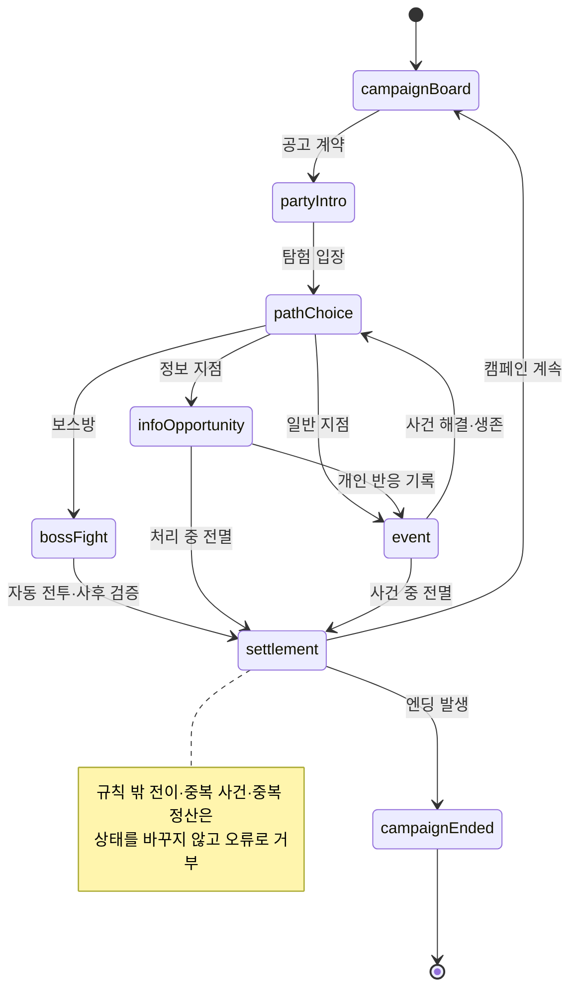

# 탐험 상태 전이

탐험 화면은 현재 단계가 허용하는 행동만 받는다. 정보 전달 기회의 유무와 전멸
여부에 따라 일부 단계를 건너뛰지만, 정보 전달이 일어난 뒤에는 반드시 별도 사건
단계가 이어진다.

[SVG로 크게 보기](svg/expedition-state.svg) ·
[PNG로 보기](png/expedition-state.png)

## 공식 단계

| 식별자 | 화면과 역할 |
| --- | --- |
| `campaignBoard` | 던전·파티 공고 비교와 계약 |
| `partyIntro` | 출전 파티와 지도·위험 확인 |
| `pathChoice` | 공개 지도에서 다음 지점 선택 |
| `infoOpportunity` | 일부 지점에서 정보 카드 선택과 개인 반응 |
| `event` | 정보와 별도로 사건 행동 선택 |
| `bossFight` | 누적 상태로 자동 전투와 사후 검증 |
| `settlement` | 보상·던전·승급·파티·엔딩 순서 처리 |
| `campaignEnded` | 정상 완주 또는 조기 종료 표시 |

규칙 밖 전이, 이미 처리한 사건과 중복 정산은 상태를 조용히 보정하지 않고 오류로
거부한다.

## 관련 문서

- [핵심 게임 루프](../design/CORE_GAME_LOOP.md)
- [탐험 시퀀스](expedition-sequence.md)
- [던전 이벤트와 보스](../systems/DUNGEON_EVENTS_AND_BOSSES.md)

