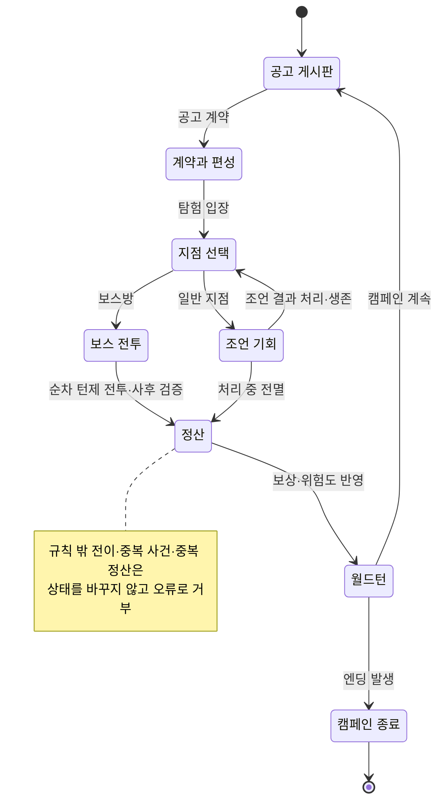

# 탐험 상태 전이

탐험 화면은 현재 단계가 허용하는 행동만 받는다. 모든 일반 지점에서 조언을 한 번
고르고 그 결과를 처리하며, 조언 선택 뒤에 별도 사건 행동 단계는 없다.

[SVG로 크게 보기](svg/expedition-state.svg) ·
[PNG로 보기](png/expedition-state.png)

## 공식 단계

| 식별자 | 화면과 역할 |
| --- | --- |
| `campaignBoard` | 진입 가능한 공고 비교. 진입 불가는 사유와 함께 표시 |
| `contract` | 답사 기록·공개 위험 태그·임시 파티 3인 확인과 계약 |
| `pathChoice` | 공개 지도에서 다음 지점 선택 |
| `adviceOpportunity` | 상황 묘사를 보고 조언 세 개 중 하나를 선택하고 파티원별 독립 반응 처리 |
| `bossFight` | 누적 상태로 순차 턴제 전투와 사후 검증 |
| `settlement` | 보상·유품 → 던전 위험도 → 명성 → 승급 순서 처리 |
| `worldTurn` | 비출전 캐릭터의 휴식·백그라운드·중상 처리와 엔딩 판정 |
| `campaignEnded` | 정상 완주 또는 조기 종료 표시 |

전멸해도 던전은 사라지지 않는다. 위험도가 1 오르고 다음 공고에 다시 나온다.
재도전하면 지도는 다시 생성되고 보스와 활성 생태 규칙은 유지된다.

규칙 밖 전이, 이미 처리한 사건과 중복 정산은 상태를 조용히 보정하지 않고 오류로
거부한다.

## 관련 문서

- [핵심 게임 루프](../design/CORE_GAME_LOOP.md)
- [탐험 시퀀스](expedition-sequence.md)
- [던전 이벤트와 보스](../systems/DUNGEON_EVENTS_AND_BOSSES.md)
- [캐릭터 풀과 월드턴](../systems/CHARACTER_POOL_AND_WORLDTURN.md)
