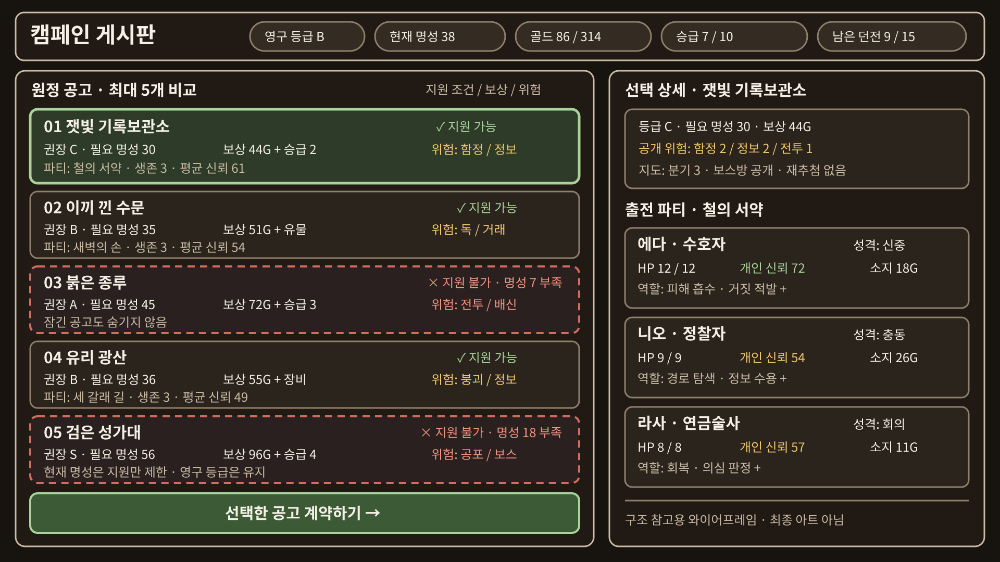
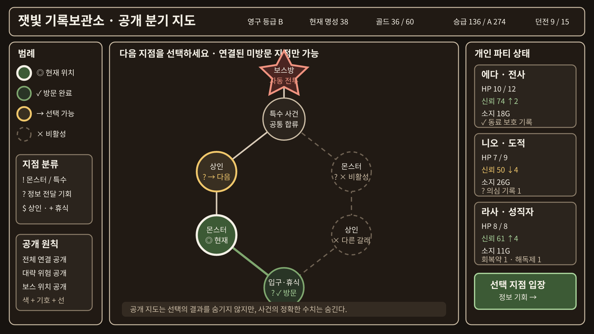
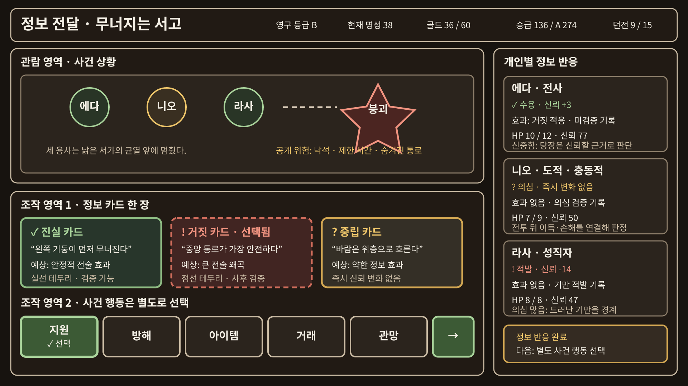
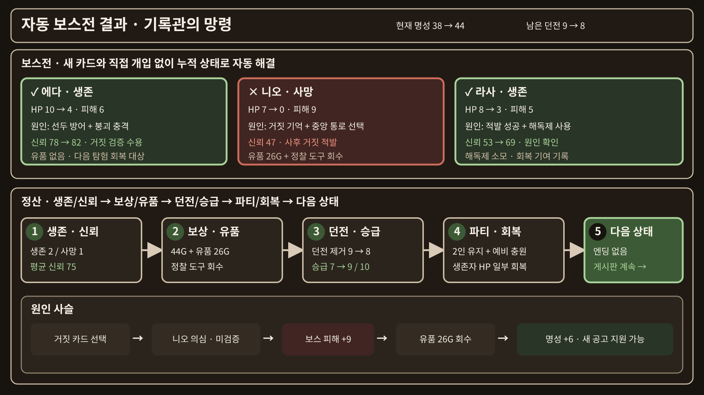
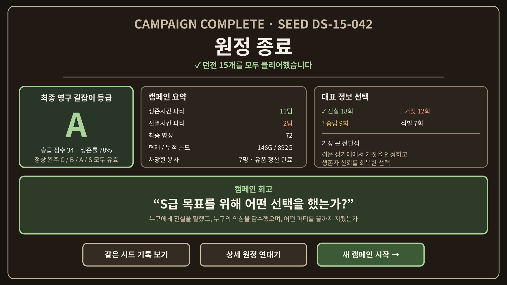

# 대표 화면 와이어프레임

초기 스케치인 [proto_image.png](../initialization/proto_image.png)의 조우·지도·결과
구도를 유지하면서, 던전 15개 캠페인의 인트로부터 엔딩까지를 보여주는 대표
화면군 6개다. 화면은 구조 참고용 와이어프레임이며 최종 아트나 실제 React
구현을 확정하지 않는다.

화면의 공식 규격은 [화면 규격](../experience/SCREEN_LAYOUT.md)에 있다. 이 문서는
그 규격이 각 화면에서 어떻게 채워지는지를 그림으로 보여준다.

> **이미지 재생성 대기 중.** 아래 설명은 현재 규칙을 따르지만 링크된 svg·png는
> 아직 이전 규칙으로 그려진 것이라 위험도와 인트로를 반영하지 않는다. 재생성은
> 배정표의 `D8`이 맡는다. 규칙이 필요하면 설명과 공식 문서를 보고, 배치 감각이
> 필요할 때만 이미지를 참고한다.

[전체 모음 SVG](svg/screen-overview.svg) ·
[전체 모음 PNG](png/screen-overview.png)

## 공통 게임 셸

모든 화면은 상단 상태 바와 좌 60%·우 40%(3:2) 본문을 가진 공통 셸 위에서 콘텐츠만
교체한다. 상단은 다음을 유지한다.

- 영구 길잡이 등급과 진입 가능한 위험도
- 현재 명성과 다음 승급 요구치
- 현재 골드
- 남은 던전 수와 출전 가능한 캐릭터 수

등급과 명성은 서로 다른 그룹과 라벨로 구분한다. 진입 한계를 정하는 것은
등급이고, 명성은 승급 요구치이기 때문이다. 둘을 붙여 두면 명성이 공고를 막는
것처럼 읽힌다.

## 1. 인트로

캠페인 시작 시 한 번 나온다. 이미지는 `D8`에서 새로 그린다.

- 길잡이가 누구이고 무엇을 할 수 있는지를 전달한다.
- 개입 수단이 직접 전투가 아니라 정보와 경로라는 것을 분명히 한다.
- 캠페인의 목표와 끝나는 조건을 미리 알린다.
- 게시판으로 진입하는 것 외에 다른 선택지를 두지 않는다.

## 2. 공고 게시판과 계약

- 왼쪽 게시판에 최대 5개 공고를 위험도 높은 순으로 배치한다.
- 진입 불가 공고는 숨기지 않고 붉은 테두리와 사유로 구분한다.
- 오른쪽 상세에서 던전 정보, 공개 위험 태그, 답사 기록, 출전 3인, 계약 보상을 본다.
- 답사 기록은 그 던전의 활성 생태 규칙 중 현재 위험도가 허용하는 만큼만 공개한다.
- 각 캐릭터는 직업·성격·HP·개인 신뢰·소지 골드를 따로 표시한다.

## 3. 던전 지도

- 입구는 아래, 보스방은 위에 둔다. 한 지점의 선택지는 최대 2개다.
- 범례 영역을 두지 않고 지점을 아이콘 자체로 구분한다.
- 현재 위치·방문 완료·선택 가능·비활성·보스방을 색과 형태로 함께 구분한다.
- 키보드로 다음 지점을 선택할 수 있다.

## 4. 던전 진행

- 왼쪽을 상 40%·하 60%로 나눈다. 위는 관람, 아래는 조작이다.
- 카드 3장은 **같은 디자인**으로 제시하고 유형·발각 위험·예상 신뢰 변화를 감춘다.
- 판단 재료는 답사 기록의 활성 규칙과 지금까지 사건 묘사에 나온 단서다.
- 카드 선택 뒤 살아 있는 파티원별 `수용`·`의심`·`적발`을 따로 보여준다.
- 반응을 처리한 뒤에도 지원·방해·아이템·거래·관망 행동을 별도로 선택한다.

## 5. 보스전과 정산

- 턴 단위 자동 보스전의 턴별 행동·피해와 생존·사망을 먼저 보여준다.
- 이어서 생존·신뢰, 보상·유품, 위험도 변화, 명성 순서를 번호로 설명한다.
- 실패했다면 위험도가 오른 것과 그것이 다음 보상에 미치는 영향을 함께 표시한다.
- `선택 → 개인 반응 → 피해 → 보상·손실 → 캠페인 변화`의 원인 사슬을 강조한다.
- 승급 요건을 만족하면 `승급하기` 버튼으로 명성 승급과 골드 승급을 고른다.

## 6. 캠페인 엔딩

- 엔딩 5종 중 무엇이 왜 성립했는지와 최종 등급을 가장 크게 보여준다.
- 생존·사망 캐릭터, 신뢰 0 누적, 최종 명성·누적 골드를 요약한다.
- 카드 전달과 반응의 누적 통계, 가장 큰 전환점, 원정 연대기를 함께 보여준다.
- 정상 완주와 조기 종료 모두 `어떤 선택이 이 결말을 만들었는가?`를 회고한다.

## 가시성 원칙

- 개별 화면은 1920×1080, 전체 모음은 3840×2160이다.
- 본문 24px 이상, 제목 36px 이상, 주요 선 3px 이상을 사용한다.
- 어두운 잉크 배경과 밝은 양피지 글자로 대비를 확보한다.
- 외부 이미지와 이모지에 의존하지 않고 SVG 기본 도형과 텍스트 기호를 사용한다.
- 색은 보조 단서이며 라벨, 기호, 선 종류와 테두리 형태가 의미를 함께 전달한다.

## 관련 문서

- [화면 규격](../experience/SCREEN_LAYOUT.md)
- [온보딩과 인터페이스](../experience/ONBOARDING_AND_INTERFACE.md)
- [캠페인 시퀀스](campaign-sequence.md)
- [탐험 상태 전이](expedition-state.md)
