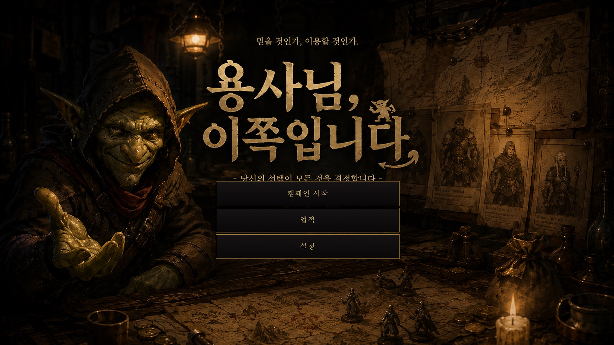
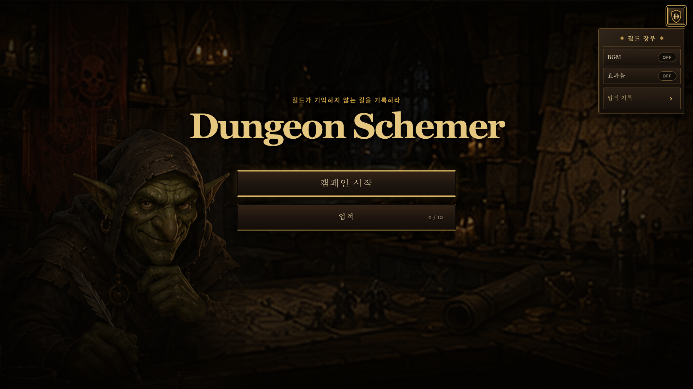
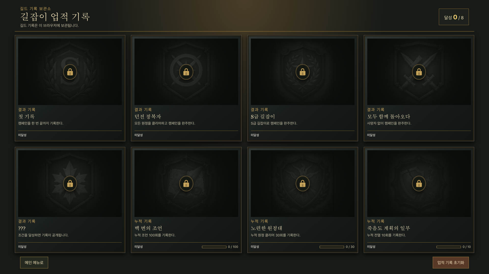
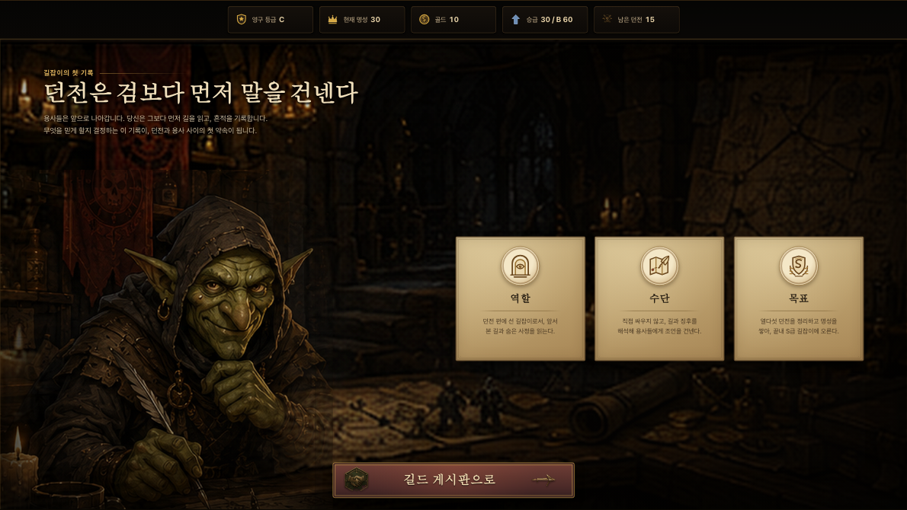
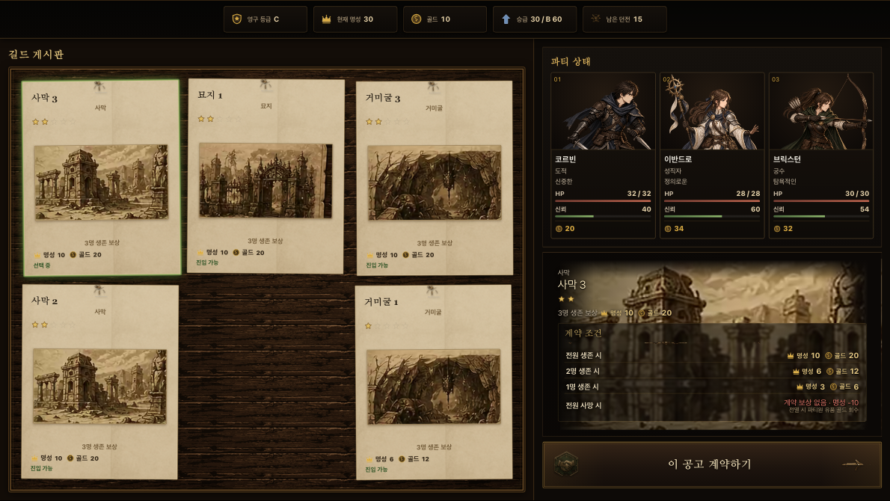
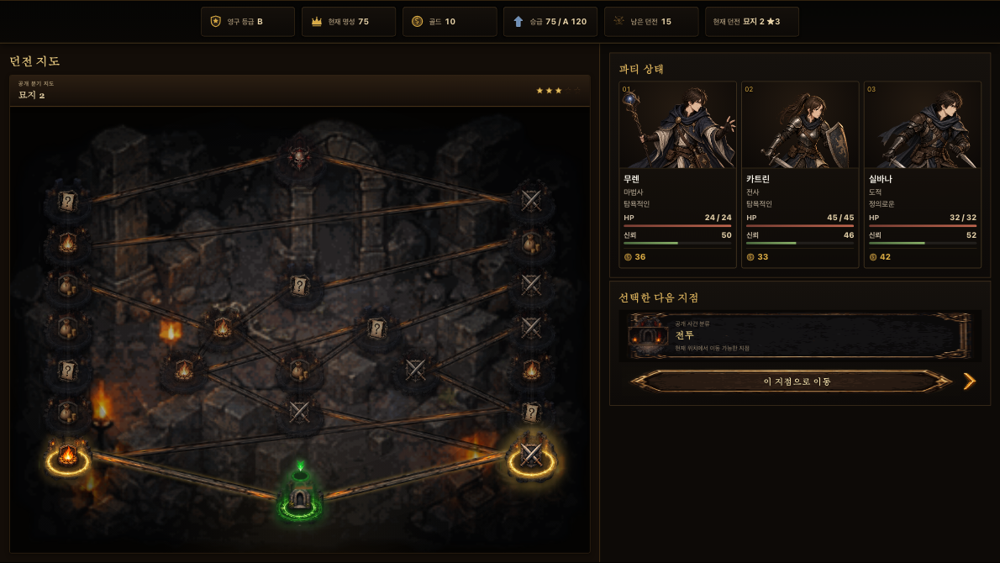
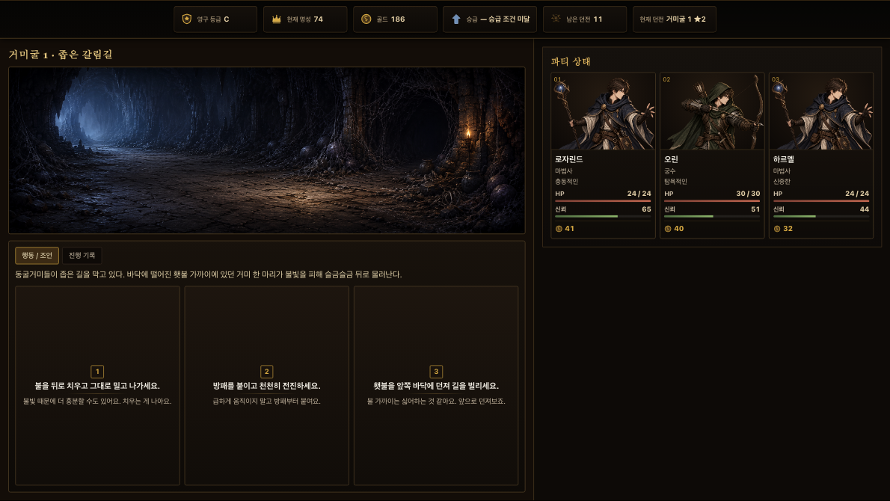
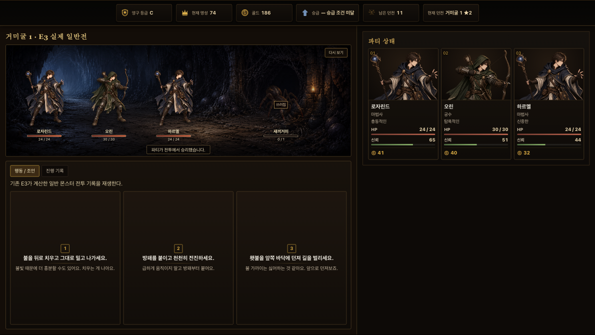
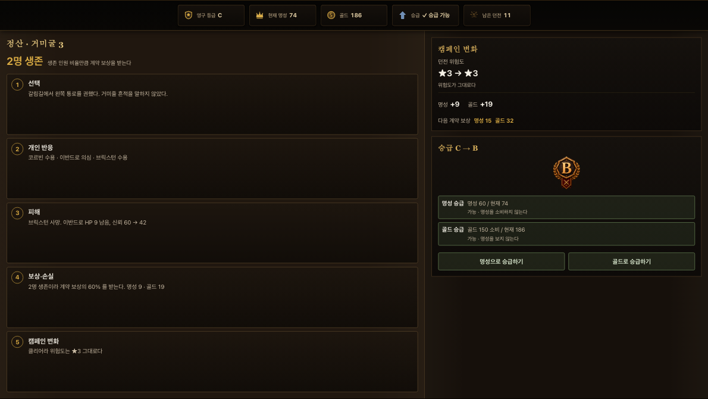
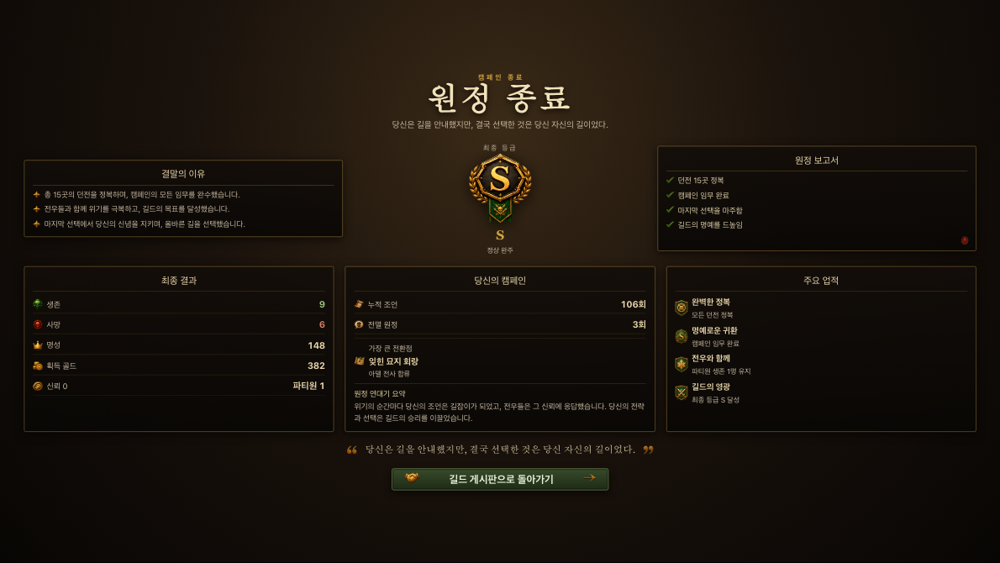

# 대표 화면

캠페인 화면 일곱 장과 캠페인 밖 메타 화면 두 장, 전역 메뉴 한 장까지 모두 열 장이다. **구현된
화면을 1920×1080 고정 캔버스에서 그대로 캡처한 것**이며, 손으로 그린
와이어프레임이 아니다.
그림이 곧 지금 돌아가는 화면이므로 설명과 어긋날 수 없다.

화면의 공식 규격은 [화면 규격](../experience/SCREEN_LAYOUT.md)에 있다. 이 문서는
그 규격이 각 화면에서 어떻게 채워지는지를 그림으로 보여준다.

일부 화면은 아직 규칙이 없어 고정 데이터로 그린다. 어느 자리가 그런지는
[화면·규칙 인수인계 계약](../technical/SCREEN_ADAPTER_CONTRACT.md)에 있다.

[캠페인 화면 일곱 장 전체 모음](png/screen-overview.png)

## 캠페인 밖 메타 화면

메인 메뉴와 업적 기록은 `GameShell`과 상단 상태 바를 사용하지 않고 고정 캔버스
전체를 점유한다.

### 메인 메뉴

- `/`에서 일러스트 중앙 명패를 덮는 `캠페인 시작`·`업적` 실제 링크와 `설정` 버튼을 제공한다.
- 세 컨트롤은 1672:941 일러스트 캔버스 좌표를 공유하며, 설정은 같은 전역 퀵 메뉴를 연다.

### 전역 퀵 메뉴

- 메인 메뉴 중앙의 `설정`과 캠페인 화면 우측 상단 trigger에서 BGM·효과음을 각각 켜고 끈다.
- 최초값은 모두 OFF이며 ON/OFF를 색뿐 아니라 문구와 switch 상태로 구분한다.
- `업적 기록`은 URL과 캠페인 phase를 유지한 overlay를 열고 `이전 화면으로` 또는
  `Escape`로 원래 화면에 돌아온다.

### 길잡이 업적 기록

- `/achievements`에서 결과형·누적형 업적 열두 장을 4열×3행으로 보여준다.
- 잠금·해금 상태, 공개 누적 진행도, 저장 상태를 색과 문구로 함께 구분한다.
- 검증된 이전 화면으로 돌아갈 수 있고, 확인 대화상자를 거쳐 이 브라우저의 기록만 초기화한다.

## 공통 게임 셸

아래 캠페인 화면 일곱 장은 상단 상태 바와 좌 60%·우 40%(3:2) 본문을 가진 공통
셸 위에서 콘텐츠만 교체한다. 상단은 다음을 유지한다.

- 영구 길잡이 등급과 진입 가능한 위험도
- 현재 명성과 다음 승급 요구치
- 현재 골드
- 남은 던전 수와 출전 가능한 캐릭터 수

등급과 명성은 서로 다른 그룹과 라벨로 구분한다. 진입 한계를 정하는 것은
등급이고, 명성은 승급 요구치이기 때문이다. 둘을 붙여 두면 명성이 공고를 막는
것처럼 읽힌다.

## 1. 인트로 · U2

- 길잡이가 누구이고 무엇을 할 수 있는지를 전달한다.
- 개입 수단이 직접 전투가 아니라 조언과 경로라는 것을 분명히 한다.
- 캠페인의 목표와 끝나는 조건을 미리 알린다.
- 게시판으로 진입하는 것 외에 다른 선택지를 두지 않는다.

## 2. 공고 게시판과 계약 · U3

- 왼쪽 게시판에 최대 5개 공고를 위험도 높은 순으로 배치한다.
- 진입 불가 공고는 숨기지 않고 붉은 테두리와 사유로 구분한다.
- 오른쪽 상세에서 던전 정보, 공개 위험 태그, 답사 기록, 출전 3인, 계약 보상을 본다.
- 답사 기록은 그 던전의 활성 생태 규칙 중 현재 위험도가 허용하는 만큼만 공개한다.
- 각 캐릭터는 직업·성격·HP·개인 신뢰·소지 골드를 따로 표시한다.
- 상단 길잡이 등급 버튼은 승급 가능할 때 색 외 강조와 빛나는 효과를 보인다. 누르면 명성·골드 경로를 고르는 오버레이가 열리고, 결과 확인 뒤 새 등급의 공고를 보여준다.

## 3. 던전 지도 · U4

- 입구는 아래, 보스방은 위에 둔다. 한 지점의 선택지는 최대 2개다.
- 범례 영역을 두지 않고 지점을 아이콘 자체로 구분한다.
- 현재 위치·방문 완료·선택 가능·비활성·보스방을 색과 형태로 함께 구분한다.
- 키보드로 다음 지점을 선택할 수 있다.

## 4. 던전 진행 · U5

- 왼쪽을 상 40%·하 60%로 나눈다. 위는 관람, 아래는 조작이다.
- 조언 3개는 **같은 디자인**으로 제시하고 유형·발각 위험·예상 신뢰 변화를 감춘다.
- 판단 재료는 답사 기록의 활성 규칙과 지금까지 사건 묘사에 나온 단서다.
- 조언 선택 뒤 살아 있는 파티원별 `수용`·`의심`·`적발`을 따로 보여준다.
- 반응과 사건 결과를 원인 순서로 보여주며, 사건용 별도 선택을 고르지 않는다.

## 5. 자동 전투 · U5-2

- 던전 진행 화면의 장면 슬롯에서 그대로 재생한다. 별도 화면을 열지 않는다.
- 정적 PNG 를 배치하고 `Idle → Attack Lunge → Hit Shake → Damage Number → HP Bar 감소` 를 순서대로 재생한다.
- 피해·확률·신뢰를 화면이 다시 계산하지 않는다. 규칙이 확정한 기록을 옮기기만 한다.
- 위 그림은 일반 몬스터 전투다. 보스전은 `E4` 가 아직 없어 화면에 fixture 임을 표시한다.

## 6. 정산 · U6

- 생존·신뢰, 보상·유품, 위험도 변화, 명성 순서를 번호로 설명한다.
- 실패했다면 위험도가 오른 것과 그것이 다음 보상에 미치는 영향을 함께 표시한다.
- `선택 → 개인 반응 → 피해 → 보상·손실 → 캠페인 변화` 의 원인 사슬을 강조한다.
- 승급 가능 여부는 캠페인 변화의 설명으로만 표시한다. 승급 버튼·선택·결과는 제공하지 않으며, 유일한 승급 경로는 U3 게시판 상단 등급 버튼이다.

## 7. 캠페인 엔딩 · U6

- 엔딩 5종 중 무엇이 왜 성립했는지와 최종 등급을 가장 크게 보여준다.
- 생존·사망 캐릭터, 신뢰 0 누적, 최종 명성·누적 골드를 요약한다.
- 조언 전달과 반응의 누적 통계, 가장 큰 전환점, 원정 연대기를 함께 보여준다.
- 정상 완주와 조기 종료 모두 `어떤 선택이 이 결말을 만들었는가?`를 회고한다.

## 이미지를 다시 만들 때

- `next build` 뒤 `next start` 로 띄운 **프로덕션 빌드**에서 1920×1080 으로 찍는다. dev 서버가 아니다.
- 저장은 0.62배로 줄여 둔다. 문서에서 읽기에 충분하고 저장소가 가벼워진다.
- 메타 화면 두 장은 실제 라우트의 1920×1080 캡처를 원본 크기로 보관한다.
- `/u1-test`~`/u6-test` 프리뷰 하네스의 탭과 안내 문구는 화면의 일부가 아니므로 감추고 찍는다.
- 전체 모음은 일곱 장을 2열로 붙인 것이다.
