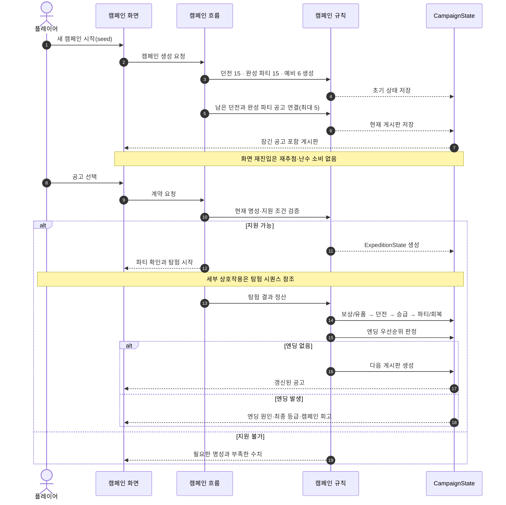
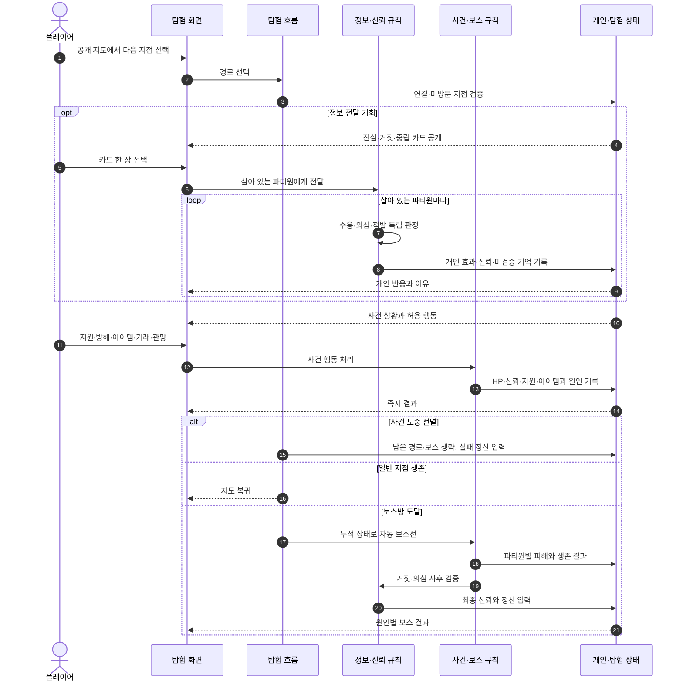
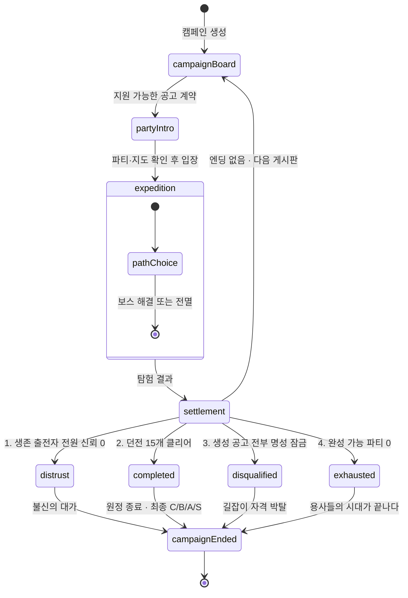
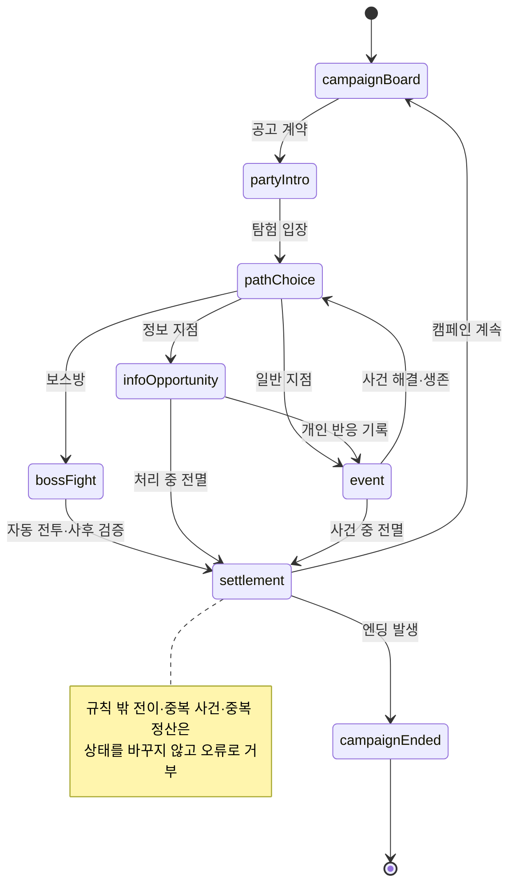

# 게임 흐름 다이어그램과 화면 와이어프레임 구현 계획

> **For agentic workers:** REQUIRED SUB-SKILL: Use superpowers:subagent-driven-development (recommended) or superpowers:executing-plans to implement this plan task-by-task. Steps use checkbox (`- [ ]`) syntax for tracking.

**Goal:** 최신 던전 15개 캠페인 문서를 캠페인·탐험 다이어그램 4장과 고가시성 대표 화면 와이어프레임 5장으로 시각화하고 Markdown·SVG·PNG로 제공한다.

**Architecture:** Markdown의 Mermaid 블록 네 개를 흐름 원본으로 삼아 임시 Mermaid CLI로 SVG와 PNG를 함께 렌더링한다. 화면은 편집 가능한 SVG 다섯 개를 원본으로 만들고 같은 SVG를 `resvg-js`로 PNG화하며, 전체 모음 SVG는 다섯 원본을 상대 참조한다. `docs/diagram/README.md`와 `docs/README.md`가 읽기 순서와 공식 문서 우선 원칙을 제공한다.

**Tech Stack:** Markdown, Mermaid `11.15.0` 임시 CLI, SVG 1.1, `@resvg/resvg-js-cli@2.6.2-beta.1`, Noto Sans CJK KR, Git

## Global Constraints

- 게임 규칙과 밸런스 수치, React 화면과 런타임 코드는 변경하지 않는다.
- `package.json`과 `pnpm-lock.yaml`에 렌더링 의존성을 추가하지 않는다.
- Mermaid CLI와 resvg-js CLI는 `pnpm dlx`의 임시 환경에서만 사용한다.
- 다이어그램 SVG는 최소 `2400×1600`, 화면 SVG는 `1920×1080`, 전체 모음은 `3840×2160`이다.
- 개별 이미지의 본문은 24px 이상, 제목은 36px 이상, 주요 선은 3px 이상으로 한다.
- 색만으로 뜻을 전달하지 않고 텍스트, `✓`·`!`·`?`·`×` 기호, 선 종류와 테두리 형태를 함께 사용한다.
- 외부 이미지와 글꼴별 모양이 다른 이모지를 사용하지 않는다.
- 한국어 글꼴은 `Noto Sans CJK KR, Noto Sans KR, Malgun Gothic, sans-serif` 순으로 폴백한다.
- `docs/initialization/proto_image.png`와 `제품 요구사항 대체됨` 역사 문서는 수정하지 않는다.
- 기존 사용자 변경을 덮어쓰거나 범위에 포함하지 않는다.
- 커밋 메시지는 제목과 본문을 모두 한국어로 작성한다.

---

## File Structure

| 파일 | 책임 |
| --- | --- |
| `docs/diagram/README.md` | 시각 자료 읽기 순서, 공식 문서 우선 원칙, 전체 인덱스 |
| `docs/diagram/campaign-sequence.md` | 캠페인 생성·게시판·탐험·정산·엔딩 Mermaid 원본과 해설 |
| `docs/diagram/expedition-sequence.md` | 경로·정보·개인 반응·사건·보스 Mermaid 원본과 해설 |
| `docs/diagram/campaign-state.md` | 정산과 네 엔딩 우선순위 Mermaid 원본과 해설 |
| `docs/diagram/expedition-state.md` | 공식 여덟 단계, 정보 유무, 전멸 조기 정산 Mermaid 원본과 해설 |
| `docs/diagram/screen-wireframes.md` | 대표 화면 5개의 표시 정보, 가시성 원칙, 이미지 링크 |
| `docs/diagram/svg/*.svg` | Mermaid 렌더 4개, 화면 원본 5개, 화면 전체 모음 1개 |
| `docs/diagram/png/*.png` | SVG 열 개와 같은 기본 이름의 PNG |
| `docs/README.md` | 공식 문서 목록에 시각 자료 인덱스 연결 |

---

### Task 1: Markdown과 Mermaid 원본을 작성한다

**Files:**
- Create: `docs/diagram/README.md`
- Create: `docs/diagram/campaign-sequence.md`
- Create: `docs/diagram/expedition-sequence.md`
- Create: `docs/diagram/campaign-state.md`
- Create: `docs/diagram/expedition-state.md`
- Create: `docs/diagram/screen-wireframes.md`

**Interfaces:**
- Consumes: `docs/GAME_PRINCIPLES.md`, `docs/design/CORE_GAME_LOOP.md`, `docs/systems/*.md`, `docs/experience/ONBOARDING_AND_INTERFACE.md`, 승인된 시각 자료 spec
- Produces: 각 다이어그램 Markdown에 정확히 하나의 `mermaid` fenced block, Task 2가 렌더링할 네 원본, Task 3 화면의 텍스트 계약

- [ ] **Step 1: 다이어그램 디렉터리와 인덱스를 만든다**

`docs/diagram/README.md`에는 다음 순서를 기록한다.

```markdown
# Dungeon Schemer 시각 자료

이 디렉터리는 공식 게임 문서를 이해하기 쉽게 요약한 파생 자료다. 규칙이 충돌하면 `docs/GAME_PRINCIPLES.md`와 `docs/design`, `docs/systems`, `docs/experience`의 공식 문서가 우선한다.

## 추천 읽기 순서
1. 캠페인 시퀀스
2. 탐험 시퀀스
3. 캠페인 상태 전이
4. 탐험 상태 전이
5. 대표 화면 와이어프레임

## 이미지 형식
- Markdown: 설명과 Mermaid 원본
- SVG: 확대·편집용
- PNG: IDE·Pull Request 미리보기용
```

각 항목은 대응 Markdown, SVG와 PNG에 상대 링크한다. 화면 전체 모음 `svg/screen-overview.svg`와 `png/screen-overview.png`는 별도 미리보기로 연결한다.

- [ ] **Step 2: 캠페인 시퀀스 Mermaid를 작성한다**

`campaign-sequence.md`의 Mermaid 블록은 아래 참여자와 흐름을 포함한다.



본문은 `현재 명성은 공고를 제한하지만 영구 길잡이 등급은 강등되지 않는다`, `같은 시드와 선택은 같은 결과를 만든다`를 설명하고 공식 근거 문서를 링크한다.

- [ ] **Step 3: 탐험 시퀀스 Mermaid를 작성한다**

`expedition-sequence.md`는 아래 핵심 흐름을 포함한다.



본문은 정보 전달이 사건 행동을 대체하지 않고, 보스방에는 새 카드·보스 거래·직접 전투가 없다는 점을 강조한다.

- [ ] **Step 4: 캠페인과 탐험 상태 Mermaid를 작성한다**

`campaign-state.md`는 아래 상태와 우선순위를 번호로 표시한다.



`expedition-state.md`는 아래 공식 상태와 조건부 전이를 사용한다.



- [ ] **Step 5: 화면 계약 문서를 작성한다**

`screen-wireframes.md`는 공통 HUD와 대표 화면 5개를 순서대로 설명한다. 공통 HUD에는 `영구 등급`, `현재 명성`, `현재/누적 골드`, `승급 점수`, `남은 던전`을 넣는다. 각 화면 절에는 다음 이미지를 SVG 우선, PNG 보조 링크로 넣는다.

```text
screen-01-campaign-board
screen-02-dungeon-map
screen-03-info-event
screen-04-boss-settlement
screen-05-campaign-ending
```

각 절은 승인된 spec의 표시 정보와 `proto_image.png`에서 이어받은 공간 구성을 설명하고, 화면은 구조 참고용 와이어프레임이며 최종 아트가 아님을 명시한다.

- [ ] **Step 6: 원본 구조 검사를 실행한다**

Run:

```bash
rg -n '^```mermaid$' docs/diagram/*.md
rg -n '보스 거래|직접 전투 개입|보스에게 정보' docs/diagram/*.md
```

Expected: 첫 명령은 다이어그램 Markdown 네 파일에서 정확히 네 줄을 출력한다. 둘째 명령은 `보스방에 제공하지 않는 것`을 설명하는 부정문만 출력한다.

- [ ] **Step 7: Task 1을 커밋한다**

```bash
git add docs/diagram/README.md docs/diagram/campaign-sequence.md docs/diagram/expedition-sequence.md docs/diagram/campaign-state.md docs/diagram/expedition-state.md docs/diagram/screen-wireframes.md
git commit -m "문서: 게임 흐름 다이어그램 원본을 작성한다" -m "캠페인과 탐험의 시퀀스·상태 전이를 Mermaid 원본으로 나눈다.
대표 화면 다섯 개의 표시 정보와 공식 문서 근거를 연결한다."
```

---

### Task 2: Mermaid 다이어그램을 SVG와 PNG로 렌더링한다

**Files:**
- Create: `docs/diagram/svg/campaign-sequence.svg`
- Create: `docs/diagram/svg/expedition-sequence.svg`
- Create: `docs/diagram/svg/campaign-state.svg`
- Create: `docs/diagram/svg/expedition-state.svg`
- Create: `docs/diagram/png/campaign-sequence.png`
- Create: `docs/diagram/png/expedition-sequence.png`
- Create: `docs/diagram/png/campaign-state.png`
- Create: `docs/diagram/png/expedition-state.png`

**Interfaces:**
- Consumes: Task 1의 Markdown마다 정확히 하나인 Mermaid block
- Produces: 같은 Mermaid 원본에서 생성된 다이어그램 SVG·PNG 네 쌍, Task 4가 검증할 8개 이미지

- [ ] **Step 1: 임시 Mermaid 설정을 만든다**

`/tmp/dungeon-schemer-mermaid-config.json`은 다음 값을 사용한다.

```json
{
  "theme": "base",
  "themeVariables": {
    "fontFamily": "Noto Sans CJK KR, Noto Sans KR, Malgun Gothic, sans-serif",
    "fontSize": "28px",
    "background": "#17130f",
    "primaryColor": "#211a14",
    "primaryTextColor": "#f4f0e6",
    "primaryBorderColor": "#cbbca5",
    "lineColor": "#d9cbb8",
    "secondaryColor": "#2d3b28",
    "tertiaryColor": "#3a2420",
    "noteBkgColor": "#2b241d",
    "noteTextColor": "#f4f0e6",
    "noteBorderColor": "#cbbca5"
  },
  "sequence": { "actorMargin": 80, "messageMargin": 50, "diagramMarginX": 60, "diagramMarginY": 60 },
  "state": { "padding": 24 }
}
```

- [ ] **Step 2: Markdown에서 Mermaid 원본 네 개를 임시 `.mmd`로 추출한다**

Node 표준 라이브러리만 사용해 각 Markdown의 첫 ` ```mermaid ... ``` ` 내용을 `/tmp/<base>.mmd`에 쓴다. Mermaid block이 없거나 두 개 이상이면 종료 코드 1로 실패시킨다.

Run:

```bash
node -e "const fs=require('fs'); for(const base of ['campaign-sequence','expedition-sequence','campaign-state','expedition-state']){const text=fs.readFileSync('docs/diagram/'+base+'.md','utf8'); const blocks=[...text.matchAll(/```mermaid\\n([\\s\\S]*?)```/g)]; if(blocks.length!==1) throw new Error(base+' mermaid blocks='+blocks.length); fs.writeFileSync('/tmp/'+base+'.mmd',blocks[0][1]);}"
```

Expected: 종료 코드 0과 `/tmp/*.mmd` 네 개.

- [ ] **Step 3: SVG와 PNG를 같은 원본에서 렌더링한다**

각 base에 대해 공식 Mermaid CLI `11.15.0`을 임시 실행한다. Puppeteer 설치 스크립트만 허용하고 저장소 manifest는 변경하지 않는다.

```bash
pnpm dlx --allow-build=puppeteer @mermaid-js/mermaid-cli@11.15.0 mmdc -i /tmp/campaign-sequence.mmd -o docs/diagram/svg/campaign-sequence.svg -c /tmp/dungeon-schemer-mermaid-config.json -w 2400 -H 1600 -b '#17130f'
pnpm dlx --allow-build=puppeteer @mermaid-js/mermaid-cli@11.15.0 mmdc -i /tmp/campaign-sequence.mmd -o docs/diagram/png/campaign-sequence.png -c /tmp/dungeon-schemer-mermaid-config.json -w 2400 -H 1600 -s 2 -b '#17130f'
```

같은 두 명령을 나머지 `expedition-sequence`, `campaign-state`, `expedition-state`에 적용한다.

- [ ] **Step 4: 다이어그램 산출물을 검사한다**

Run:

```bash
file docs/diagram/svg/{campaign-sequence,expedition-sequence,campaign-state,expedition-state}.svg
file docs/diagram/png/{campaign-sequence,expedition-sequence,campaign-state,expedition-state}.png
rg -n '<svg|Noto Sans CJK KR' docs/diagram/svg/*.svg
```

Expected: SVG 네 개와 PNG 네 개가 인식되고 SVG에 `<svg`와 지정 폰트가 있다.

- [ ] **Step 5: 네 PNG를 육안 검토한다**

각 PNG를 원본 해상도로 열어 한국어 잘림, 겹친 화살표, 읽기 어려운 작은 글자가 없는지 확인한다. 문제가 있으면 Mermaid 원본이나 설정을 고친 뒤 SVG와 PNG 쌍을 모두 다시 렌더링한다.

- [ ] **Step 6: Task 2를 커밋한다**

```bash
git add docs/diagram/svg/campaign-*.svg docs/diagram/svg/expedition-*.svg docs/diagram/png/campaign-*.png docs/diagram/png/expedition-*.png
git commit -m "문서: 캠페인과 탐험 흐름 이미지를 추가한다" -m "Mermaid 원본 네 개를 고가시성 SVG와 PNG로 렌더링한다.
캠페인·탐험 계층과 조건부 상태 전이를 확대 가능한 이미지로 제공한다."
```

---

### Task 3: 대표 화면 SVG와 PNG를 제작한다

**Files:**
- Create: `docs/diagram/svg/screen-01-campaign-board.svg`
- Create: `docs/diagram/svg/screen-02-dungeon-map.svg`
- Create: `docs/diagram/svg/screen-03-info-event.svg`
- Create: `docs/diagram/svg/screen-04-boss-settlement.svg`
- Create: `docs/diagram/svg/screen-05-campaign-ending.svg`
- Create: `docs/diagram/svg/screen-overview.svg`
- Create: 대응하는 `docs/diagram/png/screen-*.png` 6개

**Interfaces:**
- Consumes: Task 1의 `screen-wireframes.md`, `docs/initialization/proto_image.png`, 승인 spec의 가시성 수치
- Produces: 편집 가능한 1920×1080 화면 SVG 다섯 개, 상대 참조로 묶은 3840×2160 전체 모음, 같은 이름의 PNG 여섯 개

- [ ] **Step 1: 공통 SVG 시각 언어를 적용한다**

화면 SVG 다섯 개는 다음 루트와 공통 스타일로 시작한다.

```svg
<svg xmlns="http://www.w3.org/2000/svg" width="1920" height="1080" viewBox="0 0 1920 1080" role="img" aria-labelledby="title desc">
  <title id="title">화면 제목</title>
  <desc id="desc">화면의 구조와 핵심 정보</desc>
  <style>
    text { font-family: 'Noto Sans CJK KR','Noto Sans KR','Malgun Gothic',sans-serif; fill:#f4f0e6; }
    .title { font-size:44px; font-weight:700; }
    .heading { font-size:32px; font-weight:700; }
    .body { font-size:26px; }
    .small { font-size:24px; fill:#cbbca5; }
    .panel { fill:#211a14; stroke:#cbbca5; stroke-width:3; rx:20; }
    .active { fill:#2d3b28; stroke:#9fc982; stroke-width:5; }
    .danger { fill:#3a2420; stroke:#d9826c; stroke-width:5; }
    .muted { fill:#25211d; stroke:#887b6b; stroke-width:3; stroke-dasharray:12 10; }
  </style>
  <rect width="1920" height="1080" fill="#17130f"/>
</svg>
```

모든 화면은 높이 104px의 공통 HUD를 사용하고 `영구 등급 A`, `현재 명성 66`, `골드 152 / 누적 142`, `승급 274 / 370`, `남은 던전 7` 예시를 서로 분리된 라벨로 보여준다.

- [ ] **Step 2: 공고 게시판 화면을 그린다**

`screen-01-campaign-board.svg`는 왼쪽 1180px 공고 목록과 오른쪽 620px 계약 상세를 사용한다. 공고는 지원 가능 두 개를 실선·`✓ 지원 가능`으로, 명성 부족 두 개를 점선·`× 지원 불가 · 명성 15 부족`으로 표시한다. 상세에는 던전 등급·보상·7지점·위험, 3인의 직업·성격·HP·개인 신뢰·소지 골드를 행 단위로 넣는다.

- [ ] **Step 3: 던전 지도 화면을 그린다**

`screen-02-dungeon-map.svg`는 중앙 1100px 지도, 왼쪽 범례 300px, 오른쪽 파티 360px로 나눈다. 지도는 아래 `입구`에서 두 갈래로 나뉘어 공통 지점에서 합쳐지고 위 `보스방`으로 이어지는 7노드 C급 구조다. 현재는 굵은 이중 원과 `◆ 현재`, 방문은 체크와 실선, 선택 가능은 굵은 녹색 테두리와 `다음`, 비활성은 점선과 `잠김`으로 표현한다. 정보 지점에는 `! 정보`, 사건에는 `몬스터/휴식/상인/특수` 텍스트를 표시한다.

- [ ] **Step 4: 정보·사건 조우 화면을 그린다**

`screen-03-info-event.svg`는 초기 스케치처럼 위 270px 관람 영역과 아래 610px 조작 영역을 사용한다. 아래 왼쪽에는 `✓ 진실`, `! 거짓`, `— 중립` 카드 3장과 이득·위험을 표시하고, 카드 아래에 사건 행동 `용사 지원`, `몬스터 지원`, `아이템`, `관망`을 별도 행으로 둔다. 오른쪽에는 세 파티원의 `✓ 수용`, `? 의심`, `! 적발`, HP·신뢰 변화와 한 줄 이유를 표시한다.

- [ ] **Step 5: 보스·정산 화면을 그린다**

`screen-04-boss-settlement.svg`의 상단 320px은 `자동 보스전`, 생존 2·사망 1, 보스 정보·사건·아이템이 최종 피해에 미친 원인을 파티원별로 보여준다. 하단은 번호가 있는 네 패널 `1 생존·신뢰`, `2 보상·유품`, `3 던전·승급`, `4 파티·회복`을 왼쪽에서 오른쪽으로 연결하고, 맨 아래에 `선택 → 개인 반응 → 피해 → 보상·손실 → 캠페인 변화` 원인 사슬을 넣는다.

- [ ] **Step 6: 캠페인 엔딩 화면을 그린다**

`screen-05-campaign-ending.svg`는 중앙에 `원정 종료`와 `최종 길잡이 등급 A`를 64px 이상으로 표시한다. 왼쪽에는 판정 원인·클리어 15·생존/전멸 파티를, 오른쪽에는 최종 명성·골드·대표 진실/거짓 선택을 배치한다. 아래 회고 질문은 `S급 목표를 위해 어떤 선택을 했는가?`이고, `같은 시드 확인`, `새 캠페인` 버튼 자리를 구분한다.

- [ ] **Step 7: 전체 모음 SVG를 만든다**

`screen-overview.svg`는 3840×2160의 3열 2행 그리드다. 첫 행에 1·2·3번 화면, 둘째 행 중앙에 4·5번 화면을 배치한다. 각 화면은 같은 디렉터리의 원본을 `<image href="screen-01-campaign-board.svg" .../>`처럼 참조하고, 위에 번호·화면명을 36px로 붙인다.

- [ ] **Step 8: 화면 SVG를 PNG로 변환한다**

각 파일에 대해 임시 CLI를 사용한다.

```bash
pnpm dlx @resvg/resvg-js-cli@2.6.2-beta.1 --font-default-family 'Noto Sans CJK KR' docs/diagram/svg/screen-01-campaign-board.svg docs/diagram/png/screen-01-campaign-board.png
```

같은 명령을 화면 2~5와 `screen-overview`에 적용한다. `package.json`과 `pnpm-lock.yaml`이 바뀌지 않았는지 즉시 확인한다.

- [ ] **Step 9: 화면 산출물을 검사하고 육안 검토한다**

Run:

```bash
file docs/diagram/svg/screen-*.svg
file docs/diagram/png/screen-*.png
git diff -- package.json pnpm-lock.yaml
```

Expected: SVG 6개와 PNG 6개가 인식되고 package manifest diff는 비어 있다. PNG 여섯 개를 원본 해상도로 열어 글자 잘림, 패널 겹침, 상대 SVG 누락, 색 이외 단서 누락을 확인한다.

- [ ] **Step 10: Task 3을 커밋한다**

```bash
git add docs/diagram/svg/screen-*.svg docs/diagram/png/screen-*.png
git commit -m "문서: 대표 화면 와이어프레임을 추가한다" -m "초기 스케치와 최신 캠페인 문서를 결합한 대표 화면 다섯 개를 제작한다.
편집 가능한 SVG와 고해상도 PNG 및 전체 모음을 함께 제공한다."
```

---

### Task 4: 문서 인덱스를 연결하고 전체 검증한다

**Files:**
- Modify: `docs/README.md`
- Verify: `docs/diagram/**/*.md`, `docs/diagram/svg/*.svg`, `docs/diagram/png/*.png`

**Interfaces:**
- Consumes: Task 1~3의 Markdown 6개, SVG 10개, PNG 10개
- Produces: 공식 문서 진입점에서 접근 가능한 시각 자료와 검증 완료된 PR 범위

- [ ] **Step 1: docs 인덱스에 시각 자료를 추가한다**

`docs/README.md`의 공식 문서 목록에서 사용자 경험 다음, 기술 문서 전에 아래 절을 추가한다.

```markdown
### 시각 자료

- [게임 흐름 다이어그램](diagram/README.md): 캠페인·탐험 시퀀스, 상태 전이와 대표 화면 와이어프레임
```

기존 문서 우선순위와 원본 자료 설명은 바꾸지 않는다.

- [ ] **Step 2: 파일 수와 이름 대응을 검사한다**

Run:

```bash
find docs/diagram -maxdepth 1 -name '*.md' -type f | sort
find docs/diagram/svg -maxdepth 1 -name '*.svg' -type f | sort
find docs/diagram/png -maxdepth 1 -name '*.png' -type f | sort
```

Expected: Markdown 6개, SVG 10개, PNG 10개. SVG와 PNG의 기본 이름 집합이 같다.

- [ ] **Step 3: 로컬 Markdown 링크를 검사한다**

Node 표준 라이브러리로 `docs/diagram/*.md`와 `docs/README.md`의 상대 Markdown 링크와 이미지 링크를 추출한다. `http`, `https`, `#` 링크는 제외하고 각 기준 파일에서 해석한 경로가 존재하지 않으면 실패한다.

Run:

```bash
node -e "const fs=require('fs'),path=require('path'); const files=['docs/README.md',...fs.readdirSync('docs/diagram').filter(x=>x.endsWith('.md')).map(x=>'docs/diagram/'+x)]; const missing=[]; for(const file of files){const text=fs.readFileSync(file,'utf8'); for(const m of text.matchAll(/!?\\[[^\\]]*\\]\\(([^)]+)\\)/g)){const href=m[1].split('#')[0].replace(/%20/g,' '); if(!href||/^(https?:|#)/.test(href)) continue; const target=path.resolve(path.dirname(file),href); if(!fs.existsSync(target)) missing.push(file+' -> '+href);}} if(missing.length) throw new Error(missing.join('\\n')); console.log('local markdown links ok:',files.length);"
```

Expected: `local markdown links ok: 7`.

- [ ] **Step 4: 내용 불변식을 검사한다**

Run:

```bash
rg -n 'campaignBoard|partyIntro|pathChoice|infoOpportunity|event|bossFight|settlement|campaignEnded' docs/diagram/*.md
rg -n '불신의 대가|원정 종료|길잡이 자격 박탈|용사들의 시대가 끝나다' docs/diagram/campaign-state.md docs/diagram/campaign-sequence.md
rg -n '영구 등급|현재 명성|누적|승급|남은 던전' docs/diagram/screen-wireframes.md docs/diagram/svg/screen-*.svg
```

Expected: 공식 상태 8개, 엔딩 4개, 공통 HUD 5개 항목이 문서와 이미지에 존재한다.

- [ ] **Step 5: 전체 프로젝트 검증을 실행한다**

Run:

```bash
pnpm lint
pnpm typecheck
pnpm test
pnpm build
git diff --check
```

Expected: 모두 종료 코드 0. 기준 테스트 196개 이상이 통과한다.

- [ ] **Step 6: 최종 범위와 이미지 가시성을 검토한다**

Run:

```bash
git status --short --branch
git diff origin/main...HEAD --stat
git diff origin/main...HEAD -- package.json pnpm-lock.yaml docs/GAME_PRINCIPLES.md docs/design docs/systems docs/experience
```

Expected: 마지막 diff는 비어 있고 변경 범위는 plan, `docs/diagram`, `docs/README.md`뿐이다. PNG 10개를 최종 확인해 한국어, 화살표, 화면 제목과 핵심 숫자가 100% 배율에서 읽힌다.

- [ ] **Step 7: Task 4를 커밋한다**

```bash
git add docs/README.md
git commit -m "문서: 시각 자료 인덱스를 연결한다" -m "문서 진입점에서 게임 흐름 다이어그램과 화면 와이어프레임으로 이동할 수 있게 한다.
파일 대응·링크·내용 불변식과 전체 프로젝트 검증 결과를 확인한다."
```

- [ ] **Step 8: 완료 전 검증과 게시 절차로 전환한다**

`superpowers:verification-before-completion`으로 새 검증 결과를 확인하고, `superpowers:finishing-a-development-branch`와 `github:yeet`를 사용해 `agent/game-flow-diagrams`를 push한 뒤 `main` 대상 draft PR을 만든다.

---

## Self-Review

- Spec coverage: 다이어그램 4개, 화면 5개, 전체 모음, Markdown·SVG·PNG, 인덱스, 가시성, 비범위와 검증을 Task 1~4에 모두 연결했다.
- Placeholder scan: `TBD`, `TODO`, `적절한`, `나중에 구현` 같은 미정 지시가 없다.
- Interface consistency: Markdown base 이름과 SVG·PNG base 이름, 화면 1~5와 전체 모음 이름이 모든 Task에서 동일하다.
- Scope: 렌더 도구는 `pnpm dlx`만 사용하며 package manifest와 게임 규칙 문서는 변경하지 않는다.
