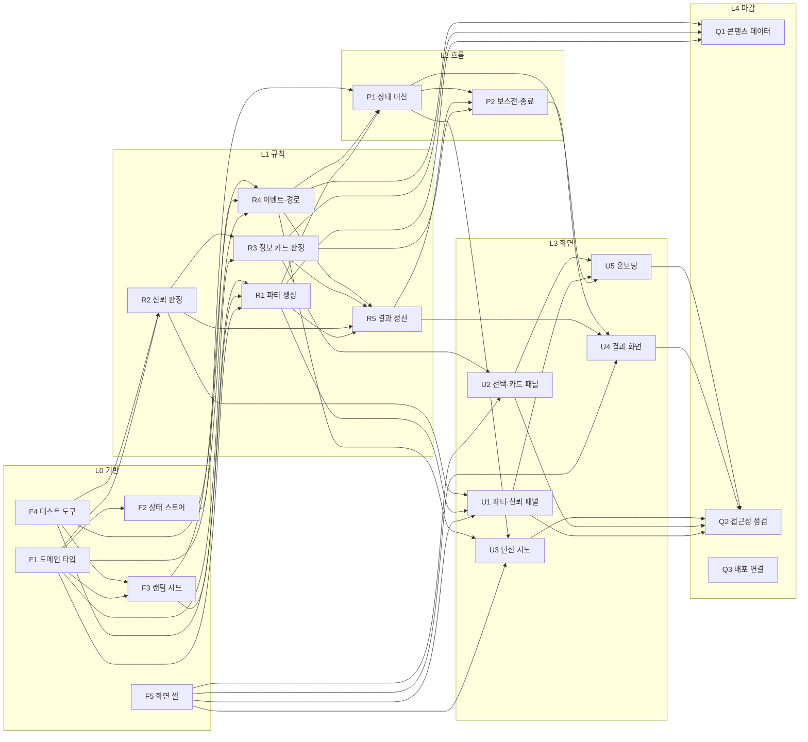

# 프로토타입 작업 배정표 재설계

**작성자:** LatteBun  
**작성 도구:** Claude Code

## 목적

`docs/technical/PROTOTYPE_WORK_ASSIGNMENT.md`를 구현 순서를 판단할 수 있는 문서로 다시 만든다.

현재 배정표는 8개의 큰 영역과 담당자 칸만 가진다. 세 명이 Pull Request 기반으로 병렬 작업하는 상황에서 다음을 판단할 수 없다.

- 어떤 작업을 끝내야 다른 작업을 시작할 수 있는가?
- 내가 지금 이 작업을 끝내면 누구의 대기가 풀리는가?
- 지금 시작해도 되는 작업이 무엇인가?

## 배경

### 코드 현황

게임 코드는 없다. `app/page.tsx`의 Hello World 화면이 전부다. 설치된 의존성은 Next.js, React, Tailwind CSS뿐이며 `DEVELOPMENT_ENVIRONMENT.md`가 표준으로 정한 Zustand, Framer Motion, Supabase와 검증 명령에 포함 예정인 Vitest는 아직 없다.

배정표의 8개 영역이 모두 미착수 상태이므로 지금이 순서를 정하기에 적절한 시점이다.

### 현재 배정표의 문제

1. **입도 불균형.** `게임 진행 기반` 한 행에 게임 시작, 상태 전환, 방 이동, 턴·선택 흐름, 종료 조건이 함께 들어 있다. 한 사람에게 배정하는 단위로 쓸 수 없다.
2. **순서 정보 없음.** 선행 관계가 표에 없다.
3. **소유권 충돌.** `데이터와 상태 관리` 행이 도메인 모델을 가지는데 나머지 7개 영역이 모두 그 모델에 의존한다. 세 명이 첫날부터 같은 파일을 건드리게 되어 `TEAM_DEVELOPMENT_WORKFLOW.md`의 "서로 다른 파일에서 작업" 원칙과 충돌한다.
4. **규칙과 UI가 한 행에 섞임.** `DEVELOPMENT_ENVIRONMENT.md`는 게임 규칙을 UI에서 분리해 테스트 가능하게 만들라고 명시한다. 그러나 `정보와 기만` 행은 판정 로직과 카드 UI를 동시에 소유한다.
5. **누락 영역.** Vitest 도입, 랜덤 시드와 재현성, 콘텐츠 데이터 분리, 접근성, Vercel 배포 연결이 어느 행에도 없다. 특히 접근성은 `ONBOARDING_AND_INTERFACE.md`가 "카드를 색상만으로 구별하지 않는다"를 원칙으로 정했는데 담당이 없다.
6. **완료 기준 없음.** 프로토타입 목표가 선언적이라 언제 끝났는지 판정할 수 없다. 선행 관계를 표시해도 다음 사람이 시작해도 되는지 알 수 없다.
7. **상태 칸 없음.** 진행 상황을 표에서 확인할 수 없다.
8. **범위 충돌.** `데이터와 상태 관리` 행의 "저장 전략"은 `TEAM_DEVELOPMENT_WORKFLOW.md`가 정한 MVP 범위(로그인·Supabase 제외) 밖이다.

## 설계 결정

| 항목 | 결정 |
| --- | --- |
| 입도 | 8행 → 20행. 계층(L0~L4) 5개로 묶는다 |
| 열 구성 | `ID`, `구현 영역`, `완료 기준`, `선행`, `풀리는 것`, `담당`, `상태` |
| 의존성 표현 | 표의 `선행`·`풀리는 것` 양방향 + 문서 상단 mermaid 그래프 |
| 프로토타입 범위 | 한 판 완주(파티 등장 → 정산). 성장·엔딩·저장·로그인 제외 |
| 병렬 전략 | 1차 선행 스프린트 후 규칙·흐름·화면 3트랙 |

### 결정의 근거

**계층 분리.** 규칙(L1)을 UI(L3)에서 떼어내면 규칙 작업의 완료 기준을 "테스트 통과"로 정의할 수 있다. 이는 `DEVELOPMENT_ENVIRONMENT.md`의 책임 경계 요구와 일치하며, 화면 작업자가 규칙 작업자를 기다리는 시간도 줄인다.

**양방향 의존성.** `선행`만 있으면 "지금 이걸 끝내면 누가 풀리는지"를 볼 수 없다. 병렬 작업에서는 후자가 우선순위 판단에 더 중요하다.

**선행은 직접 선행만 적는다.** 간접 선행은 생략한다. 예를 들어 `R3`은 완료 기준이 테스트 통과지만 선행에 `F4`를 쓰지 않는다. `R3`의 선행인 `R2`가 이미 `F4`를 요구하기 때문이다. 이 규칙 덕분에 `풀리는 것` 열은 `선행` 열의 정확한 역방향이 되고, 두 열의 불일치를 검사할 수 있다.

**수치를 Q1으로 모은다.** 모든 시스템 문서가 수치를 미확정으로 남겼다. `R1`~`R5`는 수치를 데이터에서 읽는 구조까지만 만들고 실제 값은 `Q1 콘텐츠 데이터 채우기`에서 정한다. 규칙 구현이 밸런스 논의에 막히지 않게 한다.

## 프로토타입 범위

### 포함

`CORE_GAME_LOOP.md`의 1~7단계. 새 파티 등장부터 결과 정산까지 한 판이 끊기지 않고 진행된다.

### 범위 밖

다음은 문서 하단에 명시만 하고 행을 만들지 않는다.

- 8단계 성장과 능력치(설득력·기만·생존·정보 수집·협상·은신)
- 4가지 엔딩 판정
- 던전의 장기 강화·약화와 판 간 상태 이월
- 저장과 복원, Supabase 연동
- 로그인과 사용자 계정

기존 배정표의 "저장 전략"은 여기로 옮긴다.

## 대상 문서 구조

`docs/technical/PROTOTYPE_WORK_ASSIGNMENT.md`를 다음 순서로 다시 쓴다.

1. 목적
2. 프로토타입 범위 (포함 / 범위 밖)
3. 의존성 그래프
4. 진행 순서와 3트랙
5. 배정표 (L0~L4)
6. 관리 원칙

## 의존성 그래프

`Q3`은 선행이 없고 다른 작업을 막지도 않으므로 간선 없이 홀로 놓인다. 아무 때나 집을 수 있는 작업이라는 뜻이다.

## 진행 순서와 3트랙

`F1`이 6개 작업의 선행이라 세 명이 동시에 여기서 막힌다. 이를 피하려고 선행 스프린트를 먼저 둔다.

### 1차 — 선행 스프린트

| 담당 | 작업 |
| --- | --- |
| A | `F1` 도메인 타입 정의 (단독 작업, 1~2일) |
| B | `F4` 테스트 도구 도입 |
| C | `F5` 화면 셸·레이아웃 |

`F4`와 `F5`는 `F1`과 무관하므로 동시에 진행한다. `F4`는 `R1`~`R4`의 완료 기준이 모두 테스트 통과이므로 두 번째 병목이다. 1차 안에 끝내야 한다. 먼저 끝난 사람은 `Q3`을 집을 수 있다.

### 2차 — 3트랙 병렬

| 트랙 | 담당 | 작업 |
| --- | --- | --- |
| 규칙 | A | `R2` → `R3` → `R5` |
| 흐름 | B | `F2` `F3` → `R1` `R4` → `P1` → `P2` |
| 화면 | C | `U1` `U2` → `U3` `U4` → `U5` |

트랙은 완전히 독립적이지 않다. 두 곳에서 교차한다.

- `R5`는 규칙 트랙이지만 흐름 트랙의 `R1`·`R4`를 기다린다. A는 `R2`·`R3`을 먼저 끝내고 `R5`는 B의 진행에 맞춰 시작한다.
- `U3`~`U5`는 화면 트랙이지만 흐름 트랙의 `P1`·`P2`를 기다린다. C는 `U1`·`U2`를 목 데이터로 먼저 만들고 규칙과 흐름이 준비되면 실제 상태에 연결한다.

### 3차 — 마감

`Q1` `Q2`를 세 명이 나눈다.

## 배정표

### L0 기반 — 선행 필수

| ID | 구현 영역 | 완료 기준 | 선행 | 풀리는 것 | 담당 | 상태 |
| --- | --- | --- | --- | --- | --- | --- |
| F1 | 도메인 타입 정의 | 파티원·성격·직업·신뢰·정보 카드·이벤트·경로 노드·런 상태 타입이 존재하고 `pnpm typecheck` 통과. 로직 없이 타입과 상수만 | — | **F2 F3 R1 R2 R3 R4** | | ⬜ |
| F4 | 테스트 도구 도입 | Vitest 설치, `pnpm test` 동작, 샘플 테스트 통과, 개발 환경 문서의 병합 전 검증 목록에 추가 | — | **F3 R1 R2 R4** | | ⬜ |
| F5 | 화면 셸·레이아웃 | 인터페이스 문서의 6개 화면 영역이 목 데이터로 배치된 라우트 존재 | — | **U1 U2 U3 U4** | | ⬜ |
| F2 | 상태 스토어 골격 | Zustand 설치, 런 상태와 UI 상태 스토어 분리, 초기 상태가 화면에 표시됨 | F1 | **P1** | | ⬜ |
| F3 | 랜덤 시드·재현성 | 같은 시드가 같은 파티·경로·이벤트를 만드는 테스트 통과. `Math.random` 직접 호출 금지 | F1 F4 | **R1 R4** | | ⬜ |

### L1 규칙 — UI 없는 순수 로직

| ID | 구현 영역 | 완료 기준 | 선행 | 풀리는 것 | 담당 | 상태 |
| --- | --- | --- | --- | --- | --- | --- |
| R2 | 개인 신뢰 판정 | 같은 행동이 성격별로 다른 증감을 내고, 변화 사유를 함께 반환하며, 신뢰 0이 실패 상태가 되는 테스트 통과 | F1 F4 | **R3 R5 U1** | | ⬜ |
| R1 | 파티 생성 규칙 | 시드로 3~5명의 직업·성격·초기 신뢰가 결정되고 재현되는 테스트 통과 | F1 F3 F4 | **R5 P1 U1 Q1** | | ⬜ |
| R4 | 이벤트·경로 생성 | 시드로 분기 경로가 생성되고 노드마다 몬스터·휴식·상인·특수 이벤트가 배치되며 각 이벤트가 선택지를 1개 이상 가짐 | F1 F3 F4 | **R5 P1 U3 Q1** | | ⬜ |
| R3 | 정보 카드 판정 | 대상(용사·보스) × 유형(진실·거짓·중립)에 대해 수용·의심·적발 결과, 신뢰 변화, 미검증 플래그를 반환하는 테스트 통과 | F1 R2 | **R5 P2 U2 Q1** | | ⬜ |
| R5 | 결과 정산 계산 | 런 종료 상태에서 생존자·신뢰 변화 내역·보상·영향을 준 선택 목록을 반환하는 테스트 통과 | R1 R2 R3 R4 | **P2 U4** | | ⬜ |

### L2 흐름

| ID | 구현 영역 | 완료 기준 | 선행 | 풀리는 것 | 담당 | 상태 |
| --- | --- | --- | --- | --- | --- | --- |
| P1 | 게임 상태 머신 | 파티 등장 → 경로 선택 → 이벤트 → 다음 노드 → 보스전 진입 전이가 테스트 통과하고 잘못된 전이는 거부됨 | F2 R1 R4 | **P2 U3 U5** | | ⬜ |
| P2 | 보스전과 종료 조건 | 보스전 개입, 미검증 정보의 검증, 승패·처형·클리어 종료 조건이 테스트 통과 | P1 R3 R5 | **U4** | | ⬜ |

### L3 화면

| ID | 구현 영역 | 완료 기준 | 선행 | 풀리는 것 | 담당 | 상태 |
| --- | --- | --- | --- | --- | --- | --- |
| U1 | 파티·개인 신뢰 패널 | 파티원별 직업·성격·신뢰 상태와 최근 변화 사유가 보이고, 개인별 차이를 확인할 수 있음 | F5 R1 R2 | **U5 Q2** | | ⬜ |
| U2 | 이벤트 선택·정보 카드 패널 | 선택 전 대상·예상 이득·알려진 위험이 보이고, 카드 3장 선택 후 반응이 표시됨 | F5 R3 | **U5 Q2** | | ⬜ |
| U3 | 던전 분기 지도 | 현재 위치·지나온 경로·다음 경로가 보이고 선택이 상태 머신에 전달됨 | F5 R4 P1 | **Q2** | | ⬜ |
| U4 | 결과 화면 | 생존자, 신뢰 변화와 사유, 보상, 영향을 준 선택 목록을 표시. `CLEAR`와 `GAME OVER`만 띄우지 않음 | F5 R5 P2 | **Q2** | | ⬜ |
| U5 | 30초 온보딩 | 첫 실행부터 첫 카드 선택 결과 확인까지 30초 내 도달하고 온보딩 목표 6개가 화면에서 전달됨 | P1 U1 U2 | **Q2** | | ⬜ |

### L4 마감

| ID | 구현 영역 | 완료 기준 | 선행 | 풀리는 것 | 담당 | 상태 |
| --- | --- | --- | --- | --- | --- | --- |
| Q1 | 콘텐츠 데이터 채우기 | 직업·성격·이벤트·정보 카드 풀이 데이터 파일로 분리되어 코드 수정 없이 추가 가능 | R1 R3 R4 | — | | ⬜ |
| Q2 | 접근성·피드백 점검 | 카드 유형이 색상 외 단서로 구분되고, 키보드 조작이 되며, 신뢰 변화에 사유 표시 누락이 없음 | U1 U2 U3 U4 U5 | — | | ⬜ |
| Q3 | Vercel 배포 연결 | `main` 병합 시 데모 URL이 갱신되고 핵심 흐름이 1회 재현됨 | — | — | | ⬜ |

## 관리 원칙

새 배정표에 함께 기록할 운영 규칙이다.

- 담당자 칸에는 구현을 맡기로 합의한 사람의 이름 또는 식별자를 적는다.
- 상태는 `⬜ 대기`, `🟡 진행 중`, `✅ 완료` 셋 중 하나로 표시한다.
- 작업을 시작하기 전에 `선행` 열의 모든 항목이 `✅`인지 확인한다.
- 작업을 완료하고 Pull Request를 병합할 때 같은 변경 단위에서 상태를 `✅`로 갱신한다.
- `선행`에는 직접 선행만 적는다. `풀리는 것`은 `선행`의 역방향이므로 한쪽을 고치면 반대쪽도 함께 고친다.
- 새 작업은 가장 가까운 기존 행에 넣고, 범위가 독립적이면 새 행을 만들면서 선행·풀리는 것을 함께 채운다.
- 세부 작업은 각 영역의 spec과 plan에서 관리한다. 이 표에는 큰 구현 책임과 순서만 기록한다.
- 프로토타입 범위가 바뀌면 이 문서와 `TEAM_DEVELOPMENT_WORKFLOW.md`를 같은 변경 단위에서 함께 갱신한다.

## 제외 범위

이 작업은 문서만 바꾼다. 다음은 하지 않는다.

- 게임 코드, 의존성, 설정 파일 변경
- Vitest·Zustand·Framer Motion 설치
- 담당자 이름 채우기 (팀이 직접 채운다)
- 미확정 수치와 밸런스 값 확정
- 다른 공식 설계 문서의 규칙 변경

## 함께 갱신할 문서

- `docs/README.md`: 배정표 항목 설명에 의존성·구현 순서를 다룬다는 점을 반영한다.
- `README.md`: 배정표 링크 설명을 같은 기준으로 맞춘다.

`DEVELOPMENT_ENVIRONMENT.md`의 `pnpm test` 도입은 `F4` 작업에서 처리한다. 이번 문서 작업에서는 건드리지 않는다.

## 검증

- 표의 `선행`과 `풀리는 것`이 정확히 역방향인지 20행 전부 대조한다.
- mermaid 그래프의 간선이 표의 `선행` 열과 일치하는지 확인한다.
- 그래프에 순환이 없는지 확인한다.
- 범위 밖 목록에 기존 "저장 전략"이 포함되었는지 확인한다.
- 누락으로 지적한 5개 영역(`F3` `F4` `Q1` `Q2` `Q3`)이 모두 행으로 존재하는지 확인한다.
