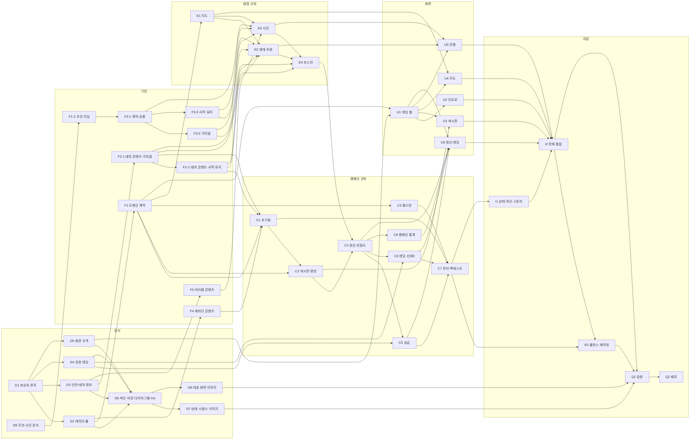

# 캠페인 개편 작업 배정표

## 목적과 현재 상태

이 문서는 2026-08-17 회의와 2026-08-18 화면 방향 논의에서 확정한 캠페인 개편의 구현 영역과 의존성을 관리한다. 규칙의 근거는 [캠페인 개편 설계](../superpowers/specs/2026-08-19-lattebun-campaign-rework-design.md)에 있고, 이 문서는 그 설계를 누가 어떤 순서로 구현하는지만 다룬다.

**이 표가 현재 유일한 작업 기준이다.** 아래 41개 항목을 모두 완료하면 인트로부터 캠페인 엔딩까지 동작한다. 이전 개편의 배정표는 다시 갱신하지 않으며 이 문서를 읽는 데 필요하지도 않다. 그 표에도 `F1`~`Q2`라는 글자가 있지만 완전히 다른 작업이다.

이 개편은 도메인 모델과 난이도 축과 자원 모델을 동시에 바꾼다. 그래서 이전에 완료했던 영역의 상당수가 다시 열린다. 작업이 부실했던 것이 아니라 **완료 기준 자체가 달라졌다.** 무엇이 그대로 살아 있고 무엇을 새로 만드는지는 아래 「재사용 자산과 새로 만드는 것」에 적었다.

## 개편 범위

### 포함

- 캐릭터 30명 풀, 임시 파티 편성, 월드턴과 휴식·백그라운드·중상
- 던전 위험도 ★1~5, 초기 위험도별 지도, 실패 시 위험도 상승과 재도전
- 테마 3종과 생태 규칙, 규칙 기반 도움·방해·중립 조언
- 명성 하한 0, 수동 승급과 골드 승급, 엔딩 5종
- 3:2 게임 셸(좌 60%·우 40%)과 인트로·게시판·지도·진행·정산 화면의 구조
- 인트로부터 월드턴까지의 상태 전이와 스토어
- 추론 정확도를 변수로 둔 백테스트 재측정

### 범위 밖

- 자동 전투 장면 연출과 애니메이션. 진행 화면 상단 40%는 구조와 자리까지만 만든다
- 보스전 턴 기록의 시각 표현. 규칙이 턴 기록을 남기는 데까지가 이번 범위다
- 저장·복원, Supabase, 로그인
- 길잡이의 직접 전투 개입, 보스와의 거래
- 등급별 3/4/5인 출전 파티
- 신뢰 0 회복 규칙과 길드 조사 이벤트

## 의존성 그래프



## 여섯 계층

| 계층 | ID | 책임 | 산출물 |
| --- | --- | --- | --- |
| 문서 | `D1`~`D6` | 설정집 개정 | 구현이 근거로 삼을 공식 규칙 |
| 기반 | `F1`~`F5` | 도메인 계약과 네 종류의 콘텐츠 데이터 | 타입과 데이터 |
| 캠페인 규칙 | `C1`~`C8` | 초기화·게시판·월드턴·정산·승급·엔딩·백테스트·통계 | UI 없는 순수 규칙과 시뮬레이터 |
| 탐험 규칙 | `E1`~`E4` | 지도·생태 추론·사건·보스전 | 한 원정의 재현 가능한 결과 |
| 화면 | `U1`~`U6` | 셸과 다섯 화면 | 규칙 결과를 설명하는 사용자 흐름 |
| 마감 | `I1` `I2` `B1` `Q1` `Q2` | 상태 머신·통합·밸런스·검증·배포 | 플레이 가능한 캠페인 |

### 왜 문서가 맨 앞인가

이전 개편에서 얻은 교훈이 `상수의 근거는 코드가 아니라 문서에 먼저 적혀 있다`였다. 그런데 그 개편의 밸런스 조정에서 `docs/systems/`만 검사했다가 `docs/design/CORE_GAME_LOOP.md`의 옛 값을 놓쳤다. 규칙 문서를 작업 항목이 아니라 부수 작업으로 두면 반드시 뒤처진다.

이번에는 문서를 선행으로 올렸다. `GAME_PRINCIPLES.md`가 `지속 파티`라고 적혀 있는 동안 캐릭터 풀을 구현하면, 그 구현은 어떤 문서도 근거로 대지 못한다.

### 시작 가능한 작업

문서 계층이 끝났고 `D9`·`F1-2`가 조언·사건 계약을 문서와 타입 양쪽에 놓았다. `C1`이 끝나 `C2`의 선행도 풀렸다.

지금 시작 가능한 것은 대표 화면 이미지 작업(`D8`), **조언 콘텐츠 계약과 공용 사건(`F3-1`)**, 아이템 콘텐츠(`F5`), 게시판·편성(`C2`), 위험도별 지도(`E1`), 인트로 화면(`U2`)이다. 여섯 개가 서로 파일이 겹치지 않는다. `F3-2`·`F3-3`은 `F3-1`이 검증기를 놓아야 시작할 수 있다.

`F3-1`이 임계 경로에 있으므로 먼저 잡는 것이 좋다.

### 임계 경로

```text
D9 → F1-2 → F3-1 → F3-2 → E3 → E2 → E4 → C4 → C6 → C7 → I1 → I2 → B1 → Q1 → Q2
```

카드와 사건을 합치면서 문서(`D9`)와 타입(`F1-2`)이 앞에 붙었다. 그 뒤의 병목은 조언 콘텐츠다. `F3-3`(사막·묘지)은 임계 경로에 없다 — 거미굴 콘텐츠만으로 `E2`·`E3`·`E4`·`U5`를 전부 개발할 수 있으므로 나중에 채운다.

## 배정표

| ID | 구현 영역 | 완료 기준 | 선행 | 풀리는 것 | 담당 | 상태 |
| --- | --- | --- | --- | --- | --- | --- |
| D1 | 최상위·루프 문서 개정 | 게임 원칙·게임 개요·핵심 게임 루프에서 `완성 파티`·`예비 인원`·`지속 파티`·`승급 점수`·`던전 등급`이 0건이고, 프로토타입 고정 범위가 캐릭터 풀·위험도·테마 3종으로 교체됨 | — | **D2 D3 D4 D5** | LatteBun | ✅ |
| D2 | 캐릭터·풀 문서 | `PARTY_AND_TRUST.md`가 캐릭터·신뢰 문서와 풀·월드턴 문서로 분할되고, 풀 30명·임시 편성·휴식·백그라운드·중상·신뢰 0 누적표가 확정 수치로 적힘 | — | **D6 F1 F4** | LatteBun | ✅ |
| D3 | 던전·테마·정보 문서 | 초기 위험도별 6~8 지점표, 재도전 규칙, 일반 지점의 조언 기회와 보스 조언 보장표, 테마 3종의 생태 규칙 계약이 적히고, 선택 전 조언 유형·발각 위험을 보여준다는 조항이 삭제됨 | — | **D6 F2-1 F5** | LatteBun | ✅ |
| D4 | 성장·엔딩 문서 | 위험도별 보상표, 명성 시작 30·하한 0, 명성 승급과 골드 승급표, 엔딩 5종과 판정 순서가 적히고 승급 점수 공식이 삭제됨 | — | **C5 C6 D6** | LatteBun | ✅ |
| D5 | 화면 규격 문서 | 3:2 게임 셸(좌 60%·우 40%), 기준 해상도, 화면별 좌·우 구조, 색 외 단서 원칙이 `SCREEN_LAYOUT.md`로 공식화되고 온보딩 문서의 화면 흐름표가 인트로를 포함해 갱신됨 | — | **D6 U1** | sbh3821 | ✅ |
| D6 | 색인·이관·다이어그램 md | README 색인과 읽기 순서가 새 문서 집합과 맞고, 회의록 2개가 `docs/meetings/`로 이관되며, 캠페인·탐험 상태·시퀀스 4개와 대표 화면 6장의 md가 새 규칙으로 갱신됨 | — | **D7 D8** | LatteBun | ✅ |
| D7 | 상태·시퀀스 다이어그램 이미지 재생성 | 캠페인·탐험 상태 및 시퀀스 4장의 SVG·PNG가 최신 md에서 재생성되고 PR #58에 반영됨 | — | **Q1** | sanghwan.yoo | ✅ |
| D8 | 대표 화면 이미지 재작업 | 인트로를 포함한 대표 화면 6장의 SVG·PNG와 전체 모음이 최신 화면 설계에 맞게 재작업되고, 텍스트·밀도·순차 턴제 보스전 정보가 확인됨 | — | **Q1** |  | ⬜ |
| D9 | 조언·사건 통합 문서 개정 | 게임 원칙 2가 조언 모델로 바뀌고, `진실·거짓·중립`과 `정보 전달 기회`가 `docs/`(회의록·spec·원본 제외)에서 0건이며, 조언 콘텐츠 계약과 강한 연계·전 경로 공통 지점이 적힘 | — | **F1-2** | LatteBun | ✅ |
| F1 | 도메인 계약 재정의 | 캐릭터 풀·위험도·임시 파티·월드턴·엔딩 5종을 담은 캠페인·원정 상태 타입과 시드 스트림 이름이 있고 타입 검사 통과. 파티 영속·던전 등급 타입 제거 | — | **C1 C2 C3 E1 U1** | LatteBun | ✅ |
| F1-2 | 조언 도메인 타입 개정 | `AdviceOutcome`·`EcologyRelation`·`ClueId`·`SituationEvent`·`AdviceOption`이 있고 `TruthType`·`InfoCard`·`InfoSubject`·`InfoClaim`·`DungeonEvent`·`EventChoice`가 제거되며 타입 검사와 전체 테스트 통과 | — | **F3-1** | LatteBun | ✅ |
| F2-1 | 테마 콘텐츠 · 거미굴 | 거미굴의 생태 규칙 6개·몬스터 5종·위험도 구간별 보스 4종이 있고, 조건부 규칙이 1개 이상이며, 수량·중복·빈 문구 검증 테스트 통과 | — | **F2-2 C1 E2 E4** | LatteBun | ✅ |
| F2-2 | 테마 콘텐츠 · 사막·묘지 | 사막·묘지도 같은 계약(생태 규칙 6개·몬스터 5종·위험도 구간별 보스 4종, 조건부 규칙 1개 이상)을 만족하고 수량·중복·빈 문구 검증 테스트 통과 | — | **C1 E2 E4** | LatteBun | ✅ |
| F3-1 | 조언 콘텐츠 계약·검증기와 공용 사건 | 사건 검증기가 조언 3개·도움방해중립 각 1개·기본 결과·중복·빈 문구를 검사하고 위반 시 생성 오류를 반환하며, 생태 규칙을 참조하지 않는 공용 사건 15개가 검증을 통과 | — | **F3-2 F3-3 E3** |  | ⬜ |
| F3-2 | 조언 콘텐츠 · 거미굴 | 거미굴 생태 규칙을 참조하는 전용 사건 16개가 있고, 활성 규칙마다 도움·방해·중립이 각각 2개 이상이며, 단서를 남기는 사건과 강한 연계 사건이 각각 1개 이상 존재하고 검증 통과 | F3-1 | **E2 E3** |  | ⬜ |
| F3-3 | 조언 콘텐츠 · 사막·묘지 | 사막·묘지도 같은 계약으로 전용 사건 16개씩을 채우고 검증 통과 | F3-1 | **E2 E3** |  | ⬜ |
| F4 | 캐릭터 콘텐츠 | 직업 5종이 최대 HP를 갖고, 성격 5종과 이름 30개 이상이 있으며, 30명 풀을 이름·직업·성격 중복 없이 생성할 수 있음을 용량 검증 테스트가 확인 | — | **C1** | LatteBun | ✅ |
| F5 | 아이템 콘텐츠 | 치료제·독·식량·정보 두루마리·유인용 미끼 5종과 가격이 있고, 식별자·문구 중복과 빈 값이 없으며 부족하면 생성 오류를 반환 | — | **E3** |  | ⬜ |
| C1 | 캠페인 초기화 | 5직업×6명·5성격×6명의 30명 풀, 테마 3종×5개와 초기 위험도 3/4/4/3/1의 던전 15개, 생태 패키지의 활성 규칙·출현 잡몹·보스, 시작 명성 30·골드 10이 시드로 재현되는 테스트 통과 | — | **C2 C7** | SangHwan Yoo | ✅ |
| C2 | 게시판·임시 파티 편성 | 진입 가능한 미클리어 던전을 위험도 높은 순으로 최대 5개 노출하고, 부족하면 진입 불가 던전을 사유와 함께 채우며, 출전 가능 캐릭터에서 서로 다른 직업 3명을 시드로 편성하고 공고마다 공개 위험 태그를 제공하는 테스트 통과 | — | **C4 U3** |  | ⬜ |
| C3 | 월드턴 | HP 50% 미만 강제 휴식, 나머지의 휴식·백그라운드 절반 배정, 최대 HP 비례 회복, HP 하한 1, 20% 미만 중상과 다음 턴 출전 불가가 동작하고 백그라운드 사망 0건 | — | **C7** | sanghwan.yoo | ✅ |
| C4 | 정산·위험도 상승 | 생존 3/2/1명의 100·60·30% 보상, 전멸 시 유품 회수와 상승 전 위험도 기준 명성 손실·하한 0, 던전 위험도 +1과 ★5 상한, 상승한 위험도의 보상표가 다음 공고에 반영되는 테스트 통과 | C2 E4 | **C5 C6 C8 U6** |  | ⬜ |
| C5 | 승급 | 요구 명성 60/120/200 무료 승급과 골드 150/320/600 승급이 모두 동작하고, 자동 승급이 일어나지 않으며, 강등이 없고 승급 점수 공식이 코드에서 제거됨 | C4 | **C7 U6** |  | ⬜ |
| C6 | 엔딩·신뢰 0 누적 | 엔딩 5종이 명시된 우선순위로 판정되고, 신뢰 0 누적 2~4명의 수용·적발 보정이 조언 판정에 적용되며, 5명에서 즉시 누적 고발 엔딩이 나는 테스트 통과 | C4 | **C7 U6** |  | ⬜ |
| C7 | 캠페인 전이·백테스트 | 게시판부터 엔딩까지 순수 전이 함수로 진행되고, 의도 3종 × 추론 정확도 2종의 6전략으로 10,000시드 보고서가 생성되며, 생성 오류와 시작 즉시 진행 불가 시드가 0건 | C5 C6 | **B1 I1** |  | ⬜ |
| C8 | 캠페인 통계 | 조언 전달·반응 횟수, 생환·전멸 원정 수, 가장 큰 전환점, 원정 연대기가 캠페인 상태에 누적되고 정산 원인 사슬이 만들어지는 테스트 통과 | C4 | **U6** |  | ⬜ |
| E1 | 위험도별 지도 생성 | 초기 위험도로 정해진 6~8 일반 지점이 실패 뒤에도 고정되고, 한 지점의 선택지가 최대 2개이며 분기가 다시 합류하고 모든 경로 길이가 같으며, 재도전 시 지도만 재생성되고 보스가 유지되며, 각 지점이 전 경로 공통인지 노출하고 ★3·★4에 공통 지점 2곳·★5에 4곳을 보장하며 못 채우면 생성 오류 | — | **E2 E3 U4** |  | ⬜ |
| E2 | 조언 판정 | 던전마다 활성 규칙 3개를 뽑고 위험도별로 3/2/1개를 공개하며, 조언의 정합·모순이 활성 규칙으로 판정되고, 살아 있는 파티원별 수용·의심·적발을 독립 판정해 한 명이라도 수용하면 실행하며, 아무도 수용하지 않으면 기본 결과가 나오고 보스 정보 보장 1~2회를 모든 경로가 충족 | F3-2 F3-3 E1 | **E4 U5** |  | ⬜ |
| E3 | 사건 배치·단서·연계 | 몬스터·휴식·상인·특수 네 분류가 모든 경로에 한 번 이상 나오고 한 던전 안에서 사건이 중복되지 않으며, 방문한 사건의 단서가 누적되어 약한 연계가 슬롯을 교체하고, 위험도별 강한 연계 쌍이 전 경로 공통 지점에 배치되는 테스트 통과 | E1 F3-1 F3-2 F3-3 F5 | **E4 U5** |  | ⬜ |
| E4 | 턴 단위 보스전 | 자동 전투가 턴별 행동·피해 기록을 남기고, 수용한 보스 조언의 유형별 보정과 누적 상하한이 적용되며, 전투 뒤 방해·의심 기록이 검증되어 신뢰가 갱신되는 테스트 통과 | E2 E3 | **C4** |  | ⬜ |
| U1 | 3:2 게임 셸 | 상단 상태 바와 좌 60%·우 40% 본문을 가진 공통 셸 위에서 모든 화면이 콘텐츠만 교체하고, 1280×720 기준과 1024×640 최소에서 가로 스크롤이 생기지 않음 | — | **U2 U3 U4 U5 U6** | SangHwan Yoo | ✅ |
| U2 | 인트로 화면 | 길잡이 역할·개입 수단·캠페인 목표를 전달하고 게시판으로 진입하며, 캠페인 시작 시 이 화면이 먼저 나옴 | — | **I2** |  | ⬜ |
| U3 | 게시판·계약 화면 | 공고 최대 5장이 게시판 위에 배치되고 진입 불가가 붉은 테두리와 사유로 구분되며, 상세에서 던전 정보·공개 위험 태그·답사 기록·출전 3인 카드·계약 보상과 계약 버튼을 보여줌 | C2 | **I2** |  | ⬜ |
| U4 | 던전 지도 화면 | 범례 영역이 없고 지점이 아이콘으로 표현되며, 현재 위치·방문 완료·선택 가능·비활성·보스방이 색과 형태로 함께 구분되고 키보드로 다음 지점을 선택할 수 있음 | E1 | **I2** |  | ⬜ |
| U5 | 던전 진행 화면 | 좌측이 상 40%·하 60%로 나뉘고, 상황 묘사 아래 조언 3개가 같은 디자인으로 유형·발각 위험·예상 신뢰 변화를 감추며, 선택 뒤 반응·사건·수치 변화가 인과 순서로 나타남 | E2 E3 | **I2** |  | ⬜ |
| U6 | 정산·승급·엔딩 화면 | 정산이 원인 순서로 나열되고 위험도와 보상 변화가 함께 표시되며, 승급하기 버튼으로 명성·골드 승급을 고를 수 있고 엔딩 5종이 판정 원인과 누적 통계와 함께 표시됨 | C4 C5 C6 C8 | **I2** |  | ⬜ |
| I1 | 상태 머신·스토어 | 인트로·게시판·계약·지도·조언·보스전·정산·월드턴·엔딩 단계의 전이가 정의되고 규칙에 없는 전이를 거부하며, 이 전이를 감싼 스토어가 화면에 상태를 공급하는 테스트 통과 | C7 | **I2** |  | ⬜ |
| I2 | 캠페인 전체 통합 | 인트로→게시판→탐험→정산→월드턴→다음 공고 또는 엔딩이 스토어 위에서 이어지고 같은 시드로 재현되며 전체 검증 통과 | U2 U3 U4 U5 U6 I1 | **B1 Q1** |  | ⬜ |
| B1 | 밸런스 재측정 | 배신 의도가 전략으로 성립하고, S 도달률이 100%가 아니며, 추론 정확도 0.4와 0.7의 결과 차이가 유의함. 상수만 바꾼 커밋에 재생성한 백테스트 보고서 동봉 | C7 I2 | **Q1** |  | ⬜ |
| Q1 | 접근성·전체 검증 | 키보드 조작, 색 외 단서, 변화 사유 표시, lint·typecheck·test·build와 브라우저 흐름 검증을 통과하고, 문서의 수치와 코드 상수가 `docs/` 전체 훑기로 일치함 | D8 I2 B1 | **Q2** |  | ⬜ |
| Q2 | 데모 배포 | `main` 데모에서 캠페인 핵심 흐름과 시드 재현을 확인 | Q1 | — |  | ⬜ |

### D7 완료 기록

- 2026-08-20: 최신 규칙 기준으로 캠페인·탐험 상태 및 시퀀스 4장의 SVG·PNG를 갱신하고 [PR #58](https://github.com/LatteBun/Dungeon_Schemer/pull/58)에 올렸다.
- 대표 화면 6장(인트로 포함)과 전체 모음의 SVG·PNG 재작업은 남은 작업으로 분리해 D8에 등록했다.

### D8 분리 기록

- D8은 대표 화면 6장과 전체 모음의 텍스트·밀도·순차 턴제 보스전 정보 재작업을 담당한다.

### U1 완료 기록

- 2026-08-20: `GameShell`·`TopStatusBar`·`U1PreviewContent`·`U1Preview`와 `/u1-test` 프리뷰 하네스를 구현했다. 인트로를 포함한 다섯 화면이 같은 셸의 콘텐츠 슬롯만 교체한다.
- 본문은 모든 화면과 상태에서 `minmax(0, 3fr) minmax(0, 2fr)`(3:2, 좌 60%·우 40%)을 유지한다. 인트로도 우측 40% 레일을 비우지 않고 구조적으로 유지한다.
- `REFERENCE_UI_01_CAMPAIGN_BOARD.png`·`REFERENCE_UI_02_DUNGEON_MAP.png`·`REFERENCE_UI_03_DUNGEON_PROGRESS.png`를 정보 위계·시각 언어의 근거로 사용했다. PNG는 앱에 임베드하거나 복제하지 않고 CSS 프레임·명도·정보 구획으로만 반영했다.
- 실제 Chromium에서 1280×720은 track `739.188px / 492.797px`, 1024×640은 `585.594px / 390.391px`였고, 두 viewport 모두 ratio `1.500`, `scrollWidth === innerWidth`였다.
- 다섯 화면 클릭 전환·`aria-pressed`·구조적 aside를 확인했고, 1024×640 게시판에서 Enter 뒤 selected/focused가 모두 `게시판`이었다. 프리뷰 행동 버튼은 비활성이고 console/page error·오류 overlay는 없었다. 1280×720 스크린샷 다섯 장을 비교했다.
- `pnpm lint`, `pnpm typecheck`, `pnpm test`(21 files, 193 tests), `pnpm build`를 통과했고 `/u1-test`는 정적 route로 생성됐다. 이후 `U2`~`U6`는 `GameShellProps`의 `status`·`main`·`rightPanel`·`rightPanelLabel` 슬롯, 상태 칩, 3:2 CSS 계약을 재사용한다.

## 관리 원칙

- 담당자 칸에는 합의한 사람의 이름 또는 식별자를 적는다.
- 상태는 `⬜ 대기`, `🟡 진행 중`, `✅ 완료`만 사용한다.
- `선행`에는 아직 끝나지 않은 직접 선행만 적는다.
- 완료된 ID는 다른 행의 `선행`에서 지우며, 남은 선행이 없으면 `—`로 적는다.
- `풀리는 것`은 완료 여부와 무관한 전체 의존성 그래프의 나가는 간선과 일치시킨다.
- 새 작업은 승인된 [캠페인 개편 설계](../superpowers/specs/2026-08-19-lattebun-campaign-rework-design.md)의 범위 안에서만 추가한다.
- 규칙 수치를 바꾸면 근거가 되는 설정집 문서를 같은 변경 단위에서 함께 고친다. 문서 정합성은 파일 하나가 아니라 `docs/` 전체를 훑어 확인한다.
- 표나 그래프를 바꾸면 [무결성 검사](CAMPAIGN_REWORK_WORK_ASSIGNMENT.test.ts)와 전체 테스트를 실행한다.

## 재사용 자산과 새로 만드는 것

표에 행이 없다고 해서 그 코드가 없는 것은 아니다. 이번 개편으로 규칙이 바뀌지 않아 손댈 필요가 없는 것들이 있다. 손댈 필요가 없는데 행을 만들면 아무도 하지 않을 작업에 완료 표시가 필요해지고, 표가 거짓말을 하게 된다.

### 옛 구현은 어디에 있는가

`F1`이 도메인 타입을 갈아끼우면서 등급·영속 파티를 전제한 옛 구현과 그 테스트를 함께 지웠다. 타입 제거가 강제한 것이 아니라, 어차피 아래 표에서 다시 만들기로 한 코드를 미리 치운 선택이다. 이유와 감수한 대가는 [F1 설계](../superpowers/specs/2026-08-19-lattebun-f1-domain-contract-design.md)와 [F1 계획](../superpowers/plans/2026-08-19-lattebun-f1-domain-contract.md)에 있다.

그 결과 `U`·`I` 항목이 끝나기 전까지 플레이 가능한 화면이 없다. 옛 구현이 필요하면 git 히스토리에서 본다.

### 그대로 쓰는 것

| 자산 | 왜 살아남는가 |
| --- | --- |
| `lib/rng/` 시드 난수 스트림 | 재현성 규약이 바뀌지 않는다. `F1`이 스트림 *이름*만 새로 정한다 |
| `lib/rules/trust.ts`의 성격별 신뢰 증감표 | 성격 5종과 공통 조언 반응별 증감이 그대로다. `C6`의 신뢰 0 누적 보정만 위에 얹힌다 |
| 조언 주제 6종 × 유형 3종 × 2개 구조 | 모든 일반 지점이 조언 기회가 되어도 콘텐츠 수량 계약이 유지된다. `F3-1`이 공용 계약과 검증을 맡고, `F3-2`·`F3-3`이 테마별 조언 콘텐츠를 채운다 |
| `components/ui/` 범용 프레임 | 게임 도메인을 모르는 패널·수치 표시라 셸 교체와 무관하다 |
| 콘텐츠 검증 실패를 생성 오류로 보고하는 규약 | 조용히 재추첨하지 않는다는 원칙이 그대로다 |

### 반드시 새로 만드는 것

| 영역 | 왜 다시 여는가 | 항목 |
| --- | --- | --- |
| 도메인 타입 | 파티 영속과 던전 등급이 타입에 박혀 있다 | `F1` |
| 캐릭터 콘텐츠 | 이름 풀이 12개인데 풀이 30명이고, 직업에 최대 HP가 없다 | `F4` |
| 조언 콘텐츠 계약·공용 사건 | 조언 3개·유형 조합·기본 결과를 검증하고 공용 사건 15개를 제공한다 | `F3-1` |
| 테마별 조언 콘텐츠 | 거미굴·사막·묘지 전용 사건을 테마당 16개씩 제공하고 활성 규칙별 유형 조합과 단서·강한 연계를 채운다 | `F3-2` `F3-3` |
| 아이템 콘텐츠 | 치료제·독·식량·정보 두루마리·유인용 미끼 5종의 가격과 식별자·문구를 검증한다 | `F5` |
| 캠페인 초기화·게시판 | 15팀 파티 생성과 등급 정렬이 사라진다 | `C1` `C2` |
| 파티 유지 | 충원·자동 재편·대기 명단이 월드턴으로 대체된다 | `C3` |
| 정산·승급·엔딩 | 명성 하한, 승급식, 엔딩 집합이 모두 바뀐다 | `C4` `C5` `C6` |
| 백테스트 | 유형을 골라 선택하는 전략이 성립하지 않는다 | `C7` |
| 통계 | 조언 유형 비공개와 위험도에 맞춰 집계 대상이 달라진다 | `C8` |
| 지도 생성 | 7/9/11/13 지점이 초기 위험도별 6~8로 바뀐다 | `E1` |
| 정보 판정 | 유형 공개를 전제로 만들어졌고 생태 규칙 판정이 없다 | `E2` |
| 상태 머신 | 등급과 영구 파티를 전제로 하며 인트로·월드턴 단계가 없다 | `I1` |
| 화면 전체 | 공통 셸이 없고 범례와 조언 유형이 노출되어 있다 | `U1`~`U6` |

## 관련 문서

- [캠페인 개편 설계](../superpowers/specs/2026-08-19-lattebun-campaign-rework-design.md)
- [게임 원칙](../GAME_PRINCIPLES.md)
- [핵심 게임 루프](../design/CORE_GAME_LOOP.md)
- [팀 개발 워크플로](TEAM_DEVELOPMENT_WORKFLOW.md)
