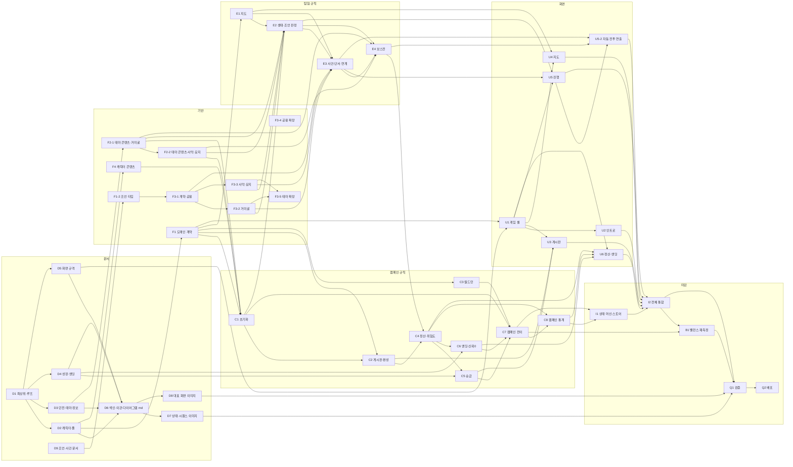

# 캠페인 개편 작업 배정표

## 목적과 현재 상태

이 문서는 2026-08-17 회의와 이후 확정된 캠페인 개편의 구현 영역과 의존성을 관리한다. 세부 규칙은 최신 공식 설정집과 후속 Superpowers 설계 문서가 근거이며, 이 문서는 **누가 어떤 순서로 무엇을 완료해야 하는지**를 정한다.

**이 표가 현재 유일한 작업 기준이다.** 아래 43개 항목을 모두 완료하면 인트로부터 캠페인 엔딩까지 동작한다. 이전 개편 배정표와 오래된 회의록은 역사 자료이며 현재 작업 상태를 덮어쓰지 않는다.

E1 이후의 탐험 규칙은 후속 설계로 구체화되었다. E2는 C1이 확정한 활성 생태 규칙을 소비해 공개 규칙과 조언 판정을 수행하고, E3가 category·cut·물질화·연계·공통 전투를 수행한다.

## 개편 범위

### 포함

- 캐릭터 30명 풀, 임시 파티 편성, 월드턴과 휴식·백그라운드·중상
- 던전 위험도 ★1~5, 초기 위험도별 지도, 실패 시 위험도 상승과 재도전
- 테마 3종과 생태 규칙, 규칙 기반 도움·방해·중립 조언
- 현재 위험도별 생태 공개, 개인별 수용·의심·적발, 원정 진행 기록
- 명성 하한 0, 수동 승급과 골드 승급, 엔딩 5종
- 3:2 게임 셸(좌 60%·우 40%)과 인트로·게시판·지도·진행·정산 화면의 구조
- 정적 PNG와 Framer Motion을 사용해 계산 완료된 일반 전투·보스 턴 기록을 순차 재생하는 자동 전투 장면 연출
- 인트로부터 월드턴까지의 상태 전이와 스토어
- 추론 정확도를 변수로 둔 백테스트 재측정

### 범위 밖

- 캐릭터별 다프레임 전투 스프라이트, Spine, Live2D 같은 별도 골격·프레임 애니메이션 시스템
- 검격·화살·마법 전용 이펙트 세트, 복잡한 카메라 연출 등 자동 전투 장면의 후속 폴리시
- 저장·복원, Supabase, 로그인
- 길잡이의 직접 전투 개입, 보스와의 거래
- 등급별 3/4/5인 출전 파티
- 신뢰 0 회복 규칙과 길드 조사 이벤트
- 독립 아이템 인벤토리

## 의존성 그래프



## 여섯 계층

| 계층 | ID | 책임 | 산출물 |
| --- | --- | --- | --- |
| 문서 | `D1`~`D9` | 설정집 개정 | 구현이 근거로 삼을 공식 규칙 |
| 기반 | `F1` `F1-2` `F2-1` `F2-2` `F3-1`~`F3-5` `F4` | 도메인 계약과 조언·테마·캐릭터 콘텐츠 | 타입과 데이터 |
| 캠페인 규칙 | `C1`~`C8` | 초기화·게시판·월드턴·정산·승급·엔딩·백테스트·통계 | UI 없는 순수 규칙과 시뮬레이터 |
| 탐험 규칙 | `E1`~`E4` | 지도·생태/조언 판정·사건/연계·보스전 | 한 원정의 재현 가능한 결과 |
| 화면 | `U1`~`U6`, `U5-2` | 셸·주요 화면·자동 전투 표현 | 규칙 결과를 설명하는 사용자 흐름 |
| 마감 | `I1` `I2` `B1` `Q1` `Q2` | 상태 머신·통합·밸런스·검증·배포 | 플레이 가능한 캠페인 |

## 현재 임계 경로

E1·E2·E3·E4와 C4 및 콘텐츠 기반이 완료된 현재 남은 캠페인 규칙의 직접 순서는 다음이다.

```text
C5·C6 → C7 → C8-A → I1 → I2 → B1 → Q1 → Q2
```

E3의 사건·단서·연계와 E4의 보스전 결과가 확정되었고, C4 정산·위험도 상승 구현도 완료되었다.

`U5-2`는 E3·E4가 확정한 전투 결과와 U5 장면 슬롯을 소비하는 병렬 화면 작업이며, 완료 뒤 I2 전체 통합에 합류한다.

## 배정표

`선행` 칸은 **아직 완료되지 않은 선행 작업만** 표시한다. 선행 작업이 모두 완료되면 `—`로 정리한다. 전체 논리 의존성은 위 Mermaid 그래프를 기준으로 유지한다.

| ID | 구현 영역 | 완료 기준 | 선행 | 풀리는 것 | 담당 | 상태 |
| --- | --- | --- | --- | --- | --- | --- |
| D1 | 최상위·루프 문서 개정 | 게임 원칙·게임 개요·핵심 게임 루프에서 구 캠페인 모델 용어가 제거되고 프로토타입 고정 범위가 캐릭터 풀·위험도·테마 3종으로 교체됨 | — | **D2 D3 D4 D5** | LatteBun | ✅ |
| D2 | 캐릭터·풀 문서 | 캐릭터·신뢰와 풀·월드턴 문서가 분리되고 풀 30명·임시 편성·휴식·백그라운드·중상·신뢰 0 누적표가 확정 수치로 적힘 | — | **D6 F1 F4** | LatteBun | ✅ |
| D3 | 던전·테마·정보 문서 | 초기 위험도별 6~8 Depth, 재도전, 조언 기회, 테마 3종 생태 규칙 계약이 공식화됨 | — | **D6 F2-1** | LatteBun | ✅ |
| D4 | 성장·엔딩 문서 | 위험도별 보상표, 명성 시작 30·하한 0, 명성/골드 승급과 엔딩 5종 판정 순서가 공식화됨 | — | **C5 C6 D6** | LatteBun | ✅ |
| D5 | 화면 규격 문서 | 3:2 게임 셸, 기준 해상도, 화면별 좌·우 구조, 색 외 단서 원칙이 공식화됨 | — | **D6 U1** | sbh3821 | ✅ |
| D6 | 색인·이관·다이어그램 md | README 색인, 회의록 이관, 상태·시퀀스·대표 화면 md가 새 규칙으로 갱신됨 | — | **D7 D8** | LatteBun | ✅ |
| D7 | 상태·시퀀스 다이어그램 이미지 재생성 | 캠페인·탐험 상태 및 시퀀스 SVG·PNG가 최신 md에서 재생성됨 | — | **Q1** | sanghwan.yoo | ✅ |
| D8 | 대표 화면 이미지 재작업 | 인트로 포함 대표 화면 이미지가 최신 화면 설계와 맞음 | — | **Q1** | sbh3821 | ✅ |
| D9 | 조언·사건 통합 문서 개정 | 구 정보카드 흐름이 조언 모델로 교체되고 조언 콘텐츠·연계 계약이 공식화됨 | — | **F1-2** | LatteBun | ✅ |
| F1 | 도메인 계약 재정의 | 캐릭터 풀·위험도·임시 파티·월드턴·엔딩을 담은 캠페인·원정 상태 타입과 시드 스트림이 있고 구 파티 영속·던전 등급 타입이 제거됨 | — | **C1 C2 C3 E1 U1** | LatteBun | ✅ |
| F1-2 | 조언 도메인 타입 개정 | `AdviceOutcome`·`EcologyRelation`·`ClueId`·`SituationEvent`·`AdviceOption`이 있고 구 정보 카드 타입이 제거됨 | — | **F3-1** | LatteBun | ✅ |
| F2-1 | 테마 콘텐츠 · 거미굴 | 생태 규칙 6개·몬스터 5종·위험도 구간별 보스 4종과 조건부 규칙을 갖고 검증 통과 | — | **F2-2 C1 E2 E4** | LatteBun | ✅ |
| F2-2 | 테마 콘텐츠 · 사막·묘지 | 사막·묘지도 같은 테마 계약과 보스 특징을 만족하고 검증 통과 | — | **C1 E2 E4** | LatteBun | ✅ |
| F3-1 | 조언 콘텐츠 계약·검증기와 공용 사건 | 조언 3개·도움/방해/중립 각 1개·기본 결과·강화 슬롯 불변식을 검증하고 공용 사건 기반이 존재 | — | **F3-2 F3-3 E3** | LatteBun | ✅ |
| F3-2 | 조언 콘텐츠 · 거미굴 | 거미굴 일반·보스 정보 사건, 규칙별 도움/방해 공급, 약한·강한 연계와 source 검증을 만족 | — | **E2 E3 F3-5** | LatteBun | ✅ |
| F3-3 | 조언 콘텐츠 · 사막·묘지 | 사막·묘지 일반·보스 정보 사건과 규칙별 공급·연계·source 검증을 만족 | — | **E2 E3 F3-5** | LatteBun | ✅ |
| F3-4 | 공용 사건 확장 | 공용 `rest`·`merchant`·`special` 각 30개, ID·문구 중복 없음 | — | — | LatteBun | ✅ |
| F3-5 | 테마 전용 사건 확장 | 테마마다 30개(일반 monster 18 + 일반 special 4 + 보스 정보 special 8), 규칙별 도움/방해와 테마 중립 공급·전역 중복 검증 통과 | — | — | LatteBun | ✅ |
| F4 | 캐릭터 콘텐츠 | 5직업×6명·5성격×6명의 30명 풀을 중복 없이 생성 가능한 콘텐츠 용량 보장 | — | **C1** | LatteBun | ✅ |
| C1 | 캠페인 초기화 | 30명 풀, 던전 15개, 생태 패키지의 `activeRuleIds` 3개·출현 잡몹·보스, 시작 명성 30·골드 10이 시드로 재현됨 | — | **C2 C7 E2** | SangHwan Yoo | ✅ |
| C2 | 게시판·임시 파티 편성 | 정상 후보 우선, 정상 파티가 없을 때 중상 수 최소·완전 파티 수 최대·시드 동률 해소의 응급 편성까지 포함한 서로 다른 직업 3인 파티 | — | **C4 U3** | SangHwan Yoo | ✅ |
| C3 | 월드턴 | HP 50% 미만 강제 휴식, 나머지 휴식·백그라운드 배정, 회복·중상·다음 턴 출전 제한과 백그라운드 사망 0건 | — | **C7** | sanghwan.yoo | ✅ |
| C4 | 정산·위험도 상승 | SettlementSnapshot 검증, 생존 3/2/1명 보상, 전멸 손실·유품, 위험도 +1/★5 상한, 누적 골드와 SettlementResult 반영, 클리어 `nextReward: null`·전멸 다음 보상, 응급 편성 연계 | — | **C5 C6 C8 U6** | LatteBun | ✅ |
| C5 | 승급 | 명성 60/120/200 무료 승급과 골드 150/320/600 승급, 수동 승급·강등 없음. 게시판에서 사용할 승급 가능 판정·결과 계약을 제공 | — | **C7 U3** | LatteBun | ✅ |
| C6 | 엔딩·신뢰 0 누적 | 살아 있는 신뢰 0 누적 2~4명 수용·적발 보정, 한 신뢰 변화 묶음 뒤 생존 파티 전원 신뢰 0 즉시 불신 결과, `denounced`→`completed`→`exhausted`→`unemployed` 순수 판정과 결정적 trigger ID | — | **C7 U6** | LatteBun | ✅ |
| C7 | 캠페인 전이 | `intro`·`board`·`contract`·`expedition`·`settlement`·`promotion`·`worldTurn`·`ended`의 순수 전이, 세션 전용 활성 원정 컨텍스트, 정산 ID 중복 거부, C3 뒤 새 공고와 C6 정상 엔딩, 최신 신뢰 변화 묶음 뒤 즉시 불신 `phase: ended` 원자 기록 | — | **C8 B1 I1** | LatteBun | ✅ |
| C8 | 캠페인 통계 | **C8-A:** C7 `CampaignTransitionResult.settlement`의 `SettlementResult`를 재계산하지 않고 단 한 번 소비해 원본 정산 이력, 클리어·전멸·사망·정산 획득 골드·최고 고정 던전 순서를 누적한다. **C8-B 후속:** E2/E3/E4·C5·I1의 확정 이벤트 계약 뒤 조언·반응·전환점·연대기를 별도 설계한다 | — | **I1 U6** |  | ⬜ |
| E1 | 위험도별 지도 생성 | 초기 위험도 기준 6~8 일반 Depth, 폭 1~5, 첫·마지막 ≤2, degree≤2, 전 노드 도달/보스 연결, 동일 경로 길이, 16개 폭 템플릿·결정적 retry 순환, `GeneratedMap.layers`·`INVALID_GENERATION` 검증 | — | **E2 E3 U4** | lattebun | ✅ |
| E2 | 생태·조언 판정 | C1 `activeRuleIds` 3개를 재추첨하지 않고 현재 위험도별 3/2/1개를 결정적 부분집합으로 공개하며, 조건부 규칙은 사건별 성립 선언이 있을 때만 후보가 된다. 조언 3개를 결정적으로 섞고 살아 있는 파티원별 기본 확률+신뢰 구간+성격+C6 보정으로 수용·의심·적발을 독립 판정한다. 한 명 이상 수용 시 `executed`, 전원 미수용 시 기본 결과를 선택하며 즉시 신뢰와 보스 지연 신뢰 시점을 구분한다. 숨은 `special` exact-once cut의 보스 정보 기회를 현재 위험도별로 준비하고 현재 던전 보스가 아닌 정보를 거부한다 | — | **E3 E4 U5** | LatteBun | ✅ |
| E3 | 사건 배치·단서·연계·공통 전투 | E1 DAG에 공개 category와 숨은 exact-once `special` cut·strong link를 준비하고 방문 시 EventId를 물질화한다. 단서·effect·monster encounter·merchant pending을 연결하고 공통 BattleEngine action record를 만든다 | — | **E4 U5 U5-2** | LatteBun | ✅ |
| E4 | 턴 단위 보스전 | `boss-battle-adapter`가 BossRule→BossTrait→개인별 static target/incoming/outgoing modifier와 merchant pending을 공통 BattleEngine 입력으로 변환하고, 턴별 action record·presentation cue와 전투 뒤 E2 accepted/suspected 기록 검증을 연결한다. 보스 종류는 초기 위험도로 유지하고 현재 위험도 차이만 HP·공격 scaling에 반영하며, 사망자 trust는 변경하지 않는다 | — | **C4 U5-2** | LatteBun | ✅ |
| U1 | 3:2 게임 셸 | 상단 상태 바와 좌60%·우40% 고정 셸, 1920×1080 16:9 고정 캔버스와 레터박스, 스크롤 없음 | — | **U2 U3 U4 U5 U6** | SangHwan Yoo | ✅ |
| U2 | 인트로 화면 | 길잡이 역할·개입 수단·캠페인 목표를 전달하고 게시판 프리뷰/캠페인으로 진입 | — | **I2** | SangHwan Yoo | ✅ |
| U3 | 게시판·계약·승급 화면 | 공고 최대 5장, 진입 불가 표시/사유, 상세 던전 정보·출전 3인·계약 보상과 버튼, 공개 환경 특성 없음. 상단 등급 버튼의 승급 가능 강조, 명성/골드 선택, 결과 확인 뒤 갱신된 공고 표시 | — | **I2** | SangHwan Yoo | ✅ |
| U4 | 던전 지도 화면 | 범례 없이 노드 아이콘으로 현재·방문·선택 가능·비활성·보스 구분, 키보드로 다음 지점 선택 | — | **I2** | sbh3821 | ✅ |
| U5 | 던전 진행 화면 | 좌측 상단 장면 슬롯과 하단 플레이어 콘솔 `[행동 / 조언] [진행 기록]`을 두고 진행 기록은 `[전체][단서][전투][생태]`를 제공한다. `생태`는 확인된 생태와 관찰 단서를 구분하고 숨은 규칙을 자동 정답 처리하지 않는다. 조언 3개는 같은 디자인으로 내부 유형·정합 관계·확률·예상 신뢰를 숨기며 선택 뒤 반응→사건 결과→수치/신뢰 변화를 인과 순서로 표시 | — | **U5-2 I2** | sbh3821 | ✅ |
| U5-2 | 자동 전투 장면 연출 | 던전 진행 화면 좌측 상단 장면 슬롯에 정적 PNG 캐릭터·몬스터를 배치하고 Framer Motion으로 `Idle → Attack Lunge → Hit Shake → Damage Number → HP Bar 감소`를 순차 재생한다. 일반 몬스터 장면은 E3가 확정한 사건·전투 결과를, 보스전은 E4 턴 기록을 소비하며 UI에서 피해·RNG·신뢰를 재계산하지 않는다 | — | **I2** | sbh3821 | ✅ |
| U6 | 정산·엔딩 화면 | 정산 원인 순서, 위험도·보상 변화와 승급 가능 여부, 엔딩 5종 판정 원인·누적 통계 표시. 승급 버튼·선택·결과는 제공하지 않음 | C8 | **I2** | sbh3821 | 🟡 |
| I1 | 상태 머신·스토어 | C7 `transitionCampaign`을 호출하고 persistent `CampaignState`와 분리된 `CampaignTransitionContext`를 세션 Store에 보관하며 인트로·게시판·계약·지도·조언·보스전·정산·월드턴·엔딩 화면에 결과를 공급 | C8 | **I2** |  | ⬜ |
| I2 | 캠페인 전체 통합 | 인트로→게시판→탐험→정산→월드턴→다음 공고/엔딩이 같은 시드로 재현되고 전체 검증 통과 | U6 I1 | **B1 Q1** |  | ⬜ |
| B1 | 밸런스 재측정 | 배신 전략 성립, S 도달률 100% 미만, 추론 정확도 0.4와 0.7 결과 차이가 유의하며 상수 변경과 백테스트 보고서 동봉 | I2 | **Q1** |  | ⬜ |
| Q1 | 접근성·전체 검증 | 키보드 조작, 색 외 단서, 변화 사유 표시, lint·typecheck·test·build와 브라우저 흐름 검증, 문서/코드 상수 일치 | I2 B1 | **Q2** |  | ⬜ |
| Q2 | 데모 배포 | `main` 데모에서 캠페인 핵심 흐름과 시드 재현 확인 | Q1 | — |  | ⬜ |

`U6`는 화면과 ViewModel 경계까지 만들었고 `/u6-test`에서 정산 3종·엔딩 5종을 확인할 수 있다. `C6` 순수 엔딩 결과가 준비되었지만 `C8`과 `I2` 연결 전까지 실제 `CampaignState`를 읽지 않고 결정적 fixture로 그린다. C4의 `SettlementResult` 어댑터와 C6의 `CampaignEnding` 계약은 준비되어 있으며, 남은 연결이 `I2`의 몫이므로 상태는 `🟡`로 둔다.

`U5`와 `U5-2`를 `✅`로 둔다. 둘의 완료 기준은 화면과 규칙 소비를 말하고 그것이 끝났다. 한때 "`I2`가 연결할 때까지 `🟡`"로 두었는데, `I2`의 선행이 그 둘이므로 서로를 기다리는 교착이었다. 실제 원정 상태와 화면을 잇는 일은 `I2`의 몫이지 이 둘의 완료 조건이 아니다.

`U5`는 `/u5-test`에서 아홉 상태를 확인할 수 있고 **지어내는 값이 없다.** 지도는 `E1`, 사건 배치와 물질화는 `E3`, 조언 제시·반응 판정·생태 공개는 `E2`가 한다. 던전 이름·위험도·사건 제목·깊이도 규칙이 낸 값을 그대로 쓴다. `components/game/u5-preview-data.ts`가 하는 일은 아홉 상태를 고르는 것뿐이고, 실제 원정에서는 플레이어의 경로 선택이 그 일을 한다. 그 연결이 `I2`의 몫이므로 상태는 `🟡`로 둔다.

`U5-2`는 장면 재생과 자산 매핑까지 만들었고 `/u5-2-test`에서 확인할 수 있다.
**fixture가 없다.** 일반 몬스터 전투는 `E3`의 `resolveMonsterEventBattle`,
보스전은 `E4`의 `resolveBossBattle`이 낸 결과를 그대로 재생한다. 어댑터는
필요 없었다. `BossBattleResolution.bossResult.battle`이 곧 `BattleResolution`
이기 때문이다. 공식 콘텐츠 27종의 전투 이미지 매핑도 끝났다. 남은 것은 실제
원정 상태와의 연결이고 그것이 `I2`의 몫이므로 상태는 `🟡`로 둔다.

배정표 밖에서 미뤄 둔 일은 [유예한 일](DEFERRED_WORK.md)에 모은다. 이 표에
행이 있으면 그 문서에 쓰지 않는다. `I1`을 시작할 때는
[세션 저장 검토](SESSION_PERSISTENCE_REVIEW.md)를 먼저 읽는다. 뒤로가기가
낡은 화면 상태를 되살려 권위 상태와 어긋나는 문제를 다룬다.

`U5`·`U5-2`·`U6`이 지금 무엇을 fixture로 메우고 있고 규칙이 들어올 자리가
어디인지는 [화면·규칙 인수인계 계약](SCREEN_ADAPTER_CONTRACT.md)에 모아 두었다.
그 문서는 요구서가 아니라 현황 보고이며, 규칙과 어긋나면 화면이 고친다.

`U3`~`U5-2`의 셸 틀·파티 블록·바탕과 질감은 공용으로 묶여 있다. 화면별로 다시
정하면 `ShellFrameConsistency`가 깨진다. `U2`와 `U6`은 아직 별개다.
`D8`은 손으로 그린 와이어프레임 대신 **구현된 화면을 그대로 캡처해** 채웠다.
그림이 곧 지금 돌아가는 화면이라 설명과 어긋날 수 없고, 다시 만들 때도 다시
찍기만 하면 된다. 인트로와 자동 전투가 더해져 여섯 장이 일곱 장이 됐다.
방법은 [대표 화면](../diagram/screens.md) 끝에 적어 두었다.

`U4`는 E1 실제 지도를 사용하는 `/u4-test`와 파티·목적지·이동 CTA를 구현했고,
1920×1080·2560×1440·1440×900·1280×1024에서 레이아웃과 키보드 이동,
사망 초상, hydration을 검증했다. 실제 캠페인 상태 전이와 이동 실행 연결은 `I2`가 맡는다.
