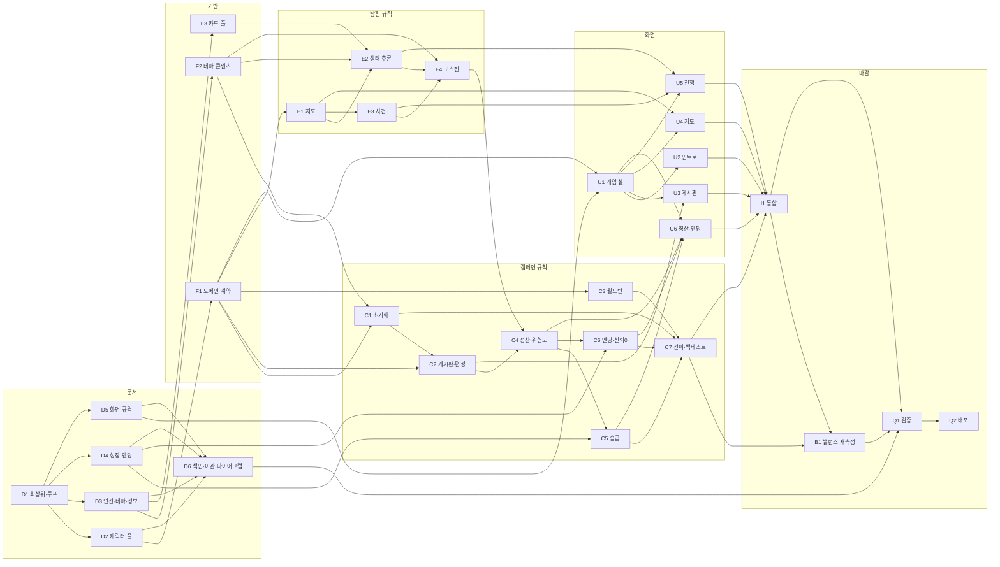

# 캠페인 개편 작업 배정표

## 목적과 현재 상태

이 문서는 2026-08-17 회의와 2026-08-18 화면 방향 논의에서 확정한 캠페인 개편의 구현 영역과 의존성을 관리한다. 규칙의 근거는 [캠페인 개편 설계](../superpowers/specs/2026-08-19-lattebun-campaign-rework-design.md)에 있고, 이 문서는 그 설계를 누가 어떤 순서로 구현하는지만 다룬다.

개편 이전 배정표는 [PROTOTYPE_WORK_ASSIGNMENT.md](PROTOTYPE_WORK_ASSIGNMENT.md)에 그대로 남아 있다. 그 표의 `F1`~`Q2`는 **이 표의 같은 글자와 다른 작업**이다. 이전 표는 완료 상태로 동결했고 다시 갱신하지 않는다.

이 개편은 도메인 모델과 난이도 축과 자원 모델을 동시에 바꾸므로, 이전 표에서 `✅ 완료`였던 항목의 상당수가 다시 열린다. 완료 표시가 되돌아간 것이 아니라 **완료 기준 자체가 달라졌다.**

## 개편 범위

### 포함

- 캐릭터 30명 풀, 임시 파티 편성, 월드턴과 휴식·백그라운드·중상
- 던전 위험도 ★1~5, 초기 위험도별 지도, 실패 시 위험도 상승과 재도전
- 테마 3종과 생태 규칙, 규칙 기반 진실·거짓·중립 카드
- 명성 하한 0, 수동 승급과 골드 승급, 엔딩 6종
- 3:1 게임 셸과 인트로·게시판·지도·진행·정산 화면의 구조
- 추론 정확도를 변수로 둔 백테스트 재측정

### 범위 밖

- 자동 전투 장면 연출과 애니메이션. 진행 화면 상단 40%는 구조와 자리까지만 만든다
- 보스전 턴 기록의 시각 표현. 규칙이 턴 기록을 남기는 데까지가 이번 범위다
- 저장·복원, Supabase, 로그인
- 길잡이의 직접 전투 개입, 보스와의 거래
- 등급별 3/4/5인 출전 파티
- 신뢰 0 회복 규칙과 길드 조사 이벤트

## 의존성 그래프



## 여섯 계층

| 계층 | ID | 책임 | 산출물 |
| --- | --- | --- | --- |
| 문서 | `D1`~`D6` | 설정집 개정 | 구현이 근거로 삼을 공식 규칙 |
| 기반 | `F1`~`F3` | 도메인 계약, 테마 콘텐츠, 카드 풀 | 타입과 데이터 |
| 캠페인 규칙 | `C1`~`C7` | 초기화·게시판·월드턴·정산·승급·엔딩·백테스트 | UI 없는 순수 규칙과 시뮬레이터 |
| 탐험 규칙 | `E1`~`E4` | 지도·생태 추론·사건·보스전 | 한 원정의 재현 가능한 결과 |
| 화면 | `U1`~`U6` | 셸과 다섯 화면 | 규칙 결과를 설명하는 사용자 흐름 |
| 마감 | `I1` `B1` `Q1` `Q2` | 통합·밸런스·검증·배포 | 플레이 가능한 캠페인 |

### 왜 문서가 맨 앞인가

이전 개편에서 얻은 교훈이 `상수의 근거는 코드가 아니라 문서에 먼저 적혀 있다`였다. 그런데 그 개편의 `B1`에서 `docs/systems/`만 검사했다가 `docs/design/CORE_GAME_LOOP.md`의 옛 값을 놓쳤다. 규칙 문서를 작업 항목이 아니라 부수 작업으로 두면 반드시 뒤처진다.

이번에는 문서를 선행으로 올렸다. `GAME_PRINCIPLES.md`가 `지속 파티`라고 적혀 있는 동안 캐릭터 풀을 구현하면, 그 구현은 어떤 문서도 근거로 대지 못한다.

### 시작 가능한 작업

착수 시점에 선행이 없는 것은 `D1` 하나다. 의도한 구조다. `D1`이 끝나면 `D2`·`D3`·`D4`·`D5` 네 개가 동시에 열려 세 명이 병렬로 붙을 수 있다.

### 임계 경로

```text
D1 → D3 → F2 → E2 → E4 → C4 → C6 → C7 → I1 → B1 → Q1 → Q2
```

생태 규칙 콘텐츠(`F2`)와 그 위의 추론 판정(`E2`)이 병목이다. `F2`에서 거미굴 1종을 먼저 완성하고 검증까지 통과시키면, 폐광·묘지를 채우는 동안 `E2`가 거미굴 fixture로 시작할 수 있다.

## 배정표

| ID | 구현 영역 | 완료 기준 | 선행 | 풀리는 것 | 담당 | 상태 |
| --- | --- | --- | --- | --- | --- | --- |
| D1 | 최상위·루프 문서 개정 | 게임 원칙·게임 개요·핵심 게임 루프에서 `완성 파티`·`예비 인원`·`지속 파티`·`승급 점수`·`던전 등급`이 0건이고, 프로토타입 고정 범위가 캐릭터 풀·위험도·테마 3종으로 교체됨 | — | **D2 D3 D4 D5** | LatteBun | ⬜ |
| D2 | 캐릭터·풀 문서 | `PARTY_AND_TRUST.md`가 캐릭터·신뢰 문서와 풀·월드턴 문서로 분할되고, 풀 30명·임시 편성·휴식·백그라운드·중상·신뢰 0 누적표가 확정 수치로 적힘 | D1 | **D6 F1** | sbh3821 | ⬜ |
| D3 | 던전·테마·정보 문서 | 초기 위험도별 6~8 지점표, 재도전 규칙, 위험도별 정보 기회표, 테마 3종의 생태 규칙 계약이 적히고, 선택 전 카드 유형·발각 위험을 보여준다는 조항이 삭제됨 | D1 | **D6 F2 F3** | SangHwan Yoo | ⬜ |
| D4 | 성장·엔딩 문서 | 위험도별 보상표, 명성 시작 30·하한 0, 명성 승급과 골드 승급표, 엔딩 6종과 판정 순서가 적히고 승급 점수 공식이 삭제됨 | D1 | **C5 C6 D6** | SangHwan Yoo | ⬜ |
| D5 | 화면 규격 문서 | 3:1 게임 셸, 기준 해상도, 화면별 좌·우 구조, 색 외 단서 원칙이 `SCREEN_LAYOUT.md`로 공식화되고 온보딩 문서의 화면 흐름표가 인트로를 포함해 갱신됨 | D1 | **D6 U1** | LatteBun | ⬜ |
| D6 | 색인·이관·다이어그램 | README 색인과 읽기 순서 갱신, 회의록 2개를 `docs/meetings/`로 이관, 이전 배정표 동결 문단 추가, 캠페인·탐험 상태·시퀀스와 대표 화면 6장을 md·svg·png로 재생성 | D2 D3 D4 D5 | **Q1** | LatteBun | ⬜ |
| F1 | 도메인 계약 재정의 | 캐릭터 풀·위험도·임시 파티·월드턴·엔딩 6종을 담은 캠페인·원정 상태 타입과 시드 스트림 이름이 있고 타입 검사 통과. 파티 영속·던전 등급 타입 제거 | D2 | **C1 C2 C3 E1 U1** | sbh3821 | ⬜ |
| F2 | 테마 콘텐츠 | 테마 3종이 각각 생태 규칙 6개·몬스터 5종·보스를 갖고, 조건부 규칙이 테마마다 1개 이상 있으며, 수량·중복·빈 문구 검증 테스트 통과. 거미굴을 먼저 완성 | D3 | **C1 E2 E4** | SangHwan Yoo | ⬜ |
| F3 | 카드 풀 재작성 | 모든 카드가 참조 규칙 ID와 정합·모순 태그를 갖고, 활성 규칙마다 진실·거짓·중립이 각각 2장 이상 존재하며 계약 위반 시 생성 오류를 반환 | D3 | **E2** | SangHwan Yoo | ⬜ |
| C1 | 캠페인 초기화 | 5직업×6명·5성격×6명의 30명 풀, 테마 3종×5개와 초기 위험도 3/4/4/3/1의 던전 15개, 시작 명성 30·골드 10이 시드로 재현되는 테스트 통과 | F1 F2 | **C2 C7** | SangHwan Yoo | ⬜ |
| C2 | 게시판·임시 파티 편성 | 진입 가능한 미클리어 던전을 위험도 높은 순으로 최대 5개 노출하고, 부족하면 진입 불가 던전을 사유와 함께 채우며, 출전 가능 캐릭터에서 서로 다른 직업 3명을 시드로 편성하는 테스트 통과 | F1 C1 | **C4 U3** | SangHwan Yoo | ⬜ |
| C3 | 월드턴 | HP 50% 미만 강제 휴식, 나머지의 휴식·백그라운드 절반 배정, 최대 HP 비례 회복, HP 하한 1, 20% 미만 중상과 다음 턴 출전 불가가 동작하고 백그라운드 사망 0건 | F1 | **C7** | sbh3821 | ⬜ |
| C4 | 정산·위험도 상승 | 생존 3/2/1명의 100·60·30% 보상, 전멸 시 유품 회수와 명성 손실 하한 0, 던전 위험도 +1과 ★5 상한, 상승한 위험도의 보상표가 다음 공고에 반영되는 테스트 통과 | C2 E4 | **C5 C6 U6** | sbh3821 | ⬜ |
| C5 | 승급 | 요구 명성 60/120/200 무료 승급과 골드 150/320/600 승급이 모두 동작하고, 자동 승급이 일어나지 않으며, 강등이 없고 승급 점수 공식이 코드에서 제거됨 | D4 C4 | **C7 U6** | sbh3821 | ⬜ |
| C6 | 엔딩·신뢰 0 누적 | 엔딩 6종이 명시된 우선순위로 판정되고, 신뢰 0 누적 2~4명의 수용·적발 보정이 카드 판정에 적용되며, 5명에서 즉시 누적 고발 엔딩이 나는 테스트 통과 | D4 C4 | **C7 U6** | sbh3821 | ⬜ |
| C7 | 캠페인 전이·백테스트 | 인트로부터 엔딩까지 전이 함수로 진행되고, 의도 3종 × 추론 정확도 2종의 6전략으로 10,000시드 보고서가 생성되며, 생성 오류와 시작 즉시 진행 불가 시드가 0건 | C1 C3 C5 C6 | **B1 I1** | sbh3821 | ⬜ |
| E1 | 위험도별 지도 생성 | 초기 위험도로 정해진 6~8 일반 지점이 실패 뒤에도 고정되고, 한 지점의 선택지가 최대 2개이며 분기가 다시 합류하고 모든 경로 길이가 같으며, 재도전 시 지도만 재생성되고 보스가 유지되는 테스트 통과 | F1 | **E2 E3 U4** | sbh3821 | ⬜ |
| E2 | 생태 규칙 추론 판정 | 던전마다 활성 규칙 3개를 뽑고 위험도별로 3/2/1개를 공개하며, 카드의 정합·모순이 활성 규칙으로 판정되고, 위험도별 정보 기회 2~5회와 보스 관련 보장 1~2회를 모든 경로가 충족 | F2 F3 E1 | **E4 U5** | SangHwan Yoo | ⬜ |
| E3 | 사건·아이템 | 몬스터·휴식·상인·특수 네 분류가 모든 경로에 한 번 이상 나오고 한 던전 안에서 사건 콘텐츠가 중복되지 않으며, 사건 행동과 아이템 효과가 HP·신뢰·골드를 바꾸는 테스트 통과 | E1 | **E4 U5** | sbh3821 | ⬜ |
| E4 | 턴 단위 보스전 | 자동 전투가 턴별 행동·피해 기록을 남기고, 수용한 보스 정보의 진위별 보정과 누적 상하한이 적용되며, 전투 뒤 거짓·의심 기록이 검증되어 신뢰가 갱신되는 테스트 통과 | F2 E2 E3 | **C4** | sbh3821 | ⬜ |
| U1 | 3:1 게임 셸 | 상단 상태 바와 좌 75%·우 25% 본문을 가진 공통 셸 위에서 모든 화면이 콘텐츠만 교체하고, 1280×720 기준과 1024×640 최소에서 가로 스크롤이 생기지 않음 | D5 F1 | **U2 U3 U4 U5 U6** | LatteBun | ⬜ |
| U2 | 인트로 화면 | 길잡이 역할·개입 수단·캠페인 목표를 전달하고 게시판으로 진입하며, 캠페인 시작 시 이 화면이 먼저 나옴 | U1 | **I1** | LatteBun | ⬜ |
| U3 | 게시판·계약 화면 | 공고 최대 5장이 게시판 위에 배치되고 진입 불가가 붉은 테두리와 사유로 구분되며, 상세에서 던전 정보·답사 기록·출전 3인 카드·계약 보상과 계약 버튼을 보여줌 | U1 C2 | **I1** | LatteBun | ⬜ |
| U4 | 던전 지도 화면 | 범례 영역이 없고 지점이 아이콘으로 표현되며, 현재 위치·방문 완료·선택 가능·비활성·보스방이 색과 형태로 함께 구분되고 키보드로 다음 지점을 선택할 수 있음 | U1 E1 | **I1** | LatteBun | ⬜ |
| U5 | 던전 진행 화면 | 좌측이 상 40%·하 60%로 나뉘고, 카드 3장이 같은 디자인으로 유형·발각 위험·예상 신뢰 변화를 감추며, 선택 뒤 반응·사건·수치 변화가 인과 순서로 나타남 | U1 E2 E3 | **I1** | LatteBun | ⬜ |
| U6 | 정산·승급·엔딩 화면 | 정산이 원인 순서로 나열되고 위험도와 보상 변화가 함께 표시되며, 승급하기 버튼으로 명성·골드 승급을 고를 수 있고 엔딩 6종이 판정 원인과 함께 표시됨 | U1 C4 C5 C6 | **I1** | LatteBun | ⬜ |
| I1 | 캠페인 전체 통합 | 인트로→게시판→탐험→정산→월드턴→다음 공고 또는 엔딩이 스토어 위에서 이어지고 같은 시드로 재현되며 전체 검증 통과 | C7 U2 U3 U4 U5 U6 | **B1 Q1** | LatteBun | ⬜ |
| B1 | 밸런스 재측정 | 배신 의도가 전략으로 성립하고, S 도달률이 100%가 아니며, 추론 정확도 0.4와 0.7의 결과 차이가 유의함. 상수만 바꾼 커밋에 재생성한 백테스트 보고서 동봉 | C7 I1 | **Q1** | LatteBun | ⬜ |
| Q1 | 접근성·전체 검증 | 키보드 조작, 색 외 단서, 변화 사유 표시, lint·typecheck·test·build와 브라우저 흐름 검증을 통과하고, 문서의 수치와 코드 상수가 `docs/` 전체 훑기로 일치함 | D6 I1 B1 | **Q2** |  | ⬜ |
| Q2 | 데모 배포 | `main` 데모에서 캠페인 핵심 흐름과 시드 재현을 확인 | Q1 | — |  | ⬜ |

## 관리 원칙

- 담당자 칸에는 합의한 사람의 이름 또는 식별자를 적는다.
- 상태는 `⬜ 대기`, `🟡 진행 중`, `✅ 완료`만 사용한다.
- `선행`에는 아직 끝나지 않은 직접 선행만 적는다.
- 완료된 ID는 다른 행의 `선행`에서 지우며, 남은 선행이 없으면 `—`로 적는다.
- `풀리는 것`은 완료 여부와 무관한 전체 의존성 그래프의 나가는 간선과 일치시킨다.
- 새 작업은 승인된 [캠페인 개편 설계](../superpowers/specs/2026-08-19-lattebun-campaign-rework-design.md)의 범위 안에서만 추가한다.
- 규칙 수치를 바꾸면 근거가 되는 설정집 문서를 같은 변경 단위에서 함께 고친다. 문서 정합성은 파일 하나가 아니라 `docs/` 전체를 훑어 확인한다.
- 표나 그래프를 바꾸면 [무결성 검사](CAMPAIGN_REWORK_WORK_ASSIGNMENT.test.ts)와 전체 테스트를 실행한다.

## 이전 배정표의 완료 항목을 다시 여는 이유

이전 표에서 `F1`~`B1`이 모두 `✅ 완료`였다. 그 작업이 부실했던 것이 아니라 전제가 바뀌었다.

| 이전 완료 항목 | 왜 다시 열리는가 |
| --- | --- |
| 도메인 타입 | 파티 영속과 던전 등급이 타입에 박혀 있다 |
| 캠페인 초기화·게시판 | 15팀 파티 생성과 등급 정렬이 사라진다 |
| 지속 파티 | 충원·자동 재편·대기 명단 개념이 없어진다 |
| 등급별 지도 | 7/9/11/13 지점이 초기 위험도별 6~8로 바뀐다 |
| 정보 판정 | 유형 공개를 전제로 만들어졌고 생태 규칙 판정이 없다 |
| 정산·승급·엔딩 | 명성 하한, 승급식, 엔딩 집합이 모두 바뀐다 |
| 백테스트 | 진위를 골라 선택하는 전략이 성립하지 않는다 |
| 화면 전체 | 공통 셸이 없고 범례·카드 유형이 노출되어 있다 |

재사용할 수 있는 것도 분명하다. 시드 난수 스트림, 성격별 신뢰 판정표, 카드 36장의 주제·진위 조합 계약, 사건 콘텐츠 12개, 원인 사슬과 원정 연대기 통계는 그대로 살아 있다.

## 관련 문서

- [캠페인 개편 설계](../superpowers/specs/2026-08-19-lattebun-campaign-rework-design.md)
- [게임 원칙](../GAME_PRINCIPLES.md)
- [핵심 게임 루프](../design/CORE_GAME_LOOP.md)
- [개편 이전 배정표](PROTOTYPE_WORK_ASSIGNMENT.md)
- [팀 개발 워크플로](TEAM_DEVELOPMENT_WORKFLOW.md)
