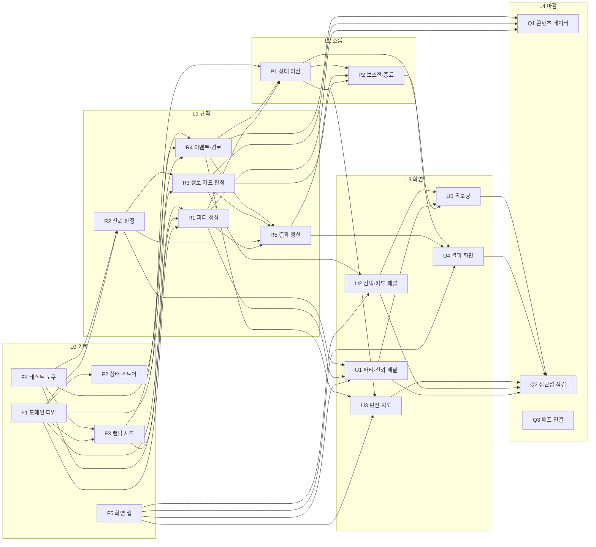

# 프로토타입 작업 배정표

## 목적

이 문서는 Dungeon Schemer 프로토타입의 구현 영역, 구현 순서, 담당자를 한곳에서 관리한다.

`선행` 열은 **아직 끝나지 않은** 선행만 담는다. 따라서 `선행`이 `—`이고 상태가 `⬜`인 행은 지금 바로 시작할 수 있다. 작업을 시작할 때 담당자와 상태를 갱신한다.

전체 의존성 구조는 아래의 [의존성 그래프](#의존성-그래프)가 담는다. 표는 지금 무엇이 막혀 있는지 보여주는 운영용 뷰다.

## 프로토타입 범위

### 포함

[핵심 게임 루프](../design/CORE_GAME_LOOP.md)의 1~7단계. 새 파티 등장부터 결과 정산까지 한 판이 끊기지 않고 진행된다.

### 범위 밖

다음은 이번 프로토타입에서 구현하지 않는다. 배정표에 행을 만들지 않는다.

- 8단계 성장과 능력치(설득력·기만·생존·정보 수집·협상·은신)
- 4가지 엔딩 판정
- 던전의 장기 강화·약화와 판 간 상태 이월
- 저장과 복원, Supabase 연동
- 로그인과 사용자 계정

## 의존성 그래프

`Q3`은 선행이 없고 다른 작업을 막지도 않으므로 간선 없이 홀로 놓인다. 아무 때나 집을 수 있는 작업이라는 뜻이다.

## 진행 순서와 3트랙

`F1`이 6개 작업의 선행이라 세 명이 동시에 여기서 막힌다. 이를 피하려고 선행 스프린트를 먼저 둔다.

### 1차 — 선행 스프린트

| 담당 | 작업 |
| --- | --- |
| A | `F1` 도메인 타입 정의 (단독 작업, 1~2일) |
| B | `F4` 테스트 도구 도입 |
| C | `F5` 화면 셸·레이아웃 |

`F4`와 `F5`는 `F1`과 무관하므로 동시에 진행한다. `F4`는 `R1`~`R4`의 완료 기준이 모두 테스트 통과이므로 두 번째 병목이다. 1차 안에 끝내야 한다. 먼저 끝난 사람은 `Q3`을 집을 수 있다.

### 2차 — 3트랙 병렬

| 트랙 | 담당 | 작업 |
| --- | --- | --- |
| 규칙 | A | `R2` → `R3` → `R5` |
| 흐름 | B | `F2` `F3` → `R1` `R4` → `P1` → `P2` |
| 화면 | C | `U1` `U2` → `U3` `U4` → `U5` |

트랙은 완전히 독립적이지 않다. 두 곳에서 교차한다.

- `R5`는 규칙 트랙이지만 흐름 트랙의 `R1`·`R4`를 기다린다. A는 `R2`·`R3`을 먼저 끝내고 `R5`는 B의 진행에 맞춰 시작한다.
- `U3`~`U5`는 화면 트랙이지만 흐름 트랙의 `P1`·`P2`를 기다린다. C는 `U1`·`U2`를 목 데이터로 먼저 만들고 규칙과 흐름이 준비되면 실제 상태에 연결한다.

### 3차 — 마감

`Q1` `Q2`를 세 명이 나눈다.

## 배정표

### L0 기반 — 선행 필수

| ID | 구현 영역 | 완료 기준 | 선행 | 풀리는 것 | 담당 | 상태 |
| --- | --- | --- | --- | --- | --- | --- |
| F1 | 도메인 타입 정의 | 파티원·성격·직업·신뢰·정보 카드·이벤트·경로 노드·런 상태 타입이 존재하고 `pnpm typecheck` 통과. 로직 없이 타입과 상수만 | — | **F2 F3 R1 R2 R3 R4** | LatteBun | ✅ |
| F4 | 테스트 도구 도입 | Vitest 설치, `pnpm test` 동작, 샘플 테스트 통과, 개발 환경 문서의 병합 전 검증 목록에 추가 | — | **F3 R1 R2 R4** | LatteBun | ✅ |
| F2 | 상태 스토어 골격 | Zustand 설치, 런 상태와 UI 상태 스토어 분리, 초기 상태가 화면에 표시됨 | — | **P1** | SangHwan Yoo | ✅ |
| F5 | 화면 셸·레이아웃 | 인터페이스 문서의 6개 화면 영역이 목 데이터로 배치된 라우트 존재 | — | **U1 U2 U3 U4** | LatteBun | ✅ |
| F3 | 랜덤 시드·재현성 | 같은 시드와 스트림 이름이 같은 수열을 만드는 테스트 통과. 파생 스트림이 호출 순서와 무관함을 검증. `Math.random` 직접 호출을 eslint로 차단 | — | **R1 R4** | LatteBun | ✅ |

### L1 규칙 — UI 없는 순수 로직

| ID | 구현 영역 | 완료 기준 | 선행 | 풀리는 것 | 담당 | 상태 |
| --- | --- | --- | --- | --- | --- | --- |
| R2 | 개인 신뢰 판정 | 기존 행동과 R3의 거짓 수용·의심 사후 판정 행동이 성격별로 다른 증감을 내고, 변화 사유를 함께 반환하며, 신뢰 0이 실패 상태가 되는 테스트 통과 | — | **R3 R5 U1** | LatteBun | ✅ |
| R1 | 파티 생성 규칙 | 시드로 3~5명의 직업·성격·초기 신뢰가 결정되고 재현되는 테스트 통과 | — | **R5 P1 U1 Q1** | sbh3821 | ✅ |
| R4 | 이벤트·경로 생성 | 시드로 분기 경로가 생성되고 노드마다 몬스터·휴식·상인·특수 이벤트가 배치되며 각 이벤트가 선택지를 1개 이상 가짐 | — | **R5 P1 U3 Q1** | LatteBun | ✅ |
| R3 | 정보 카드 판정 | 대상(용사·보스) × 유형(진실·거짓·중립)에 대해 수용·의심·적발 결과, 즉시·사후 신뢰 변화, 미검증·의심 검증 플래그를 반환하는 테스트 통과 | — | **R5 P2 U2 Q1** | SangHwan Yoo | ✅ |
| R5 | 결과 정산 계산 | 런 종료 상태에서 생존자·신뢰 변화 내역·보상·영향을 준 선택 목록을 반환하는 테스트 통과 | — | **P2 U4** | | ⬜ |

### L2 흐름

| ID | 구현 영역 | 완료 기준 | 선행 | 풀리는 것 | 담당 | 상태 |
| --- | --- | --- | --- | --- | --- | --- |
| P1 | 게임 상태 머신 | 파티 등장 → 경로 선택 → 이벤트 → 다음 노드 → 보스전 진입 전이가 테스트 통과하고 잘못된 전이는 거부됨 | — | **P2 U3 U5** | | ⬜ |
| P2 | 보스전과 종료 조건 | 보스전 개입, 미검증 정보의 검증, 승패·처형·클리어 종료 조건이 테스트 통과 | P1 R5 | **U4** | | ⬜ |

### L3 화면

| ID | 구현 영역 | 완료 기준 | 선행 | 풀리는 것 | 담당 | 상태 |
| --- | --- | --- | --- | --- | --- | --- |
| U1 | 파티·개인 신뢰 패널 | 파티원별 직업·성격·신뢰 상태와 최근 변화 사유가 보이고, 개인별 차이를 확인할 수 있음 | — | **U5 Q2** | | ⬜ |
| U2 | 이벤트 선택·정보 카드 패널 | 선택 전 대상·예상 이득·알려진 위험이 보이고, 카드 3장 선택 후 반응이 표시됨 | — | **U5 Q2** | | ⬜ |
| U3 | 던전 분기 지도 | 현재 위치·지나온 경로·다음 경로가 보이고 선택이 상태 머신에 전달됨 | P1 | **Q2** | | ⬜ |
| U4 | 결과 화면 | 생존자, 신뢰 변화와 사유, 보상, 영향을 준 선택 목록을 표시. `CLEAR`와 `GAME OVER`만 띄우지 않음 | R5 P2 | **Q2** | | ⬜ |
| U5 | 30초 온보딩 | 첫 실행부터 첫 카드 선택 결과 확인까지 30초 내 도달하고 온보딩 목표 6개가 화면에서 전달됨 | P1 U1 U2 | **Q2** | | ⬜ |

### L4 마감

| ID | 구현 영역 | 완료 기준 | 선행 | 풀리는 것 | 담당 | 상태 |
| --- | --- | --- | --- | --- | --- | --- |
| Q1 | 콘텐츠 데이터 채우기 | 직업·성격·이벤트·정보 카드 풀이 데이터 파일로 분리되어 코드 수정 없이 추가 가능 | — | — | | ⬜ |
| Q2 | 접근성·피드백 점검 | 카드 유형이 색상 외 단서로 구분되고, 키보드 조작이 되며, 신뢰 변화에 사유 표시 누락이 없음 | U1 U2 U3 U4 U5 | — | | ⬜ |
| Q3 | Vercel 배포 연결 | `main` 병합 시 데모 URL이 갱신되고 핵심 흐름이 1회 재현됨 | — | — | | ⬜ |

## 관리 원칙

- 담당자 칸에는 구현을 맡기로 합의한 사람의 이름 또는 식별자를 적는다.
- 상태는 `⬜ 대기`, `🟡 진행 중`, `✅ 완료` 셋 중 하나로 표시한다.
- `선행`이 `—`이고 상태가 `⬜`인 행은 지금 시작할 수 있다. `선행`에 ID가 남아 있으면 그것이 아직 막고 있는 작업이다.
- 작업을 완료하고 Pull Request를 병합할 때 같은 변경 단위에서 상태를 `✅`로 갱신한다.
- **상태를 `✅`로 바꿀 때 그 ID를 다른 행의 `선행` 열에서 지운다.** 남은 선행이 없어지면 `—`로 적는다. 이 규칙 덕분에 표만 보고 시작 가능한 작업을 찾을 수 있다.
- `선행`에는 직접 선행만 적는다. 간접 선행은 생략한다.
- `선행`과 `풀리는 것`은 역방향이 아니다. `선행`은 남은 것만, `풀리는 것`은 완료 여부와 무관한 전체 구조를 담는다. 후자는 "이걸 끝내면 누가 풀리는지"를 보여주므로 완료된 행에서도 그대로 유지한다.
- 의존성 그래프가 전체 구조의 단일 출처다. 새 의존 관계를 만들 때는 그래프와 `풀리는 것`을, 그리고 선행이 아직 안 끝났다면 `선행`까지 함께 고친다.
- 위 규약은 [무결성 검사](PROTOTYPE_WORK_ASSIGNMENT.test.ts)가 `pnpm test`에서 확인한다. 이 표를 고치면 `pnpm test`를 함께 돌린다. 검사는 표와 그래프의 일치, 완료된 ID가 `선행`에 남아 있지 않은지, 안 끝난 선행이 빠지지 않았는지, 순환이 없는지를 본다.
- 새 작업은 가장 가까운 기존 행에 넣고, 범위가 독립적이면 새 행을 만들면서 선행·풀리는 것을 함께 채운다.
- 세부 작업은 각 영역의 spec과 plan에서 관리한다. 이 표에는 큰 구현 책임과 순서만 기록한다.
- 프로토타입 범위가 바뀌면 이 문서와 [팀 개발 워크플로](TEAM_DEVELOPMENT_WORKFLOW.md)를 같은 변경 단위에서 함께 갱신한다.

## 관련 문서

- [게임 원칙](../GAME_PRINCIPLES.md)
- [핵심 게임 루프](../design/CORE_GAME_LOOP.md)
- [팀 개발 워크플로](TEAM_DEVELOPMENT_WORKFLOW.md)
- [개발 환경](DEVELOPMENT_ENVIRONMENT.md)
- [배정표 재설계 spec](../superpowers/specs/2026-08-12-prototype-work-assignment-lattebun-design.md)
