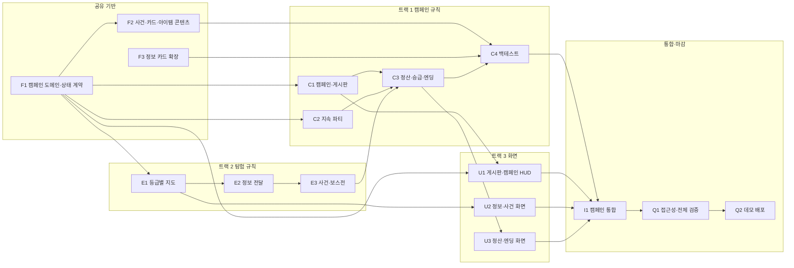

# 프로토타입 작업 배정표

## 목적과 현재 상태

이 문서는 던전 15개 캠페인 개편의 구현 영역과 의존성을 관리한다. 기존 단일 탐험 프로토타입에서 완료한 도메인 타입, 시드 난수, 신뢰 판정, 지도·상태 머신과 화면은 새 작업의 기반으로 재사용하되 새 캠페인 요구사항이 완료된 것으로 간주하지 않는다.

2026-08-13 개편에서 작업 ID를 새로 부여했다. 이전 문서에 같은 글자로 적힌 ID는 현재 배정표가 아니라 이전 작업표를 가리킨다.

**새 상위 spec과 상세 구현 plan이 모두 승인되기 전에는 아래 작업을 시작하지 않는다.** 아래 ID는 팀 작업의 큰 단위이고, 세부 구현은 [상세 구현 plan](../superpowers/plans/2026-08-13-sanghwan-yoo-game-direction-rework.md)의 Task를 따른다.

## 프로토타입 범위

### 포함

- 던전 15개 캠페인 생성과 최대 5개 공고 게시판
- 지속 3인 파티 15팀, 예비 인원 6명, 충원·재편·회복
- C/B/A/S 등급별 지도와 정보 전달 기회
- 용사 파티 대상 카드와 자동 보스전
- 정산, 명성·골드 승급, 네 캠페인 엔딩
- 시드 재현 테스트와 10,000개 시드 백테스트

### 범위 밖

- 저장·복원, Supabase와 로그인
- 고유 던전·보스 서사
- 길잡이 직접 전투
- 보스 거래와 보스에게 파티 정보를 제공하는 행동
- 등급별 3/3/4/5인 출전 파티
- 턴제 보스전 (아래 참고)

### 프로토타입 이후로 합의한 방향

프로토타입을 마친 뒤 보스전을 바꾸기로 합의했다. 지금 구현하지 않는 이유는 첫 백테스트가 현재 규칙의 밸런스를 재는 것이기 때문이다. 여기 적어 두어 나중에 누락으로 오해되지 않게 한다.

- 용사 파티원과 보스가 턴제로 서로 공격한다
- 보스는 파티원의 **직업과 전투 방식에 따라 다른 확률로** 공격 대상을 고른다

이렇게 되면 직업 구성이 생존에 직접 영향을 주고, 어떤 파티를 어떤 던전에 보내는지가 더 무거운 결정이 된다. `E3`이 만든 `resolveBossFight`의 입력 계약과 정보 보정 규칙은 그대로 쓸 수 있고 내부 계산과 결과의 턴 기록만 달라진다.

## 의존성 그래프



## 진행 순서와 세 트랙

### 공유 기반

`F1`에서 `CampaignState`와 `ExpeditionState`, 던전·공고·파티·자원·엔딩 계약과 시드 스트림 이름을 먼저 확정한다.

### 병렬 트랙

| 트랙 | 책임 | 주요 산출물 |
| --- | --- | --- |
| 캠페인 규칙 | 게시판, 지속 파티, 정산, 승급, 엔딩, 백테스트 | UI 없는 순수 규칙과 시뮬레이터 |
| 탐험 규칙 | 등급별 지도, 정보 전달 기회, 사건, 자동 보스전 | 한 탐험의 재현 가능한 결과 |
| 화면 | 게시판·HUD, 정보·사건, 정산·엔딩 | 규칙 결과를 설명하는 사용자 흐름 |

`C3`는 탐험 규칙의 최종 결과인 `E3`를 기다린다. 화면 트랙은 목 계약으로 병렬 진행하되 `I1`에서 실제 규칙과 합친다.

### 통합과 마감

`I1`에서 게시판부터 엔딩까지 한 캠페인을 연결한다. `Q1`은 접근성, 원인 피드백, 전체 테스트와 브라우저 흐름을 검증하고 `Q2`가 통합 데모를 배포한다.

## 상세 구현 plan 대응표

배정표의 action ID는 담당자·의존성·완료 상태를 추적하는 상위 작업이다. 상세 plan의 Task는 해당 action을 완료하기 위해 수행하는 코드·테스트 작업이다. 따라서 plan Task가 끝날 때 관련 action ID를 갱신하며, action ID마다 별도의 중복 구현을 만들지 않는다.

| Action ID | 상세 plan Task | 관계 |
| --- | --- | --- |
| F1 | Task 1 | 캠페인·탐험 도메인 계약과 구조화 오류 |
| F2 | Task 5~7 중 콘텐츠 계약·불변식 부분 | 사건·정보 카드·아이템·보스 데이터를 등급별 요구량까지 채우기 |
| F3 | Task 6 실행 중 발견한 콘텐츠 공백 | 카드 풀을 주제·진위 조합마다 2장으로 넓히고 지점 분류에 연동하기 |
| C1 | Task 2~3 | 캠페인 초기화, 던전 생성, 게시판과 지원 자격 |
| C2 | Task 4 | 지속 파티, 예비 충원, 자동 재편, 비출전 5% 회복 |
| C3 | Task 7 | 자동 보스 결과를 반영한 정산, 승급, 엔딩 |
| C4 | Task 10과 Task 8 중 전이 함수 | 기준 checkpoint, 10,000개 시드 백테스트, 그리고 백테스트가 호출할 `transitionCampaign` |
| E1 | Task 5 | 등급별 대칭 지도와 경로 불변식 |
| E2 | Task 5~6 | 정보 기회 생성, 보스 관련 카드 보장, 개인별 카드 판정 |
| E3 | Task 6~7 | 사건 행동과 자동 보스전·사후 검증 |
| U1 | Task 9 | 게시판, 계약 확인, 캠페인 HUD |
| U2 | Task 9 | 지도, 정보 전달, 사건 행동 화면 |
| U3 | Task 9 | 정산 timeline, 최종 등급, 엔딩 화면 |
| I1 | Task 8~9 중 스토어와 화면 | Zustand 스토어와 전체 화면 흐름을 `C4`가 만든 전이 함수 위에 올린다 |
| Q1 | Task 9~10 | 접근성, 브라우저 흐름, 전체 검증과 회귀 테스트 |
| Q2 | 현재 plan 범위 밖 | 검증된 `main` 데모 배포와 시드 재현 확인. 별도 배포 작업으로 진행 |

F1은 도메인·탐험 계약, 구조화 오류, 시드 스트림 이름과 타입 검증을 완료했고 F2는 콘텐츠 데이터 계약·불변식과 F1 연동 검증 화면까지 완료해 `✅ 완료`다. C1·C2·E1도 각 Task의 완료 기준을 충족해 `✅ 완료`이며, 각 상세 plan Task의 완료 기준을 모두 충족했을 때만 상태를 갱신한다. Q2는 승인된 spec의 이번 구현 범위가 배포 전까지이므로 별도 후속 작업으로 남긴다.

### F2를 따로 둔 이유

상위 spec은 등급별 지도 크기와 `한 던전 안에서 같은 사건 콘텐츠를 중복하지 않는다`를 함께 요구한다. 지도는 고르지 않은 갈래까지 모두 채워야 하므로 한 던전에 필요한 서로 다른 사건 수는 다음과 같다.

| 등급 | 전체 지점 | 필요한 서로 다른 사건 |
| --- | ---: | ---: |
| C | 7 | 6 |
| B | 9 | 8 |
| A | 11 | 10 |
| S | 13 | 12 |

F2는 `lib/content/events.ts`에 일반 사건 12개와 보스 사건 풀을 제공하고, C/B/A/S 일반 지점 요구량 6/8/10/12를 콘텐츠 용량으로 검증한다. 콘텐츠 확보를 규칙 작업 안에 숨겨 두면 `E1`~`E3`이 fixture로 `✅`가 된 뒤 `C4`에서야 막히므로 별도 ID로 분리한다.

규칙 함수는 콘텐츠 풀을 인자로 받아 fixture로 검증할 수 있다. 따라서 `F2`는 `E1`~`E3`의 시작을 막지 않고 `C4`만 막는다.

사건마다 선택지 2개 이상을 완료 기준에 넣은 이유는 선택지가 하나뿐이면 확인 버튼과 같아 [핵심 게임 루프](../design/CORE_GAME_LOOP.md)의 `모든 주요 단계에서 최소 하나의 의미 있는 플레이어 결정` 제약을 만족하지 못하기 때문이다. F2 생산 사건은 선택지를 2개 이상 제공하며, 선택지는 용사 지원·위험 조절·거래·관망 축에서 서로 다른 의도를 선언한다. 실제 효과 계산은 Task 6~7에서 정한다.

### F3을 따로 둔 이유

`E2` 구현 중 중립 보스 카드가 없어 `수용한 중립 -10%` 보정이 실행되지 않는 것을 발견해 만든 항목이다. 그 공백을 파고들다 더 큰 문제가 드러나 범위를 카드 풀 전체 확장으로 넓혔다.

**기만이 핵심 루프인데 플레이어가 할 수 있는 말이 12가지뿐이었다.** 던전 15개를 다 클리어하는 한 캠페인의 정보 기회를 세어 보면 얇음이 분명하다.

| | 계산 | 횟수 |
| --- | --- | ---: |
| 전체 정보 기회 | C6×2 + B4×3 + A3×4 + S2×5 | 46회 |
| 그중 보스 보장 | C6×1 + B4×1 + A3×2 + S2×2 | 20회 |
| 카드 제시 총량 | 46 × 3장 | 138회 |

보스 카드가 2장이라 보스 기회 20번이 매번 같은 카드를 제시했고, 비보스 9장이 26번의 기회를 돌려 써 장당 평균 8.7회 노출됐다. 게다가 주제가 상황과 무관해 휴식 지점에서 상인 이야기가 나왔다.

그래서 주제 6종 × 진위 3종 조합마다 2장씩 **36장**으로 늘리고, 지점의 사건 분류가 카드 주제를 정하도록 바꿨다. 조합당 2장인 것은 A·S급 때문이다. 경로마다 보장이 2회인데 1장이면 두 기회가 모든 시드에서 같은 세 장을 제시한다.

규칙은 중립 보스 카드가 생기면 그대로 동작하도록 `E3` 전에 이미 구현했으므로 `E3`을 막지 않았다. 막는 것은 `C4`다. 백테스트가 규칙 하나가 빠진 채로 보정 분포를 산출하게 되기 때문이다. `F2`가 `C4`만 막았던 것과 같은 이유다.

## 첫 백테스트 보고서

`C4`가 10,000개 시드 × 3전략 = 30,000 캠페인을 92.9초에 돌린 결과다. **생성 오류 0건, 시작 즉시 진행 불가 시드 0건**으로 강제 조건은 통과했다. 아래는 합격·불합격이 아니라 밸런스 조정 자료다.

| | survivalFirst | balanced | wipeGoldFirst |
| --- | ---: | ---: | ---: |
| 평균 원정 | 15.3 | 16.5 | **6.4** |
| 평균 클리어 | 15.0 | 14.9 | 4.5 |
| 평균 전멸 | 0.3 | 1.6 | 1.9 |
| 최종 승급 점수 | 1126 | 1114 | **273** |
| S 도달률 | **100%** | **100%** | 15.6% |
| 원정 종료 엔딩 | 100% | 98.1% | 0% |
| 길잡이 자격 박탈 | 0% | 1.9% | **77.4%** |
| 불신의 대가 | 0% | 0% | 22.6% |

### 확인된 밸런스 문제

**1. 명성 음수 절벽이 실재한다 (C3 예측 적중).** `wipeGoldFirst`의 **77.4%가 첫 전멸 뒤 지원 불가로 끝났다.** 평균 원정 6.4회로 15개 던전의 절반도 못 돈다. 배신 전략이 전략으로 성립하지 않는다. 조정 후보는 명성 하한 0, C급 지원 명성을 음수로 두기, 전멸 명성 손실 축소 셋이다.

**2. 생존·균형 전략이 너무 쉽다.** 둘 다 **S 도달률 100%**이고 최종 점수가 1100대다. S 기준이 370이므로 3배를 넘긴다. 승급 기준이 낮거나 클리어 보상이 후하다. 점수 곡선을 다시 볼 자리다.

**3. 보스전이 거의 위협이 되지 않는다.** 보스방 도착 평균 HP가 `balanced` 기준 C 77.1 · B 68.2 · A 58.6 · S 54.6인데 보스 기본 피해는 최대 24다. 등급이 오를수록 HP가 낮아지는 것은 `E3`의 등급 배율이 의도대로 작동한 결과지만, 그 값이 보스를 넘기에 너무 여유롭다.

**4. 카드 노출 12종은 전략 탓이지 콘텐츠 문제가 아니다.** 세 전략 모두 진위 선호가 고정이라 36장 중 12장(6주제 × 선호 진위 2장)만 쓴다. 사람이 플레이하면 섞어 고르므로 이 수치는 콘텐츠 부족의 근거가 아니다. 다만 같은 진위 안에서도 최다·최소가 4배 차이인데, `boss` 주제가 보장 지점 덕에 가장 많이 나오고 `route`가 입구에서만 나오기 때문이다. 설계대로다.

조정은 이 보고서를 근거로 **별도 커밋**에서 한다. 상위 plan이 `수치가 목표와 다르면 코드를 임의로 맞추지 말고 보고서를 먼저 남긴 뒤 공식 밸런스 상수 변경을 별도 커밋으로 수행한다`고 정했다.

## 밸런스 조정과 재측정

전체 보고서는 [BACKTEST_REPORT.md](BACKTEST_REPORT.md)에 있다. `pnpm backtest`가 만드는 파일이므로 **직접 고치지 않는다.**

### 절차

1. 보고서를 근거로 **무엇을 왜 바꾸는지** 먼저 정한다
2. 상수만 바꾸는 커밋을 만든다. 규칙 구조 변경과 섞지 않는다
3. `pnpm backtest`로 보고서를 다시 만든다
4. `git diff docs/technical/BACKTEST_REPORT.md`로 무엇이 얼마나 달라졌는지 확인한다
5. 같은 커밋에 갱신된 보고서를 넣는다

보고서를 파일로 떨어뜨리는 이유가 4단계다. 콘솔로만 보면 패치 전후를 사람이 눈으로 맞춰야 한다.

### 명령

```bash
pnpm backtest                      # 10,000 시드 × 3전략, 약 80초
BACKTEST_SEEDS=200 pnpm backtest   # 빠르게 확인할 때
```

`pnpm test`에는 잡히지 않는다. 실행기 파일이 `*.run.ts`이고 [전용 설정](../../vitest.backtest.config.ts)으로만 돈다. 1분 넘게 도는 작업을 매 테스트 실행에 넣지 않기 위해서다. 대신 `pnpm test`의 백테스트 테스트는 60시드로 규약만 확인한다.

### 조정할 수 있는 상수

| 파일 | 상수 | 무엇을 바꾸나 |
| --- | --- | --- |
| `lib/content/effects.ts` | `EVENT_KIND_BASE_HP` | 개입하지 않아도 깎이는 분류별 HP |
| | `EVENT_EFFECT_HP` | 지원·방해 등 행동의 보정 |
| | `ITEM_EFFECT_HP` | 상품을 사서 썼을 때의 보정 |
| | `GRADE_EFFECT_SCALE` | 등급이 사건 효과에 주는 배율 |
| | `BOSS_MODIFIER_MIN` · `MAX` | 보스 피해 보정의 누적 상하한 |
| `lib/content/dungeons.ts` | `CAMPAIGN_GRADE_CONFIG` | 등급별 지원 명성·보상·지도 크기 |
| | `INITIAL_DUNGEON_DEFINITIONS` | 시작 던전 15개의 등급 구성 |
| `lib/content/bosses.ts` | `BOSSES` | 등급별 보스 기본 피해 |
| `lib/content/items.ts` | `ITEMS` | 상품 가격 |
| `lib/rules/promotion.ts` | `PROMOTION_THRESHOLDS` | B·A·S 승급 점수 기준 |
| `lib/rules/settlement.ts` | `CLEAR_REWARD_RATIO` | 생존 인원별 보상 비율 |
| `lib/rules/info.ts` | `BOSS_DAMAGE_MODIFIERS` | 진위별 보스 피해 보정 |
| `lib/rules/party-lifecycle.ts` | `REST_HEAL_RATIO` | 비출전 생존자 회복률 |

### 상수를 바꾸면 함께 깨지는 것

이 셋은 상수를 그대로 단정하고 있으므로 조정과 같은 커밋에서 함께 고친다. **테스트가 깨지는 것이 정상이고, 깨지지 않으면 그 상수가 어디에도 쓰이지 않는다는 뜻이다.**

| 무엇 | 어디 |
| --- | --- |
| 기준 승급 시나리오 | `lib/backtest/campaign-simulator.test.ts`의 checkpoint 120·274·370 |
| 승급 기준 상수 | `lib/rules/promotion.test.ts` |
| 사건 효과 계산 | `lib/rules/event.test.ts` |
| 정산 보상 | `lib/rules/settlement.test.ts` |
| 문서의 수치표 | [성장과 엔딩](../systems/PROGRESSION_AND_ENDINGS.md), [던전 사건과 보스](../systems/DUNGEON_EVENTS_AND_BOSSES.md) |

문서를 함께 고치는 것이 중요하다. 상수의 근거는 코드가 아니라 그 문서에 먼저 적혀 있다.

## 배정표

| ID | 구현 영역 | 완료 기준 | 선행 | 풀리는 것 | 담당 | 상태 |
| --- | --- | --- | --- | --- | --- | --- |
| F1 | 캠페인 도메인·상태 계약 | 캠페인·탐험 상태와 모든 새 규칙 입력·출력 타입, 시드 스트림 이름이 있고 타입 검사 통과 | — | **C1 C2 E1 F2 U1** | SangHwan Yoo | ✅ |
| F2 | 사건·카드·아이템 콘텐츠 | 일반 사건 12개와 보스 사건·카드·아이템·C/B/A/S 보스 데이터의 계약·불변식 테스트와 F1 연동 브라우저 검증 통과. 실제 효과 계산은 Task 6~7에서 별도 구현 | — | **C4** | SangHwan Yoo | ✅ |
| F3 | 정보 카드 확장·지점 연동 | 주제 6종 × 진위 3종 조합마다 카드 2장, 지점의 사건 분류가 카드 주제를 정하고, `수용한 중립 -10%` 보정이 실제 콘텐츠에서 발생 | — | **C4** | sbh3821 | ✅ |
| C1 | 캠페인 초기화·게시판 | 15개 던전 생성, 정렬, 최대 5개 공고와 시드 기반 파티 연결·명성 제한 테스트 통과 | — | **C3 U1** | SangHwan Yoo | ✅ |
| C2 | 지속 파티 | 충원, 최대 파티 자동 재편, 개인 상태 유지, 비출전 5% 회복 테스트 통과 | — | **C3** | sbh3821 | ✅ |
| C3 | 정산·승급·엔딩 | 생존 보상, 전멸 유품·던전 상승, 승급식, 엔딩 우선순위 테스트 통과 | — | **C4 U3** | sbh3821 | ✅ |
| C4 | 캠페인 전이 함수·백테스트 | 게시판부터 엔딩까지 `transitionCampaign`으로 진행, 기준 승급 시나리오와 10,000개 시드 전략 보고서 생성, 생성 불능 0건 | — | **I1** | sbh3821 | ✅ |
| E1 | 등급별 지도·정보 기회 생성 | 7/9/11/13 지점 대칭 지도와 모든 경로의 C2/B3/A4/S5 정보 횟수 테스트 통과 | — | **E2 U2** | sbh3821 | ✅ |
| E2 | 용사 대상 정보 판정 | 보스 수신 제거, 개인별 반응, 보스 정보 1/1/2/2 보장과 기록 테스트 통과 | — | **E3** | sbh3821 | ✅ |
| E3 | 사건·자동 보스전 | 사건 행동과 보스 피해 보정·상한·사후 검증, 생존·전멸 결과 테스트 통과 | — | **C3** | sbh3821 | ✅ |
| U1 | 게시판·캠페인 HUD | 공고·지원 조건·파티 상태와 등급·명성·두 골드·점수·남은 던전 표시 | — | **I1** | LatteBun | ✅ |
| U2 | 지도·정보·사건 화면 | 공개 지도, 정보 전달 기회, 개인 반응과 별도 사건 행동 흐름 동작 | — | **I1** | LatteBun | ✅ |
| U3 | 정산·엔딩 화면 | 생존부터 승급까지 원인 순서와 네 엔딩·최종 등급 표시 | — | **I1** |  | ⬜ |
| I1 | 캠페인 전체 통합 | 게시판→탐험→정산→다음 공고/엔딩 흐름이 시드로 재현되고 전체 검증 통과 | **U3** | **Q1** |  | ⬜ |
| Q1 | 접근성·전체 검증 | 키보드 조작, 색상 외 단서, 변화 사유, lint·typecheck·test·build와 브라우저 검증 통과 | **I1** | **Q2** |  | ⬜ |
| Q2 | 데모 배포 | `main` 데모에서 캠페인 핵심 흐름과 시드 재현을 확인 | **Q1** | — |  | ⬜ |

## 관리 원칙

- 담당자 칸에는 합의한 사람의 이름 또는 식별자를 적는다.
- 상태는 `⬜ 대기`, `🟡 진행 중`, `✅ 완료`만 사용한다.
- `선행`에는 아직 끝나지 않은 직접 선행만 적는다.
- 완료된 ID는 다른 행의 `선행`에서 지우며, 남은 선행이 없으면 `—`로 적는다.
- `풀리는 것`은 완료 여부와 무관한 전체 의존성 그래프의 나가는 간선과 일치시킨다.
- 새 작업은 승인된 상위 spec과 상세 plan의 범위 안에서만 추가한다.
- 표나 그래프를 바꾸면 [무결성 검사](PROTOTYPE_WORK_ASSIGNMENT.test.ts)와 전체 테스트를 실행한다.

## 관련 문서

- [게임 원칙](../GAME_PRINCIPLES.md)
- [핵심 게임 루프](../design/CORE_GAME_LOOP.md)
- [팀 개발 워크플로](TEAM_DEVELOPMENT_WORKFLOW.md)
- [개발 환경](DEVELOPMENT_ENVIRONMENT.md)
